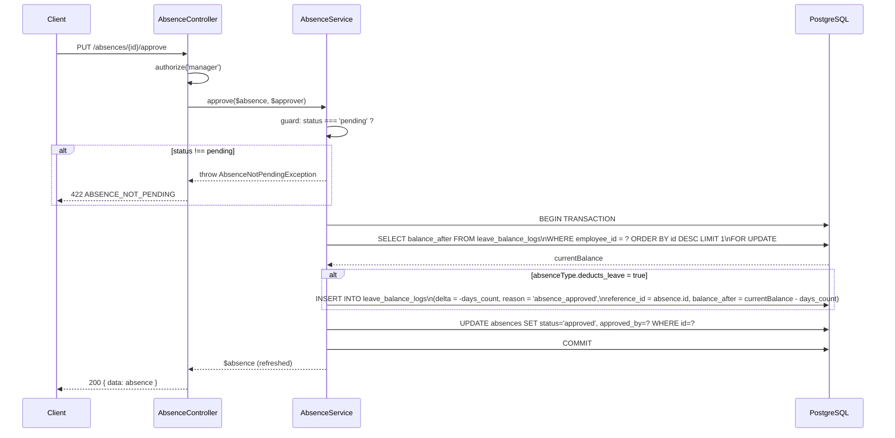

# Design — Module Absences

## Overview

Le module Absences s'intègre dans l'API Laravel 11 existante du projet Leopardo RH. Il suit exactement les mêmes conventions architecturales que le module Pointage (`AttendanceController` / `AttendanceService`) : un controller mince qui délègue toute la logique métier à un service dédié, des Form Requests pour la validation, et des modèles Eloquent avec le trait `BelongsToCompany` pour l'isolation multitenant.

La particularité de ce module est la gestion **atomique** du solde de congés : toute déduction ou restauration de solde doit s'effectuer dans une transaction PostgreSQL pour éviter les race conditions.

---

## Architecture

```
routes/modules/rh.php
        │
        ▼
AbsenceController          (app/Http/Controllers/Api/V1/)
        │  valide via Form Requests
        │  délègue à
        ▼
AbsenceService             (app/Services/)
        │  utilise
        ├──► Absence            (app/Models/)
        ├──► AbsenceType        (app/Models/)
        └──► LeaveBalanceLog    (app/Models/)
```

### Couches et responsabilités

| Couche | Classe | Responsabilité |
|---|---|---|
| Routing | `routes/modules/rh.php` | Déclarer les 6 endpoints sous le groupe `auth:sanctum + tenant` |
| Controller | `AbsenceController` | HTTP in/out, autorisation, sérialisation JSON |
| Form Requests | `AbsenceIndexRequest`, `StoreAbsenceRequest`, `RejectAbsenceRequest` | Validation des entrées |
| Service | `AbsenceService` | Logique métier : vérification solde, conflits, transactions |
| Models | `Absence`, `AbsenceType`, `LeaveBalanceLog` | Eloquent ORM, scopes, relations |
| Exceptions | `InsufficientLeaveBalanceException`, `AbsenceDateConflictException`, `AbsenceNotPendingException` | Erreurs métier typées |

---

## Components and Interfaces

### AbsenceController

```php
namespace App\Http\Controllers\Api\V1;

class AbsenceController extends Controller
{
    public function __construct(private readonly AbsenceService $absenceService) {}

    public function index(AbsenceIndexRequest $request): JsonResponse      // GET /absences
    public function store(StoreAbsenceRequest $request): JsonResponse      // POST /absences
    public function show(Request $request, Absence $absence): JsonResponse // GET /absences/{id}
    public function approve(Request $request, Absence $absence): JsonResponse // PUT /absences/{id}/approve
    public function reject(RejectAbsenceRequest $request, Absence $absence): JsonResponse // PUT /absences/{id}/reject
    public function destroy(Request $request, Absence $absence): JsonResponse // DELETE /absences/{id}

    private function serialize(Absence $absence): array
}
```

### AbsenceService

```php
namespace App\Services;

class AbsenceService
{
    /**
     * Vérifie le solde et les conflits, crée l'absence en statut pending.
     * @throws InsufficientLeaveBalanceException
     * @throws AbsenceDateConflictException
     */
    public function create(Employee $employee, array $data): Absence

    /**
     * Approuve l'absence et déduit le solde dans une transaction atomique.
     * @throws AbsenceNotPendingException
     */
    public function approve(Absence $absence, Employee $approver): Absence

    /**
     * Rejette l'absence. Restaure le solde si déjà déduit (statut approved).
     * @throws AbsenceNotPendingException (si ni pending ni approved)
     */
    public function reject(Absence $absence, string $reason): Absence

    /**
     * Annule l'absence (employé, statut pending uniquement).
     * @throws AbsenceNotPendingException
     */
    public function cancel(Absence $absence): Absence

    /** Retourne le solde courant de l'employé (dernière entrée leave_balance_logs). */
    public function currentBalance(Employee $employee): float

    /** Vérifie les chevauchements de dates pour un employé. */
    private function hasDateConflict(Employee $employee, string $startDate, string $endDate, ?int $excludeId = null): bool

    /** Crée une entrée dans leave_balance_logs. */
    private function logBalanceChange(Employee $employee, float $delta, string $reason, int $referenceId, float $balanceAfter): LeaveBalanceLog
}
```

### Form Requests

**`AbsenceIndexRequest`**
```php
rules(): [
    'employee_id' => ['nullable', 'integer', 'min:1'],
    'status'      => ['nullable', 'in:pending,approved,rejected,cancelled'],
    'month'       => ['nullable', 'integer', 'between:1,12'],
    'year'        => ['nullable', 'integer', 'min:2000'],
    'per_page'    => ['nullable', 'integer', 'min:1', 'max:100'],
]
```

**`StoreAbsenceRequest`**
```php
rules(): [
    'absence_type_id' => ['required', 'integer', 'exists:absence_types,id'],
    'start_date'      => ['required', 'date_format:Y-m-d'],
    'end_date'        => ['required', 'date_format:Y-m-d', 'gte:start_date'],
    'reason'          => ['nullable', 'string', 'max:1000'],
]
```

**`RejectAbsenceRequest`**
```php
rules(): [
    'rejected_reason' => ['required', 'string', 'min:1', 'max:1000'],
]
```

### Routes à ajouter dans `routes/modules/rh.php`

```php
use App\Http\Controllers\Api\V1\AbsenceController;

// Absences
Route::get('/absences', [AbsenceController::class, 'index']);
Route::post('/absences', [AbsenceController::class, 'store']);
Route::get('/absences/{absence}', [AbsenceController::class, 'show'])->whereNumber('absence');
Route::put('/absences/{absence}/approve', [AbsenceController::class, 'approve'])->whereNumber('absence');
Route::put('/absences/{absence}/reject', [AbsenceController::class, 'reject'])->whereNumber('absence');
Route::delete('/absences/{absence}', [AbsenceController::class, 'destroy'])->whereNumber('absence');
```

Ces routes s'insèrent dans le groupe existant `middleware(['throttle:60,1', 'auth:sanctum', 'tenant'])`.

---

## Data Models

### Absence

```php
namespace App\Models;

class Absence extends Model
{
    use BelongsToCompany, HasFactory;

    protected $fillable = [
        'company_id', 'employee_id', 'absence_type_id',
        'start_date', 'end_date', 'days_count',
        'status', 'reason', 'proof_path',
        'approved_by', 'rejected_reason',
    ];

    protected $casts = [
        'start_date' => 'date',
        'end_date'   => 'date',
    ];

    // Relations
    public function employee(): BelongsTo   // → Employee
    public function absenceType(): BelongsTo // → AbsenceType
    public function approver(): BelongsTo   // → Employee (approved_by)

    // Scopes
    public function scopePending(Builder $q): Builder
    public function scopeForEmployee(Builder $q, int $employeeId): Builder
}
```

### AbsenceType

```php
namespace App\Models;

class AbsenceType extends Model
{
    use BelongsToCompany;

    protected $fillable = [
        'company_id', 'name', 'code',
        'is_paid', 'deducts_leave', 'requires_proof', 'max_days_once',
    ];

    protected $casts = [
        'is_paid'        => 'boolean',
        'deducts_leave'  => 'boolean',
        'requires_proof' => 'boolean',
    ];
}
```

### LeaveBalanceLog

```php
namespace App\Models;

class LeaveBalanceLog extends Model
{
    use BelongsToCompany;

    public $timestamps = false;
    const CREATED_AT = 'created_at';

    protected $fillable = [
        'company_id', 'employee_id',
        'delta', 'reason', 'reference_id', 'balance_after',
    ];

    protected $casts = [
        'delta'         => 'float',
        'balance_after' => 'float',
        'created_at'    => 'datetime',
    ];

    public function employee(): BelongsTo
}
```

### Schéma des tables (existant, rappel)

```
absences
  id, company_id, employee_id (FK), absence_type_id (FK),
  start_date, end_date, days_count,
  status ENUM(pending|approved|rejected|cancelled),
  reason, proof_path, approved_by (FK), rejected_reason,
  created_at, updated_at
  INDEX (employee_id, status), INDEX (start_date, end_date)
  CHECK (end_date >= start_date)

absence_types
  id, company_id, name, code UNIQUE,
  is_paid, deducts_leave, requires_proof, max_days_once,
  created_at

leave_balance_logs
  id, company_id, employee_id (FK),
  delta DECIMAL(5,2), reason VARCHAR(100),
  reference_id, balance_after DECIMAL(6,2),
  created_at
  INDEX (employee_id)
```

---

## Diagramme de séquence — Approbation (transaction atomique)



---

## Correctness Properties

*A property is a characteristic or behavior that should hold true across all valid executions of a system — essentially, a formal statement about what the system should do. Properties serve as the bridge between human-readable specifications and machine-verifiable correctness guarantees.*

### Property 1 : Round-trip du solde à l'approbation puis au rejet

*For any* employé avec un solde initial S et une absence de N jours dont le type déduit le solde, approuver puis rejeter cette absence doit restaurer le solde à exactement S (i.e., `balance_after` de la dernière entrée `leave_balance_logs` = S).

**Validates: Requirements 4.2, 4.3, 5.3**

### Property 2 : Idempotence de l'approbation

*For any* absence déjà en statut `approved`, appeler `approve` une seconde fois doit retourner l'erreur `ABSENCE_NOT_PENDING` sans modifier le solde ni créer d'entrée supplémentaire dans `leave_balance_logs`.

**Validates: Requirements 4.4**

### Property 3 : Invariant de non-chevauchement

*For any* employé, après la création réussie d'une absence couvrant la période [D1, D2], toute tentative de créer une nouvelle absence dont la période chevauche [D1, D2] doit être rejetée avec `ABSENCE_DATE_CONFLICT`.

**Validates: Requirements 2.3**

### Property 4 : Invariant de solde non négatif à la création

*For any* employé dont le solde courant est S et pour tout N > S, tenter de créer une absence de N jours avec un type `deducts_leave = true` doit être rejeté avec `INSUFFICIENT_LEAVE_BALANCE`, et le solde doit rester S.

**Validates: Requirements 2.2**

### Property 5 : Isolation RBAC — visibilité des absences

*For any* employé E1, toute requête `GET /absences` ou `GET /absences/{id}` authentifiée avec le token de E1 ne doit retourner que des absences dont `employee_id = E1.id` (jamais celles d'un autre employé de la même company).

**Validates: Requirements 1.1, 3.2, 7.3**

---

## Error Handling

Les exceptions métier sont des classes dédiées dans `app/Exceptions/` qui étendent `DomainException` (déjà présent dans le projet). Le handler global Laravel les convertit en réponses JSON structurées.

| Exception | Code métier | HTTP |
|---|---|---|
| `InsufficientLeaveBalanceException` | `INSUFFICIENT_LEAVE_BALANCE` | 422 |
| `AbsenceDateConflictException` | `ABSENCE_DATE_CONFLICT` | 422 |
| `AbsenceNotPendingException` | `ABSENCE_NOT_PENDING` | 422 |

Format de réponse d'erreur (cohérent avec le reste de l'API) :

```json
{
  "error": {
    "code": "INSUFFICIENT_LEAVE_BALANCE",
    "message": "Solde de congés insuffisant. Solde disponible : 3.00 jours, demandé : 5 jours."
  }
}
```

Les erreurs de validation Laravel (422) conservent le format standard `{ "message": "...", "errors": { ... } }`.

---

## Testing Strategy

### Approche duale

- **Tests Feature** (`tests/Feature/`) : scénarios HTTP end-to-end avec base de données SQLite en mémoire (ou PostgreSQL de test), couvrant les cas nominaux et les cas d'erreur.
- **Tests de propriétés** : validés via des tests paramétrés / data providers PHPUnit qui génèrent des jeux de données variés pour vérifier les propriétés universelles.

### Bibliothèque PBT

Le projet étant en PHP/Laravel, on utilisera **[eris/eris](https://github.com/giorgiosironi/eris)** (library de property-based testing pour PHP) ou, à défaut, des data providers PHPUnit avec génération aléatoire contrôlée par seed. Chaque test de propriété doit s'exécuter avec **minimum 100 itérations**.

### Tests Feature prioritaires

```
tests/Feature/Absences/
  AbsenceIndexTest.php       — RBAC liste (employé vs manager), filtres, pagination
  AbsenceStoreTest.php       — création valide, INSUFFICIENT_BALANCE, DATE_CONFLICT, validation 422
  AbsenceShowTest.php        — accès propre vs autre employé (403), 404
  AbsenceApproveTest.php     — approbation, déduction solde, NOT_PENDING, 403 employé
  AbsenceRejectTest.php      — rejet avec raison, restauration solde, NOT_PENDING
  AbsenceCancelTest.php      — annulation pending, NOT_PENDING, 403 autre employé
```

### Tests de propriétés (tag format)

Chaque test de propriété est annoté :
`// Feature: absences-module, Property {N}: {property_text}`

| Propriété | Test | Itérations |
|---|---|---|
| Property 1 : Round-trip solde | `AbsenceBalanceRoundTripTest` | 100 |
| Property 2 : Idempotence approbation | `AbsenceApproveIdempotenceTest` | 100 |
| Property 3 : Non-chevauchement | `AbsenceDateConflictPropertyTest` | 100 |
| Property 4 : Solde non négatif | `AbsenceInsufficientBalancePropertyTest` | 100 |
| Property 5 : Isolation RBAC | `AbsenceRbacIsolationPropertyTest` | 100 |

### Couverture minimale attendue

- Tous les endpoints : cas nominal + cas d'erreur métier + cas 401/403/404
- Transaction atomique de l'approbation : test avec simulation de rollback (mock DB::transaction)
- Isolation multitenant : vérifier qu'un token d'une company A ne peut pas lire les absences de la company B
