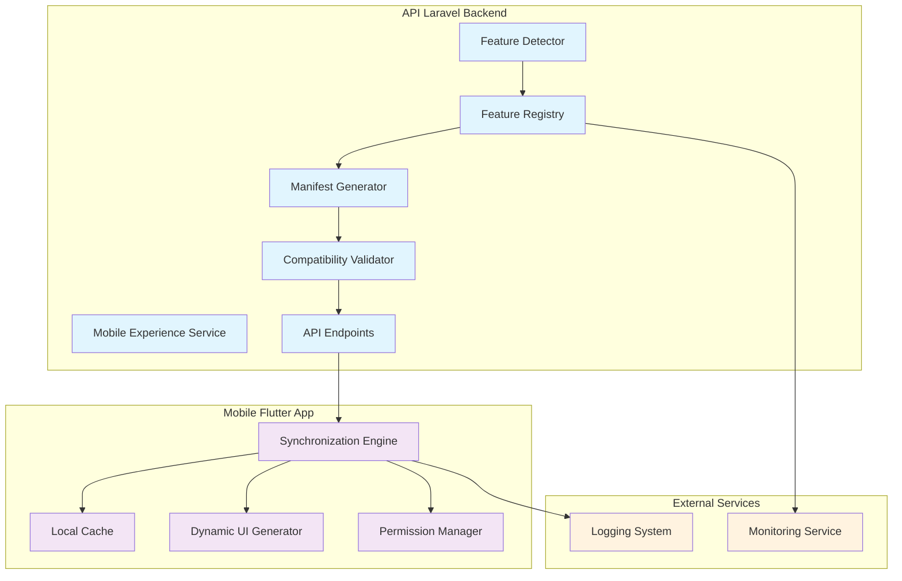

# Design Document - Mobile-API Synchronization

## Overview

Ce document présente la conception technique du système de synchronisation automatique entre l'API Laravel Leopardo RH et l'application mobile Flutter. Le système garantit que toutes les nouvelles fonctionnalités développées dans l'API soient automatiquement disponibles et accessibles depuis l'application mobile, maintenant ainsi la parité des fonctionnalités entre les interfaces web et mobile.

### Objectifs Principaux

1. **Détection Automatique** : Identifier automatiquement les nouvelles fonctionnalités API sans intervention manuelle
2. **Synchronisation Transparente** : Propager les fonctionnalités vers l'application mobile de manière seamless
3. **Compatibilité Garantie** : Assurer la compatibilité entre versions API et mobile
4. **Expérience Professionnelle** : Maintenir des standards de qualité élevés pour l'interface mobile
5. **Sécurité Renforcée** : Protéger l'intégrité des données et respecter les permissions

### Contraintes Techniques

- **API Existante** : Laravel 11.31 avec Sanctum pour l'authentification
- **Mobile Existant** : Application Flutter avec architecture modulaire
- **Service Existant** : MobileExperienceService déjà en place pour la configuration mobile
- **Performance** : Synchronisation en moins de 5 secondes sur connexion 4G
- **Compatibilité** : Support des 3 dernières versions majeures mobile

## Architecture

### Vue d'Ensemble du Système



### Patterns Architecturaux

1. **Registry Pattern** : Feature Registry centralise l'inventaire des fonctionnalités
2. **Observer Pattern** : Détection automatique des changements API
3. **Strategy Pattern** : Gestion des différentes stratégies de synchronisation
4. **Cache-Aside Pattern** : Gestion intelligente du cache local mobile
5. **Circuit Breaker Pattern** : Résilience en cas d'échec de synchronisation

## Components and Interfaces

### 1. Feature Registry (Backend)

**Responsabilité** : Maintenir l'inventaire centralisé de toutes les fonctionnalités API

```php
interface FeatureRegistryInterface
{
    public function registerFeature(Feature $feature): void;
    public function getFeatures(?string $version = null): Collection;
    public function getFeature(string $key): ?Feature;
    public function updateFeature(string $key, array $metadata): void;
    public function removeFeature(string $key): void;
    public function getManifest(?string $mobileVersion = null): array;
}

class FeatureRegistry implements FeatureRegistryInterface
{
    public function __construct(
        private FeatureDetector $detector,
        private CompatibilityValidator $validator,
        private CacheManager $cache
    ) {}
}
```

**Fonctionnalités Clés** :
- Détection automatique via reflection des contrôleurs API
- Extraction des métadonnées depuis les annotations/attributs
- Cache intelligent avec invalidation automatique
- Support du versioning et de la rétrocompatibilité

### 2. Feature Detector (Backend)

**Responsabilité** : Détecter automatiquement les nouvelles fonctionnalités API

```php
interface FeatureDetectorInterface
{
    public function detectNewFeatures(): Collection;
    public function extractMetadata(string $controllerClass, string $method): array;
    public function scanRoutes(): Collection;
    public function detectChanges(): Collection;
}

class FeatureDetector implements FeatureDetectorInterface
{
    public function __construct(
        private Router $router,
        private ReflectionService $reflection,
        private AnnotationReader $annotations
    ) {}

    public function detectNewFeatures(): Collection
    {
        $routes = $this->scanRoutes();
        $features = collect();

        foreach ($routes as $route) {
            $metadata = $this->extractMetadata(
                $route->getControllerClass(),
                $route->getActionMethod()
            );

            if ($this->isNewFeature($metadata)) {
                $features->push(new Feature($metadata));
            }
        }

        return $features;
    }
}
```

### 3. Manifest Generator (Backend)

**Responsabilité** : Générer le manifeste JSON des fonctionnalités

```php
interface ManifestGeneratorInterface
{
    public function generate(?string $mobileVersion = null): array;
    public function generateForUser(Employee $employee): array;
    public function validateManifest(array $manifest): bool;
    public function signManifest(array $manifest): array;
}

class ManifestGenerator implements ManifestGeneratorInterface
{
    public function generate(?string $mobileVersion = null): array
    {
        $features = $this->registry->getFeatures($mobileVersion);

        return [
            'version' => $this->getApiVersion(),
            'generated_at' => now()->toISOString(),
            'mobile_version_min' => $this->getMinMobileVersion(),
            'features' => $features->map(fn($f) => $f->toManifestArray())->toArray(),
            'signature' => $this->cryptoService->sign($features->toJson())
        ];
    }
}
```

### 4. Synchronization Engine (Mobile)

**Responsabilité** : Orchestrer la synchronisation côté mobile

```dart
abstract class SynchronizationEngine {
  Future<SyncResult> synchronize();
  Future<FeatureManifest> fetchManifest();
  Future<void> applyFeatures(List<Feature> features);
  Future<bool> validateCompatibility(FeatureManifest manifest);
}

class SynchronizationEngineImpl implements SynchronizationEngine {
  final ApiClient _apiClient;
  final LocalCache _cache;
  final CompatibilityValidator _validator;
  final PermissionManager _permissions;

  @override
  Future<SyncResult> synchronize() async {
    try {
      final manifest = await fetchManifest();

      if (!await validateCompatibility(manifest)) {
        return SyncResult.incompatible();
      }

      final newFeatures = await _identifyNewFeatures(manifest);
      final authorizedFeatures = await _permissions.filterAuthorized(newFeatures);

      await applyFeatures(authorizedFeatures);
      await _cache.updateManifest(manifest);

      return SyncResult.success(authorizedFeatures.length);
    } catch (e) {
      return SyncResult.error(e);
    }
  }
}
```

### 5. Dynamic UI Generator (Mobile)

**Responsabilité** : Générer automatiquement les interfaces mobiles

```dart
abstract class DynamicUIGenerator {
  Widget generateScreen(Feature feature);
  Widget generateForm(FormSchema schema);
  Widget generateList(ListSchema schema);
  Widget generateDetail(DetailSchema schema);
}

class DynamicUIGeneratorImpl implements DynamicUIGenerator {
  final ThemeData _theme;
  final LocalizationService _l10n;

  @override
  Widget generateScreen(Feature feature) {
    switch (feature.type) {
      case FeatureType.list:
        return _generateListScreen(feature);
      case FeatureType.form:
        return _generateFormScreen(feature);
      case FeatureType.detail:
        return _generateDetailScreen(feature);
      default:
        return _generateGenericScreen(feature);
    }
  }

  Widget _generateListScreen(Feature feature) {
    return Scaffold(
      appBar: AppBar(title: Text(feature.title)),
      body: DynamicListView(
        endpoint: feature.endpoint,
        schema: feature.listSchema,
        theme: _theme,
      ),
    );
  }
}
```

### 6. Compatibility Validator

**Responsabilité** : Valider la compatibilité entre versions

```php
// Backend
interface CompatibilityValidatorInterface
{
    public function validateFeature(Feature $feature, string $mobileVersion): bool;
    public function getCompatibilityMatrix(): array;
    public function getMinimumMobileVersion(Feature $feature): string;
}

class CompatibilityValidator implements CompatibilityValidatorInterface
{
    private array $compatibilityMatrix = [
        '1.0.0' => ['mobile_min' => '1.0.0', 'mobile_max' => '1.2.x'],
        '1.1.0' => ['mobile_min' => '1.1.0', 'mobile_max' => '1.3.x'],
        '1.2.0' => ['mobile_min' => '1.2.0', 'mobile_max' => '1.4.x'],
    ];
}
```

```dart
// Mobile
class CompatibilityValidator {
  static const String currentMobileVersion = '1.2.0';

  bool isCompatible(Feature feature) {
    final minVersion = feature.minimumMobileVersion;
    final maxVersion = feature.maximumMobileVersion;

    return _versionInRange(currentMobileVersion, minVersion, maxVersion);
  }

  bool _versionInRange(String current, String min, String? max) {
    // Implémentation de comparaison sémantique des versions
    return Version.parse(current) >= Version.parse(min) &&
           (max == null || Version.parse(current) <= Version.parse(max));
  }
}
```

## Data Models

### Feature Model

```php
class Feature extends Model
{
    protected $fillable = [
        'key',
        'title',
        'description',
        'endpoint',
        'http_methods',
        'parameters',
        'response_schema',
        'permissions',
        'mobile_version_min',
        'mobile_version_max',
        'api_version',
        'status',
        'metadata'
    ];

    protected $casts = [
        'http_methods' => 'array',
        'parameters' => 'array',
        'response_schema' => 'array',
        'permissions' => 'array',
        'metadata' => 'array',
    ];

    public function toManifestArray(): array
    {
        return [
            'key' => $this->key,
            'title' => $this->title,
            'description' => $this->description,
            'endpoint' => $this->endpoint,
            'methods' => $this->http_methods,
            'parameters' => $this->parameters,
            'response_schema' => $this->response_schema,
            'permissions' => $this->permissions,
            'mobile_version_min' => $this->mobile_version_min,
            'mobile_version_max' => $this->mobile_version_max,
            'ui_type' => $this->metadata['ui_type'] ?? 'generic',
            'form_schema' => $this->metadata['form_schema'] ?? null,
        ];
    }
}
```

### Mobile Feature Model

```dart
class Feature {
  final String key;
  final String title;
  final String description;
  final String endpoint;
  final List<String> methods;
  final Map<String, dynamic> parameters;
  final Map<String, dynamic> responseSchema;
  final List<String> permissions;
  final String minimumMobileVersion;
  final String? maximumMobileVersion;
  final FeatureType type;
  final FormSchema? formSchema;
  final ListSchema? listSchema;

  const Feature({
    required this.key,
    required this.title,
    required this.description,
    required this.endpoint,
    required this.methods,
    required this.parameters,
    required this.responseSchema,
    required this.permissions,
    required this.minimumMobileVersion,
    this.maximumMobileVersion,
    required this.type,
    this.formSchema,
    this.listSchema,
  });

  factory Feature.fromJson(Map<String, dynamic> json) {
    return Feature(
      key: json['key'],
      title: json['title'],
      description: json['description'],
      endpoint: json['endpoint'],
      methods: List<String>.from(json['methods']),
      parameters: json['parameters'],
      responseSchema: json['response_schema'],
      permissions: List<String>.from(json['permissions']),
      minimumMobileVersion: json['mobile_version_min'],
      maximumMobileVersion: json['mobile_version_max'],
      type: FeatureType.fromString(json['ui_type']),
      formSchema: json['form_schema'] != null
          ? FormSchema.fromJson(json['form_schema'])
          : null,
      listSchema: json['list_schema'] != null
          ? ListSchema.fromJson(json['list_schema'])
          : null,
    );
  }
}

enum FeatureType {
  list,
  form,
  detail,
  dashboard,
  generic;

  static FeatureType fromString(String type) {
    return FeatureType.values.firstWhere(
      (e) => e.name == type,
      orElse: () => FeatureType.generic,
    );
  }
}
```

### Manifest Schema

```json
{
  "version": "1.2.0",
  "generated_at": "2024-01-15T10:30:00Z",
  "mobile_version_min": "1.0.0",
  "signature": "sha256:abc123...",
  "features": [
    {
      "key": "employee_management",
      "title": "Gestion des Employés",
      "description": "Créer, modifier et gérer les employés",
      "endpoint": "/api/v1/employees",
      "methods": ["GET", "POST", "PUT", "DELETE"],
      "parameters": {
        "list": {
          "page": {"type": "integer", "required": false},
          "per_page": {"type": "integer", "required": false},
          "search": {"type": "string", "required": false}
        },
        "create": {
          "first_name": {"type": "string", "required": true},
          "last_name": {"type": "string", "required": true},
          "email": {"type": "email", "required": true}
        }
      },
      "response_schema": {
        "employee": {
          "id": "integer",
          "first_name": "string",
          "last_name": "string",
          "email": "string",
          "created_at": "datetime"
        }
      },
      "permissions": ["employees.view", "employees.create"],
      "mobile_version_min": "1.0.0",
      "mobile_version_max": null,
      "ui_type": "list",
      "form_schema": {
        "fields": [
          {
            "name": "first_name",
            "type": "text",
            "label": "Prénom",
            "required": true,
            "validation": {"min_length": 2, "max_length": 50}
          }
        ]
      }
    }
  ]
}
```

## Error Handling

### Backend Error Handling

```php
class FeatureSynchronizationException extends Exception
{
    public static function detectionFailed(string $reason): self
    {
        return new self("Feature detection failed: {$reason}");
    }

    public static function manifestGenerationFailed(string $reason): self
    {
        return new self("Manifest generation failed: {$reason}");
    }

    public static function incompatibleVersion(string $feature, string $version): self
    {
        return new self("Feature {$feature} incompatible with mobile version {$version}");
    }
}

class FeatureRegistryService
{
    public function registerFeature(Feature $feature): void
    {
        try {
            $this->validator->validate($feature);
            $this->registry->store($feature);
            $this->cache->invalidate('features');
        } catch (ValidationException $e) {
            Log::error('Feature registration failed', [
                'feature' => $feature->key,
                'error' => $e->getMessage()
            ]);
            throw FeatureSynchronizationException::detectionFailed($e->getMessage());
        }
    }
}
```

### Mobile Error Handling

```dart
class SyncException implements Exception {
  final String message;
  final SyncErrorType type;
  final dynamic originalError;

  const SyncException(this.message, this.type, [this.originalError]);

  static SyncException networkError(dynamic error) {
    return SyncException('Network error during sync', SyncErrorType.network, error);
  }

  static SyncException incompatibleVersion(String version) {
    return SyncException('Incompatible version: $version', SyncErrorType.compatibility);
  }

  static SyncException manifestCorrupted() {
    return SyncException('Manifest signature invalid', SyncErrorType.security);
  }
}

enum SyncErrorType {
  network,
  compatibility,
  security,
  permission,
  unknown
}

class ErrorRecoveryService {
  Future<void> handleSyncError(SyncException error) async {
    switch (error.type) {
      case SyncErrorType.network:
        await _scheduleRetry();
        break;
      case SyncErrorType.compatibility:
        await _showUpdateDialog();
        break;
      case SyncErrorType.security:
        await _clearCacheAndReauth();
        break;
      case SyncErrorType.permission:
        await _refreshPermissions();
        break;
      default:
        await _logAndContinue(error);
    }
  }
}
```

## Testing Strategy

### Backend Testing

**Unit Tests** :
- FeatureDetector : validation de la détection des routes et métadonnées
- ManifestGenerator : génération correcte du JSON et signature
- CompatibilityValidator : logique de validation des versions
- FeatureRegistry : opérations CRUD et cache

**Integration Tests** :
- API endpoints `/api/v1/features/manifest`
- Intégration avec MobileExperienceService existant
- Tests de performance pour la génération de manifeste
- Tests de sécurité pour la signature cryptographique

**Property-Based Tests** : Non applicable - ce système implique principalement de la configuration et de l'intégration avec des services externes.

### Mobile Testing

**Unit Tests** :
- SynchronizationEngine : logique de synchronisation
- CompatibilityValidator : validation des versions
- DynamicUIGenerator : génération d'interfaces
- LocalCache : gestion du cache et persistance

**Widget Tests** :
- Interfaces générées dynamiquement
- Gestion des états d'erreur
- Validation des formulaires générés

**Integration Tests** :
- Synchronisation complète end-to-end
- Tests de performance sur différentes connexions
- Tests de résilience en cas de panne réseau

### Test Configuration

**Frameworks** :
- Backend : Pest (PHP) pour les tests unitaires et d'intégration
- Mobile : Flutter Test pour les tests unitaires et widget tests

**Couverture Minimale** : 85% pour les composants critiques (FeatureRegistry, SynchronizationEngine)

**Tests de Performance** :
- Synchronisation complète < 5 secondes sur 4G
- Génération de manifeste < 2 secondes pour 100 fonctionnalités
- Génération d'interface < 1 seconde par écran

## Correctness Properties

*A property is a characteristic or behavior that should hold true across all valid executions of a system-essentially, a formal statement about what the system should do. Properties serve as the bridge between human-readable specifications and machine-verifiable correctness guarantees.*

### Property 1: Feature Detection Completeness

*For any* new API route, controller, or resource added to the system, the Feature_Registry SHALL automatically detect it and extract all required metadata (name, description, permissions, endpoints, parameters, response schema).

**Validates: Requirements 1.1, 1.2, 1.3, 1.5**

### Property 2: Registry Inventory Consistency

*For any* sequence of feature additions, modifications, or removals, the Feature_Registry SHALL maintain a complete and consistent inventory of all available API features.

**Validates: Requirements 1.4**

### Property 3: Manifest Generation Completeness

*For any* set of detected features, the Feature_Registry SHALL generate a Feature_Manifest that includes complete metadata (endpoints, HTTP methods, parameters, responses, permissions, versioning, mobile compatibility) for all features.

**Validates: Requirements 2.1, 2.2, 2.3, 2.4, 2.6**

### Property 4: Synchronization Differential Analysis

*For any* pair of local and remote Feature_Manifests, the Synchronization_Engine SHALL correctly identify all new, modified, and removed features between the two versions.

**Validates: Requirements 3.2**

### Property 5: Feature Availability Propagation

*For any* set of new compatible features, the Mobile_App SHALL make all of them automatically available in the user interface and integrate them appropriately into modules and quick actions.

**Validates: Requirements 3.3, 3.4**

### Property 6: Cache Consistency Maintenance

*For any* Feature_Manifest update, the Mobile_App SHALL maintain cache consistency and ensure offline functionality remains intact.

**Validates: Requirements 3.6**

### Property 7: Compatibility Validation Accuracy

*For any* combination of API version, mobile version, and feature requirements, the Compatibility_Validator SHALL correctly determine compatibility and prevent activation of incompatible features.

**Validates: Requirements 4.1, 4.2, 4.3**

### Property 8: Compatibility Matrix Consistency

*For any* version updates to API or mobile components, the Compatibility_Validator SHALL maintain an accurate and consistent compatibility matrix.

**Validates: Requirements 4.5**

### Property 9: Dynamic UI Generation Standards

*For any* feature metadata from the Feature_Manifest, the Mobile_App SHALL generate user interfaces that respect Professional_Standards, apply consistent theming, and implement appropriate forms and validation based on API schemas.

**Validates: Requirements 5.1, 5.2, 5.4, 5.5, 5.6**

### Property 10: Navigation Integration Accuracy

*For any* user role and available feature combination, the Mobile_App SHALL integrate features into the appropriate navigation structure based on the user's permissions and role.

**Validates: Requirements 5.3**

### Property 11: Permission-Based Feature Filtering

*For any* user with specific permissions and set of available features, the Mobile_App SHALL filter and display only the features the user is authorized to access, completely hiding unauthorized features.

**Validates: Requirements 6.1, 6.3, 6.5**

### Property 12: Sensitive Feature Security

*For any* feature marked as sensitive, the Mobile_App SHALL implement additional authentication when required by the API.

**Validates: Requirements 6.4**

### Property 13: Synchronization Event Logging

*For any* synchronization event or error that occurs, the Synchronization_Engine SHALL log all events with complete details to the system logs.

**Validates: Requirements 7.1**

### Property 14: Backward Compatibility Maintenance

*For any* request from mobile versions within the supported range (3 latest major versions), the API_Backend SHALL maintain backward compatibility and handle the request appropriately.

**Validates: Requirements 8.1**

### Property 15: Deprecation Information Inclusion

*For any* deprecated feature, the Feature_Manifest SHALL include complete deprecation information and warnings.

**Validates: Requirements 8.3**

### Property 16: Performance Optimization

*For any* synchronization operation, the Mobile_App SHALL use intelligent caching to minimize network calls, implement incremental synchronization to download only changes, and limit synchronization frequency to preserve resources.

**Validates: Requirements 9.2, 9.4, 9.6**

### Property 17: Manifest Compression Optimization

*For any* generated Feature_Manifest, it SHALL be compressed and optimized to minimize bandwidth usage.

**Validates: Requirements 9.3**

### Property 18: Comprehensive Security Implementation

*For any* Feature_Manifest and synchronization exchange, the system SHALL implement cryptographic signing for integrity, signature validation before application, HTTPS encryption for all communications, and local cache encryption for sensitive metadata.

**Validates: Requirements 10.1, 10.2, 10.3, 10.4**
