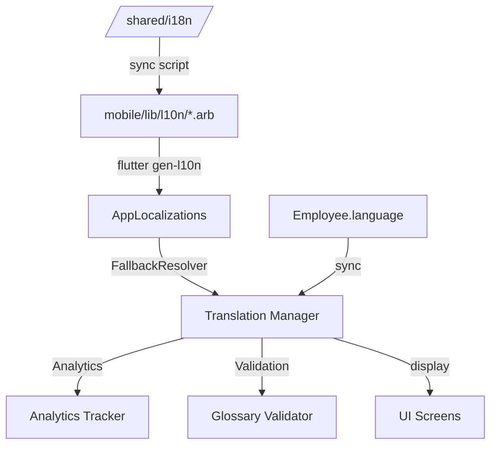

# Design Document - MVP i18n Mobile Pragmatique

## Overview

Ce document détaille l'architecture technique pour implémenter le système i18n mobile Flutter de Leopardo RH selon une approche pragmatique business-first. L'objectif est de livrer une application multilingue crédible en 4-5 jours.

### Objectifs de Design

- **Pragmatisme**: 4-5 jours de développement (pas 8 jours)
- **MVP Focus**: 5 écrans = 80% valeur business
- **Source of Truth**: /shared/i18n/ centralisé
- **Fallback Intelligent**: AR  EN  FR  key
- **Analytics Business**: Tracking complet usage multilingue
- **Post-PMF Ready**: Remote updates + IA préparés

---

## Architecture Technique

### Structure des Dossiers

```
/shared/i18n/                          # Source of truth centralisée
 glossary.json                      # Termes RH verrouillés
 fr.json                            # Traductions françaises
 ar.json                            # Traductions arabes
 tr.json                            # Traductions turques
 en.json                            # Traductions anglaises
 metadata.json                      # Version, updated_at

mobile/lib/core/i18n/
 translation_manager.dart           # Gestionnaire central
 fallback_resolver.dart             # Résolution AR  EN  FR  key
 glossary_validator.dart            # Validation termes RH
 sync_engine.dart                   # Sync background (post-PMF)
 analytics_tracker.dart             # Tracking événements
 arb_parser.dart                    # Parser/pretty printer

mobile/scripts/
 sync_translations.dart             # Script sync local
 validate_i18n.dart                 # Validation existante (déjà créé)

mobile/lib/l10n/                       # Fichiers ARB générés
 app_fr.arb                         # Template français (existant)
 app_ar.arb                         # Arabe (existant)
 app_tr.arb                         # Turc (existant)
 app_en.arb                         # Anglais (existant)
```

### Diagramme d'Architecture



---

## Composants Principaux

### 1. TranslationManager

**Responsabilité**: Gestionnaire central des traductions avec fallback intelligent.

**Interface**:

```dart
class TranslationManager {
  final FallbackResolver _fallbackResolver;
  final GlossaryValidator _glossaryValidator;
  final AnalyticsTracker _analyticsTracker;
  
  /// Résout une clé de traduction avec fallback intelligent
  String resolve(String key, String locale);
  
  /// Change la langue de l'utilisateur
  Future<void> setLocale(String locale);
  
  /// Synchronise avec le backend
  Future<void> syncWithBackend();
  
  /// Valide une traduction contre le glossary
  bool validateTranslation(String key, String value, String locale);
}
```

**Algorithme de résolution**:

```dart
String resolve(String key, String locale) {
  // 1. Essayer la langue demandée
  if (_translations[locale]?.containsKey(key)) {
    return _translations[locale]![key]!;
  }
  
  // 2. Fallback AR  EN
  if (locale == 'ar' && _translations['en']?.containsKey(key)) {
    _logFallback(key, 'ar', 'en');
    _analyticsTracker.trackFallback(key, 'ar', 'en');
    return _translations['en']![key]!;
  }
  
  // 3. Fallback EN  FR
  if ((locale == 'ar' || locale == 'en') && 
      _translations['fr']?.containsKey(key)) {
    _logFallback(key, locale, 'fr');
    _analyticsTracker.trackFallback(key, locale, 'fr');
    return _translations['fr']![key]!;
  }
  
  // 4. Fallback final  clé hardcodée
  _logMissingKey(key, locale);
  _analyticsTracker.trackMissingKey(key, locale);
  return key;
}
```

---

### 2. FallbackResolver

**Responsabilité**: Implémente la chaîne de fallback AR  EN  FR  key.

**Interface**:

```dart
class FallbackResolver {
  final Map<String, Map<String, String>> _translations;
  
  /// Résout une clé avec fallback
  String resolve(String key, String locale);
  
  /// Retourne la chaîne de fallback pour une locale
  List<String> getFallbackChain(String locale);
  
  /// Log un fallback
  void logFallback(String key, String from, String to);
}
```

**Chaînes de fallback**:

```dart
Map<String, List<String>> fallbackChains = {
  'ar': ['ar', 'en', 'fr', 'key'],
  'en': ['en', 'fr', 'key'],
  'tr': ['tr', 'en', 'fr', 'key'],
  'fr': ['fr', 'key'],
};
```

---

### 3. GlossaryValidator

**Responsabilité**: Valide les traductions contre le glossary RH verrouillé.

**Interface**:

```dart
class GlossaryValidator {
  final Glossary _glossary;
  
  /// Valide une traduction contre le glossary
  bool validate(String key, String value, String locale);
  
  /// Retourne les termes verrouillés
  List<GlossaryTerm> getLockedTerms();
  
  /// Vérifie si un terme est verrouillé
  bool isLocked(String key);
}
```

**Structure Glossary**:

```json
{
  "version": "1.0.0",
  "updated_at": "2026-05-07",
  "terms": [
    {
      "key": "payroll",
      "locked": true,
      "translations": {
        "fr": "Paie",
        "ar": "الرواتب",
        "tr": "Bordro",
        "en": "Payroll"
      },
      "context": "RH - Comptabilité"
    },
    {
      "key": "net_salary",
      "locked": true,
      "translations": {
        "fr": "Salaire net",
        "ar": "الراتب الصافي",
        "tr": "Net maaş",
        "en": "Net salary"
      },
      "context": "RH - Paie"
    },
    {
      "key": "check_in",
      "locked": true,
      "translations": {
        "fr": "Pointage entrée",
        "ar": "تسجيل الدخول",
        "tr": "Giriş kaydı",
        "en": "Check-in"
      },
      "context": "RH - Pointage"
    }
  ]
}
```

---

### 4. SyncEngine (Post-PMF)

**Responsabilité**: Synchronisation background des traductions (pas de reload temps réel).

**Interface**:

```dart
class SyncEngine {
  /// Synchronise les traductions en background
  Future<void> syncInBackground();
  
  /// Vérifie si des mises à jour sont disponibles
  Future<bool> hasUpdates();
  
  /// Télécharge les nouvelles traductions
  Future<Map<String, dynamic>> downloadUpdates();
  
  /// Stocke les traductions localement
  Future<void> cacheTranslations(Map<String, dynamic> translations);
  
  /// Notifie l'utilisateur qu'un redémarrage est recommandé
  void showRestartNotification();
}
```

**Algorithme de sync**:

```dart
Future<void> syncInBackground() async {
  try {
    // 1. Vérifier si des mises à jour existent
    final hasUpdates = await _checkForUpdates();
    if (!hasUpdates) return;
    
    // 2. Télécharger en background (pas de blocage UI)
    final updates = await _downloadUpdates();
    
    // 3. Stocker localement (cache SQLite ou SharedPreferences)
    await _cacheTranslations(updates);
    
    // 4. Notifier utilisateur (redémarrage recommandé)
    _showRestartNotification();
    
    // PAS de reload temps réel - activation au redémarrage uniquement
  } catch (e) {
    _logError('Sync failed', e);
  }
}
```

---

### 5. AnalyticsTracker

**Responsabilité**: Tracking des événements business multilingues.

**Interface**:

```dart
class AnalyticsTracker {
  /// Track changement de langue
  void trackLanguageSelected(String oldLang, String newLang);
  
  /// Track rétention par locale
  void trackLocaleRetention(String locale, int sessionCount);
  
  /// Track usage écran par locale
  void trackScreenLocaleUsage(String screen, String locale);
  
  /// Track durée session RTL
  void trackRtlSessionDuration(Duration duration);
  
  /// Track fallback
  void trackFallback(String key, String from, String to);
  
  /// Track clé manquante
  void trackMissingKey(String key, String locale);
}
```

**Événements trackés**:

```dart
// language_selected
{
  'event': 'language_selected',
  'user_id': 'user_123',
  'old_lang': 'fr',
  'new_lang': 'ar',
  'timestamp': '2026-05-07T20:00:00Z',
}

// locale_retention
{
  'event': 'locale_retention',
  'user_id': 'user_123',
  'locale': 'ar',
  'session_count': 15,
  'timestamp': '2026-05-07T20:00:00Z',
}

// screen_locale_usage
{
  'event': 'screen_locale_usage',
  'user_id': 'user_123',
  'screen': 'attendance_screen',
  'locale': 'ar',
  'timestamp': '2026-05-07T20:00:00Z',
}

// rtl_session_duration
{
  'event': 'rtl_session_duration',
  'user_id': 'user_123',
  'duration_seconds': 1200,
  'timestamp': '2026-05-07T20:00:00Z',
}
```

---

### 6. ARBParser

**Responsabilité**: Parser et pretty printer pour fichiers ARB avec validation round-trip.

**Interface**:

```dart
class ARBParser {
  /// Parse un fichier ARB
  ARBFile parse(String content);
  
  /// Pretty print un fichier ARB
  String print(ARBFile arb);
  
  /// Valide la syntaxe JSON
  bool validate(String content);
  
  /// Vérifie la propriété round-trip
  bool verifyRoundTrip(String content);
}
```

**Propriété round-trip**:

```dart
bool verifyRoundTrip(String content) {
  final arb1 = parse(content);
  final printed = print(arb1);
  final arb2 = parse(printed);
  return arb1 == arb2;
}
```

---

## Data Models

### Translation

```dart
class Translation {
  final String key;
  final Map<String, String> values; // locale -> value
  final TranslationMetadata metadata;
  
  Translation({
    required this.key,
    required this.values,
    required this.metadata,
  });
}

class TranslationMetadata {
  final String version;
  final DateTime updatedAt;
  final bool needsReview;
  final String? context;
  
  TranslationMetadata({
    required this.version,
    required this.updatedAt,
    this.needsReview = false,
    this.context,
  });
}
```

### Glossary

```dart
class Glossary {
  final String version;
  final DateTime updatedAt;
  final List<GlossaryTerm> terms;
  
  Glossary({
    required this.version,
    required this.updatedAt,
    required this.terms,
  });
}

class GlossaryTerm {
  final String key;
  final bool locked;
  final Map<String, String> translations;
  final String context;
  
  GlossaryTerm({
    required this.key,
    required this.locked,
    required this.translations,
    required this.context,
  });
}
```

### AnalyticsEvent

```dart
class AnalyticsEvent {
  final String type;
  final String userId;
  final DateTime timestamp;
  final Map<String, dynamic> properties;
  
  AnalyticsEvent({
    required this.type,
    required this.userId,
    required this.timestamp,
    required this.properties,
  });
}
```

### SyncState

```dart
class SyncState {
  final DateTime lastSync;
  final bool hasUpdates;
  final String currentVersion;
  final String latestVersion;
  
  SyncState({
    required this.lastSync,
    required this.hasUpdates,
    required this.currentVersion,
    required this.latestVersion,
  });
}
```

---

## Algorithmes Clés

### 1. Hierarchy Validation

**Contrainte**: Max 3 niveaux de hiérarchie JSON.

```dart
bool validateHierarchy(String key) {
  final depth = key.split('.').length;
  return depth <= 3;
}

// Exemples:
//  "attendance.check_in"  depth = 2
//  "attendance.check_in.button"  depth = 3
//  "modules.attendance.actions.checkin.buttons.primary.label"  depth = 7
```

### 2. Placeholder Consistency Validation

**Contrainte**: Les placeholders doivent être identiques dans toutes les langues.

```dart
bool validatePlaceholders(String key, Map<String, String> translations) {
  final placeholderPattern = RegExp(r'\{(\w+)\}');
  
  // Extraire les placeholders de chaque langue
  final placeholderSets = translations.map((locale, value) {
    final matches = placeholderPattern.allMatches(value);
    final placeholders = matches.map((m) => m.group(1)!).toSet();
    return MapEntry(locale, placeholders);
  });
  
  // Vérifier que tous les sets sont identiques
  final firstSet = placeholderSets.values.first;
  return placeholderSets.values.every((set) => set.containsAll(firstSet) && firstSet.containsAll(set));
}

// Exemple:
//  fr: "Bonjour, {name}" | ar: "مرحبا {name}"  OK
//  fr: "Bonjour, {name}" | ar: "مرحبا {firstName}"  ERREUR
```

### 3. Key Parity Validation

**Contrainte**: Toutes les langues doivent avoir les mêmes clés.

```dart
bool validateKeyParity(Map<String, Map<String, String>> allTranslations) {
  final locales = allTranslations.keys.toList();
  final firstKeys = allTranslations[locales.first]!.keys.toSet();
  
  for (final locale in locales.skip(1)) {
    final keys = allTranslations[locale]!.keys.toSet();
    if (!keys.containsAll(firstKeys) || !firstKeys.containsAll(keys)) {
      return false;
    }
  }
  
  return true;
}
```

### 4. Background Sync Algorithm

**Contrainte**: Pas de reload temps réel, sync background uniquement.

```dart
Future<void> syncTranslations() async {
  // 1. Vérifier si des mises à jour existent
  final response = await http.get('/api/translations/version');
  final latestVersion = response.data['version'];
  final currentVersion = await _getLocalVersion();
  
  if (latestVersion == currentVersion) {
    return; // Pas de mise à jour
  }
  
  // 2. Télécharger nouvelles traductions en background
  final updates = await http.get('/api/translations/latest');
  
  // 3. Stocker localement (cache)
  await _cacheTranslations(updates.data);
  
  // 4. Mettre à jour la version locale
  await _setLocalVersion(latestVersion);
  
  // 5. Notifier utilisateur (redémarrage recommandé)
  if (updates.data.isNotEmpty) {
    _showRestartNotification();
  }
  
  // PAS de reload temps réel - activation au redémarrage uniquement
}
```

---

## Phases d'Implémentation

### Phase 1 (1 jour): Architecture

**Objectif**: Créer la structure centralisée et le fallback system.

**Tâches**:
1. Créer /shared/i18n/ avec structure
2. Créer glossary.json avec 20 termes RH verrouillés
3. Implémenter FallbackResolver
4. Créer script sync_translations.dart
5. Normaliser clés ARB existantes (max 3 niveaux)

**Livrables**:
- /shared/i18n/ opérationnel
- FallbackResolver testé
- Script sync fonctionnel
- Clés ARB normalisées

---

### Phase 2 (2-3 jours): MVP 5 Écrans

**Objectif**: Migrer les 5 écrans prioritaires (80% valeur business).

**Écrans à migrer**:
1. **Auth** (login, register, welcome) - 1 jour
2. **Home** - 0.5 jour
3. **Attendance** (check-in/out, history) - 0.5 jour
4. **Absences** (list, request) - 0.5 jour
5. **Payrolls** (list, detail) - 0.5 jour

**Approche**:
- Remplacer 100% textes hardcodés par context.l10n.key
- Ajouter clés manquantes dans les 4 ARB
- Tester RTL sur chaque écran
- Valider avec script alidate_i18n.dart

**Livrables**:
- 5 écrans 100% traduits
- 0% texte hardcodé
- RTL validé manuellement
- Tests manuels sur device réel (FR, AR, TR, EN)

---

### Phase 3 (1 jour): Emails + QA + RTL

**Objectif**: Finaliser emails multilingues et validation.

**Tâches**:
1. Traduire 5 emails backend (welcome, invitation, password_reset, absence_approved, payroll_ready)
2. Ajouter support RTL dans templates HTML
3. Implémenter validation CI/CD (clés + placeholders)
4. Tests RTL manuels sur les 5 écrans MVP
5. Documenter le système dans README

**Livrables**:
- 5 emails traduits (4 langues)
- Validation CI/CD bloque si erreurs
- RTL validé sur MVP
- Documentation complète

---

### Phase 4 (post-PMF): Remote + Analytics + IA

**Objectif**: Préparer le scale post-PMF.

**Tâches**:
1. Implémenter SyncEngine avec background sync
2. Implémenter AnalyticsTracker avec 6 événements
3. Créer dashboard analytics (Mixpanel/Amplitude)
4. Documenter pipeline IA GPT-4
5. Estimer coûts traduction IA

**Livrables**:
- Remote updates fonctionnels
- Analytics dashboard opérationnel
- Pipeline IA documenté
- Estimation coûts

---

## Correctness Properties

### Property 1: Round-Trip

**Propriété**: Pour tout fichier ARB valide, parse(print(parse(A))) = parse(A)

**Test**:
```dart
test('ARB round-trip property', () {
  final content = File('app_fr.arb').readAsStringSync();
  final arb1 = parser.parse(content);
  final printed = parser.print(arb1);
  final arb2 = parser.parse(printed);
  expect(arb1, equals(arb2));
});
```

---

### Property 2: Key Parity

**Propriété**: Pour toutes langues L1 et L2, keys(arb_L1) = keys(arb_L2)

**Test**:
```dart
test('Key parity across languages', () {
  final frKeys = parser.parse(File('app_fr.arb').readAsStringSync()).keys;
  final arKeys = parser.parse(File('app_ar.arb').readAsStringSync()).keys;
  final trKeys = parser.parse(File('app_tr.arb').readAsStringSync()).keys;
  final enKeys = parser.parse(File('app_en.arb').readAsStringSync()).keys;
  
  expect(arKeys, equals(frKeys));
  expect(trKeys, equals(frKeys));
  expect(enKeys, equals(frKeys));
});
```

---

### Property 3: Hierarchy Constraint

**Propriété**: Pour toute clé K, depth(K) <= 3

**Test**:
```dart
test('Hierarchy max 3 levels', () {
  final arb = parser.parse(File('app_fr.arb').readAsStringSync());
  for (final key in arb.keys) {
    final depth = key.split('.').length;
    expect(depth, lessThanOrEqualTo(3), reason: 'Key  has depth  > 3');
  }
});
```

---

### Property 4: Fallback Chain

**Propriété**: 
esolve(key, "ar") = ar[key] ?? en[key] ?? fr[key] ?? key

**Test**:
```dart
test('Fallback chain AR  EN  FR  key', () {
  final resolver = FallbackResolver({
    'ar': {'existing': 'موجود'},
    'en': {'existing': 'existing', 'fallback_en': 'fallback'},
    'fr': {'existing': 'existant', 'fallback_en': 'repli', 'fallback_fr': 'repli_fr'},
  });
  
  expect(resolver.resolve('existing', 'ar'), equals('موجود'));
  expect(resolver.resolve('fallback_en', 'ar'), equals('fallback'));
  expect(resolver.resolve('fallback_fr', 'ar'), equals('repli_fr'));
  expect(resolver.resolve('missing', 'ar'), equals('missing'));
});
```

---

### Property 5: Placeholder Consistency

**Propriété**: Pour toute clé K avec placeholders P, placeholders(fr[K]) = placeholders(ar[K]) = placeholders(tr[K]) = placeholders(en[K])

**Test**:
```dart
test('Placeholder consistency', () {
  final validator = PlaceholderValidator();
  final translations = {
    'fr': 'Bonjour, {name}',
    'ar': 'مرحبا {name}',
    'tr': 'Merhaba, {name}',
    'en': 'Hello, {name}',
  };
  
  expect(validator.validate('greeting', translations), isTrue);
  
  final invalid = {
    'fr': 'Bonjour, {name}',
    'ar': 'مرحبا {firstName}', // Placeholder différent
  };
  
  expect(validator.validate('greeting', invalid), isFalse);
});
```

---

## Testing Strategy

### Unit Tests

**Composants à tester**:
- FallbackResolver
- GlossaryValidator
- ARBParser
- PlaceholderValidator
- HierarchyValidator

**Exemples**:
```dart
test('FallbackResolver resolves AR  EN', () {
  final resolver = FallbackResolver(translations);
  expect(resolver.resolve('missing_ar', 'ar'), equals(translations['en']['missing_ar']));
});

test('GlossaryValidator rejects unlocked term modification', () {
  final validator = GlossaryValidator(glossary);
  expect(validator.validate('payroll', 'Salaire', 'fr'), isFalse);
});
```

---

### Integration Tests

**Flux à tester**:
- Changement de langue (FR  AR  EN  TR)
- Fallback automatique sur clé manquante
- Synchronisation avec backend
- Validation glossary

**Exemples**:
```dart
testWidgets('Language change updates UI', (tester) async {
  await tester.pumpWidget(MyApp());
  
  // Vérifier langue initiale (FR)
  expect(find.text('Connexion employé'), findsOneWidget);
  
  // Changer vers arabe
  await tester.tap(find.byIcon(Icons.language));
  await tester.tap(find.text('العربية'));
  await tester.pumpAndSettle();
  
  // Vérifier langue arabe
  expect(find.text('تسجيل دخول الموظف'), findsOneWidget);
});
```

---

### E2E Tests

**Parcours utilisateur**:
1. Utilisateur ouvre app  langue device détectée
2. Utilisateur change langue  UI mise à jour
3. Utilisateur navigue entre écrans  traductions correctes
4. Utilisateur en arabe  RTL activé

---

### Visual Regression Tests

**Snapshots**:
- Écrans MVP en 4 langues (FR, AR, TR, EN)
- RTL arabe vs LTR français
- Dark mode + light mode

---

## Performance Optimizations

### Lazy Loading

```dart
// Charger traductions à la demande
class LazyTranslationLoader {
  final Map<String, Future<Map<String, String>>> _cache = {};
  
  Future<Map<String, String>> load(String locale) async {
    if (_cache.containsKey(locale)) {
      return _cache[locale]!;
    }
    
    final future = _loadFromDisk(locale);
    _cache[locale] = future;
    return future;
  }
}
```

### Caching Strategy

```dart
// Cache local avec SQLite ou SharedPreferences
class TranslationCache {
  Future<void> cache(String locale, Map<String, String> translations) async {
    final prefs = await SharedPreferences.getInstance();
    await prefs.setString('translations_', jsonEncode(translations));
  }
  
  Future<Map<String, String>?> get(String locale) async {
    final prefs = await SharedPreferences.getInstance();
    final json = prefs.getString('translations_');
    if (json == null) return null;
    return Map<String, String>.from(jsonDecode(json));
  }
}
```

---

## Accessibilité

### RTL Support

```dart
// Détection automatique RTL
bool isRtl(String locale) {
  return locale == 'ar';
}

// Application RTL
MaterialApp(
  builder: (context, child) {
    final locale = Localizations.localeOf(context);
    return Directionality(
      textDirection: isRtl(locale.languageCode) ? TextDirection.rtl : TextDirection.ltr,
      child: child!,
    );
  },
)
```

### Screen Reader

```dart
// Sémantique pour screen readers
Semantics(
  label: context.l10n.loginButton,
  button: true,
  child: ElevatedButton(
    onPressed: _login,
    child: Text(context.l10n.loginButton),
  ),
)
```

---

## Monitoring & Analytics

### Événements à Tracker

1. **language_selected**: Changement de langue
2. **locale_retention**: Rétention par locale
3. **screen_locale_usage**: Usage écran par locale
4. **rtl_session_duration**: Durée session RTL
5. **fallback_triggered**: Fallback déclenché
6. **missing_key**: Clé manquante

### Dashboard Analytics

**Métriques clés**:
- Distribution langues (FR: 40%, AR: 30%, TR: 20%, EN: 10%)
- Taux de fallback par langue
- Durée moyenne session RTL
- Écrans les plus utilisés par langue
- Taux de rétention par langue

---

## Sécurité

### Input Sanitization

```dart
// Sanitize user input avant traduction
String sanitize(String input) {
  return input
    .replaceAll('<', '&lt;')
    .replaceAll('>', '&gt;')
    .replaceAll('"', '&quot;')
    .replaceAll("'", '&#x27;');
}
```

### Rate Limiting

```dart
// Limiter les requêtes de sync
class RateLimiter {
  DateTime? _lastSync;
  final Duration _minInterval = Duration(minutes: 15);
  
  bool canSync() {
    if (_lastSync == null) return true;
    return DateTime.now().difference(_lastSync!) > _minInterval;
  }
}
```

---

## Prochaines Étapes

1.  Requirements.md (complété)
2.  Design.md (ce document)
3.  Tasks.md (phase suivante)

Le design est maintenant prêt pour la phase de création des tâches d'implémentation.
