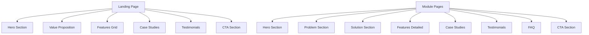
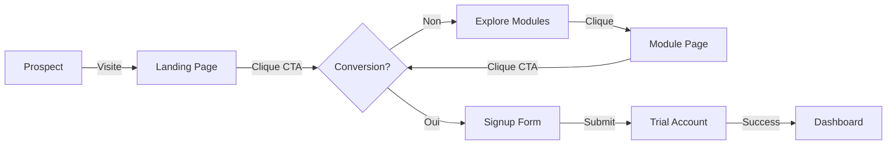
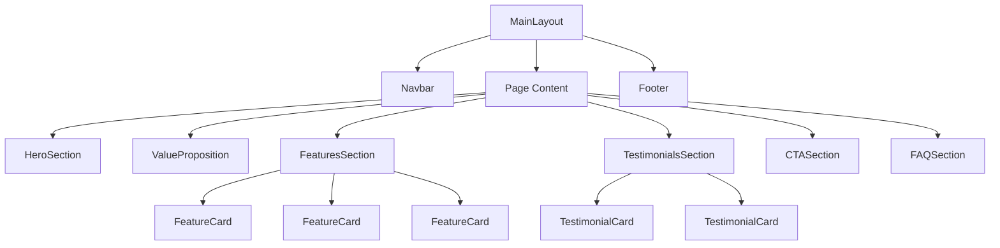

# Design Document - Restructuration de la Vitrine

## Overview

La vitrine restructurée est une plateforme multi-pages optimisée pour la conversion, construite avec Next.js 16, React, Tailwind CSS, Framer Motion et GSAP. Elle suit une stratégie "une idée par page" pour maximiser la clarté et les taux de conversion.

### Objectifs de Design

- **Conversion**: Taux de conversion > 8% sur landing, > 6% sur modules
- **Performance**: Page load time < 2 secondes, Lighthouse > 90
- **Accessibilité**: WCAG 2.1 AA compliant
- **SEO**: Top 10 pour 20+ mots-clés prioritaires
- **Mobile-First**: Expérience optimale sur tous les appareils

### Pages Principales

1. Landing Page (Accueil)
2. Gestion des Employés
3. Gestion des Documents
4. Comptabilité & Paie
5. Marketing Digital
6. Pricing
7. À Propos
8. Blog & Resources

---

## Architecture Technique

### Structure des Dossiers

```
web/src/modules/vitrine/
├── app/
│   ├── page.tsx                 # Landing page
│   ├── employes/
│   │   └── page.tsx            # Gestion employés
│   ├── documents/
│   │   └── page.tsx            # Gestion documents
│   ├── comptabilite/
│   │   └── page.tsx            # Comptabilité & paie
│   ├── marketing/
│   │   └── page.tsx            # Marketing digital
│   ├── pricing/
│   │   └── page.tsx            # Pricing
│   ├── about/
│   │   └── page.tsx            # À propos
│   ├── blog/
│   │   ├── page.tsx            # Blog listing
│   │   └── [slug]/
│   │       └── page.tsx        # Article détail
│   └── layout.tsx              # Layout racine
├── components/
│   ├── layout/
│   │   ├── Navbar.tsx
│   │   ├── Footer.tsx
│   │   └── MainLayout.tsx
│   ├── sections/
│   │   ├── HeroSection.tsx
│   │   ├── ValueProposition.tsx
│   │   ├── FeaturesSection.tsx
│   │   ├── CaseStudiesSection.tsx
│   │   ├── TestimonialsSection.tsx
│   │   ├── FAQSection.tsx
│   │   ├── CTASection.tsx
│   │   └── PricingSection.tsx
│   ├── cards/
│   │   ├── FeatureCard.tsx
│   │   ├── PricingCard.tsx
│   │   ├── TestimonialCard.tsx
│   │   ├── CaseStudyCard.tsx
│   │   └── BlogCard.tsx
│   ├── forms/
│   │   ├── SignupForm.tsx
│   │   ├── DemoForm.tsx
│   │   ├── ContactForm.tsx
│   │   └── NewsletterForm.tsx
│   ├── animations/
│   │   ├── ScrollAnimations.tsx
│   │   ├── ParticleField.tsx
│   │   ├── GradientOrbs.tsx
│   │   └── AnimatedCounter.tsx
│   └── common/
│       ├── Button.tsx
│       ├── Badge.tsx
│       ├── Icon.tsx
│       └── Divider.tsx
├── lib/
│   ├── constants.ts            # Constantes (nav items, etc)
│   ├── content.ts              # Contenu des pages
│   ├── seo.ts                  # Metadata SEO
│   ├── animations.ts           # Configurations animations
│   └── utils.ts                # Utilitaires
├── hooks/
│   ├── useScrollAnimation.ts
│   ├── useDarkMode.ts
│   ├── useIntersectionObserver.ts
│   └── useFormSubmit.ts
├── styles/
│   ├── globals.css
│   ├── animations.css
│   └── tailwind.config.ts
└── public/
    ├── images/
    │   ├── heroes/
    │   ├── features/
    │   ├── testimonials/
    │   └── case-studies/
    └── icons/
```

### Routing Next.js (App Router)

```
/ → Landing Page
/employes → Gestion Employés
/documents → Gestion Documents
/comptabilite → Comptabilité & Paie
/marketing → Marketing Digital
/pricing → Pricing
/about → À Propos
/blog → Blog Listing
/blog/[slug] → Article Détail
```

### Composants Réutilisables

**Hiérarchie des composants:**

```
MainLayout
├── Navbar
├── Page Content
│   ├── HeroSection
│   ├── ValueProposition
│   ├── FeaturesSection
│   │   └── FeatureCard (x3-4)
│   ├── CaseStudiesSection
│   │   └── CaseStudyCard (x3)
│   ├── TestimonialsSection
│   │   └── TestimonialCard (x3-4)
│   ├── FAQSection
│   ├── CTASection
│   └── PricingSection (si applicable)
└── Footer
```

---

## Design System

### Palette de Couleurs

**Primaire:**
- Emerald 500: `#10b981` - CTA principal, accents
- Emerald 600: `#059669` - Hover state
- Emerald 400: `#34d399` - Accents légers

**Secondaire:**
- Cyan 400: `#22d3ee` - Accents, gradients
- Cyan 500: `#06b6d4` - Hover state

**Neutres:**
- Slate 900: `#0f172a` - Texte principal (light mode)
- Slate 950: `#020617` - Fond (dark mode)
- Slate 600: `#475569` - Texte secondaire
- Slate 400: `#94a3b8` - Texte tertiaire
- White: `#ffffff` - Fond (light mode)

**Sémantiques:**
- Success: Emerald 500
- Warning: Amber 500
- Error: Red 500
- Info: Blue 500

### Typographie

**Fonts:**
- Headings: Inter (font-weight: 900, 800, 700)
- Body: Inter (font-weight: 400, 500, 600)
- Mono: JetBrains Mono (code blocks)

**Sizes:**
- H1: 3.5rem (56px) - Landing hero
- H2: 2.25rem (36px) - Section titles
- H3: 1.875rem (30px) - Subsection titles
- H4: 1.5rem (24px) - Card titles
- Body: 1rem (16px) - Texte principal
- Small: 0.875rem (14px) - Texte secondaire
- Tiny: 0.75rem (12px) - Labels, badges

**Line Heights:**
- Headings: 0.95-1.0
- Body: 1.5-1.6
- Tight: 1.2

### Spacing & Grid System

**Spacing Scale (Tailwind):**
- xs: 0.25rem (4px)
- sm: 0.5rem (8px)
- md: 1rem (16px)
- lg: 1.5rem (24px)
- xl: 2rem (32px)
- 2xl: 3rem (48px)
- 3xl: 4rem (64px)
- 4xl: 6rem (96px)

**Grid System:**
- Max-width: 1280px (7xl)
- Columns: 12 (Tailwind default)
- Gutter: 1.5rem (24px)
- Mobile: Full width - 1rem padding

### Composants de Base

#### Button

```typescript
interface ButtonProps {
  variant: 'primary' | 'secondary' | 'outline' | 'ghost';
  size: 'sm' | 'md' | 'lg';
  icon?: React.ReactNode;
  loading?: boolean;
  disabled?: boolean;
  children: React.ReactNode;
  onClick?: () => void;
  className?: string;
}

// Variants:
// primary: bg-emerald-500 hover:bg-emerald-600 text-white
// secondary: bg-slate-100 dark:bg-slate-800 text-slate-900 dark:text-white
// outline: border border-slate-300 dark:border-slate-700 text-slate-900 dark:text-white
// ghost: text-slate-600 dark:text-slate-400 hover:bg-slate-100 dark:hover:bg-slate-800
```

#### Card

```typescript
interface CardProps {
  variant: 'default' | 'elevated' | 'outlined';
  hover?: boolean;
  children: React.ReactNode;
  className?: string;
}

// Variants:
// default: bg-white dark:bg-slate-900 rounded-xl
// elevated: shadow-lg rounded-2xl
// outlined: border border-slate-200 dark:border-slate-800 rounded-xl
```

#### Badge

```typescript
interface BadgeProps {
  variant: 'primary' | 'secondary' | 'success' | 'warning' | 'error';
  size: 'sm' | 'md';
  icon?: React.ReactNode;
  children: React.ReactNode;
}
```

#### Input

```typescript
interface InputProps {
  type: 'text' | 'email' | 'password' | 'number' | 'tel';
  placeholder?: string;
  value?: string;
  onChange?: (e: React.ChangeEvent<HTMLInputElement>) => void;
  error?: string;
  disabled?: boolean;
  icon?: React.ReactNode;
  className?: string;
}
```

---

## Animations & Interactions

### GSAP ScrollTrigger Animations

**Scroll-triggered animations:**

```typescript
// Fade in on scroll
gsap.registerPlugin(ScrollTrigger);
gsap.to('.fade-in', {
  scrollTrigger: {
    trigger: '.fade-in',
    start: 'top 80%',
    end: 'top 20%',
    scrub: 1,
  },
  opacity: 1,
  y: 0,
  duration: 0.8,
});

// Parallax effect
gsap.to('.parallax', {
  scrollTrigger: {
    trigger: '.parallax',
    scrub: 1,
  },
  y: -100,
  duration: 1,
});

// Counter animation
gsap.to('.counter', {
  scrollTrigger: {
    trigger: '.counter',
    start: 'top 80%',
  },
  textContent: 500,
  duration: 2,
  snap: { textContent: 1 },
});
```

### Framer Motion Interactions

**Page transitions:**

```typescript
const pageVariants = {
  initial: { opacity: 0, y: 20 },
  animate: { opacity: 1, y: 0 },
  exit: { opacity: 0, y: -20 },
};

const pageTransition = {
  duration: 0.6,
  ease: [0.22, 1, 0.36, 1], // Custom easing
};
```

**Hover effects:**

```typescript
const hoverVariants = {
  initial: { scale: 1 },
  hover: { scale: 1.05 },
};

const tapVariants = {
  tap: { scale: 0.95 },
};
```

**Stagger animations:**

```typescript
const containerVariants = {
  hidden: { opacity: 0 },
  visible: {
    opacity: 1,
    transition: {
      staggerChildren: 0.1,
      delayChildren: 0.2,
    },
  },
};

const itemVariants = {
  hidden: { opacity: 0, y: 20 },
  visible: { opacity: 1, y: 0 },
};
```

### Micro-interactions

**Button hover:**
- Scale: 1.02
- Shadow: Augmente
- Duration: 300ms

**Card hover:**
- Lift: translateY(-4px)
- Shadow: Augmente
- Duration: 300ms

**Input focus:**
- Border color: Emerald 500
- Shadow: Emerald glow
- Duration: 200ms

**Link hover:**
- Color: Emerald 600
- Underline: Slide in
- Duration: 200ms

---

## Layouts

### Layout Principal (MainLayout)

```typescript
export function MainLayout({ children }: { children: React.ReactNode }) {
  const [isDark, setIsDark] = useState(false);

  return (
    <div className={isDark ? 'dark' : ''}>
      <Navbar isDark={isDark} onToggleDark={() => setIsDark(!isDark)} />
      <main className="min-h-screen">
        {children}
      </main>
      <Footer />
    </div>
  );
}
```

### Layout Pages Modules

**Structure commune:**

```
HeroSection (headline, subheadline, CTA, visuel)
  ↓
ProblemSection (problème du prospect)
  ↓
SolutionSection (comment on résout)
  ↓
FeaturesSection (4 features détaillées)
  ↓
CaseStudiesSection (3 cas d'usage)
  ↓
TestimonialsSection (3-4 avis clients)
  ↓
FAQSection (5-6 questions)
  ↓
CTASection (CTA final)
```

### Layout Blog

**Blog Listing:**
- Grid 3 colonnes (desktop), 1 colonne (mobile)
- BlogCard avec image, titre, excerpt, date, auteur
- Pagination ou infinite scroll
- Filtres par catégorie

**Article Détail:**
- Hero avec image
- Contenu markdown
- Table of contents
- Articles recommandés
- Newsletter signup

---

## Composants Spécifiques

### Navbar

```typescript
interface NavbarProps {
  isDark: boolean;
  onToggleDark: () => void;
}

// Éléments:
// - Logo (avec gradient et animation)
// - Nav links (Fonctionnalités, Tarifs, Témoignages, FAQ)
// - Dark mode toggle
// - Login link
// - CTA button (Essai gratuit)
// - Mobile menu (hamburger)

// Comportements:
// - Sticky on scroll
// - Background blur on scroll
// - Mobile menu animation
// - Active link highlight
```

### HeroSection

```typescript
interface HeroSectionProps {
  headline: string;
  subheadline: string;
  badge?: string;
  ctaPrimary: {
    text: string;
    href: string;
  };
  ctaSecondary?: {
    text: string;
    href: string;
  };
  visual?: React.ReactNode;
  stats?: Array<{
    value: number;
    suffix: string;
    label: string;
    icon: React.ReactNode;
  }>;
}

// Animations:
// - Fade in + slide up on load
// - Parallax on scroll
// - Animated counter for stats
// - Particle field background
```

### FeatureCard

```typescript
interface FeatureCardProps {
  icon: React.ReactNode;
  title: string;
  description: string;
  details?: string[];
  image?: string;
  variant: 'default' | 'highlighted';
}

// Variants:
// default: bg-white dark:bg-slate-900 border
// highlighted: bg-gradient-to-br from-emerald-50 to-cyan-50 dark:from-emerald-900/20 dark:to-cyan-900/20
```

### PricingCard

```typescript
interface PricingCardProps {
  name: string;
  price: number;
  currency: string;
  period: string;
  description: string;
  features: string[];
  cta: {
    text: string;
    href: string;
  };
  highlighted?: boolean;
  badge?: string;
}

// Highlighted variant:
// - Larger scale
// - Shadow effect
// - Badge "POPULAIRE"
// - Different CTA styling
```

### TestimonialCard

```typescript
interface TestimonialCardProps {
  quote: string;
  author: string;
  role: string;
  company: string;
  avatar: string;
  rating: number;
}

// Éléments:
// - Star rating (1-5)
// - Quote text
// - Author info (avatar, name, role, company)
// - Hover effect
```

### CaseStudyCard

```typescript
interface CaseStudyCardProps {
  title: string;
  description: string;
  industry: string;
  metrics: Array<{
    label: string;
    value: string;
  }>;
  image: string;
  link: string;
}
```

### CTASection

```typescript
interface CTASectionProps {
  headline: string;
  subheadline?: string;
  ctaPrimary: {
    text: string;
    href: string;
  };
  ctaSecondary?: {
    text: string;
    href: string;
  };
  background?: 'gradient' | 'solid' | 'image';
}

// Backgrounds:
// gradient: from-emerald-500 to-cyan-500
// solid: bg-slate-900 dark:bg-slate-950
// image: bg-cover with overlay
```

### Footer

```typescript
interface FooterProps {
  isDark?: boolean;
}

// Sections:
// - Logo + description
// - Links (Product, Company, Resources, Legal)
// - Social links
// - Newsletter signup
// - Copyright
```

---

## Data Models

### Page Content Structure

```typescript
interface PageContent {
  id: string;
  slug: string;
  title: string;
  description: string;
  metadata: {
    title: string;
    description: string;
    keywords: string[];
    ogImage: string;
  };
  sections: Section[];
  seo: {
    structuredData: Record<string, any>;
    canonical: string;
  };
}

interface Section {
  id: string;
  type: 'hero' | 'value-prop' | 'features' | 'case-studies' | 'testimonials' | 'faq' | 'cta' | 'pricing';
  content: Record<string, any>;
  animations?: AnimationConfig;
}
```

### Conversion Tracking

```typescript
interface ConversionEvent {
  id: string;
  type: 'signup' | 'demo_request' | 'contact' | 'newsletter';
  page: string;
  timestamp: Date;
  source: string;
  userAgent: string;
  metadata?: Record<string, any>;
}

interface FormSubmission {
  id: string;
  type: 'signup' | 'demo' | 'contact' | 'newsletter';
  email: string;
  name?: string;
  company?: string;
  message?: string;
  timestamp: Date;
  page: string;
}
```

### Blog Content

```typescript
interface BlogPost {
  id: string;
  slug: string;
  title: string;
  excerpt: string;
  content: string; // Markdown
  author: {
    name: string;
    avatar: string;
    bio: string;
  };
  category: string;
  tags: string[];
  image: string;
  publishedAt: Date;
  updatedAt: Date;
  readingTime: number;
  seo: {
    title: string;
    description: string;
    keywords: string[];
  };
}
```

---

## Error Handling

### 404 Page

```typescript
// Affiche message amical
// Propose navigation vers pages principales
// CTA vers homepage
```

### Form Validation

```typescript
interface FormError {
  field: string;
  message: string;
}

// Validation côté client:
// - Email format
// - Required fields
// - Min/max length
// - Custom rules

// Validation côté serveur:
// - Duplicate email check
// - Rate limiting
// - CSRF protection
```

### API Error Handling

```typescript
interface ApiError {
  code: string;
  message: string;
  details?: Record<string, any>;
}

// Fallbacks:
// - Retry logic pour requêtes
// - Graceful degradation
// - User-friendly error messages
```

### Performance Fallbacks

```typescript
// Image lazy loading avec placeholder
// Skeleton loading states
// Progressive enhancement
// Graceful degradation pour animations
```

---

## Testing Strategy

### Unit Tests

**Composants:**
- Button, Card, Badge, Input
- Form validation
- Utility functions

**Exemples:**
- Button renders with correct variant
- Form validation rejects invalid email
- Counter increments correctly

### Integration Tests

**Page flows:**
- Landing page loads and displays all sections
- Signup form submits successfully
- Demo request form sends email
- Newsletter signup works

**Navigation:**
- Navbar links navigate correctly
- Mobile menu opens/closes
- Dark mode toggle works

### E2E Tests (Cypress/Playwright)

**User journeys:**
- Prospect visits landing → scrolls → clicks CTA → signs up
- Prospect visits module page → reads content → requests demo
- Prospect visits pricing → selects plan → starts trial

**Performance:**
- Page load time < 2 seconds
- Lighthouse score > 90
- Core Web Vitals pass

### Visual Regression Tests

**Snapshots:**
- Hero sections
- Feature cards
- Pricing cards
- Testimonials

**Responsive:**
- Mobile (320px)
- Tablet (768px)
- Desktop (1280px)

### SEO Tests

**On-page:**
- Metadata present and correct
- Headings hierarchy valid
- Images have alt text
- Links have descriptive text

**Technical:**
- Sitemap.xml valid
- Robots.txt correct
- Structured data valid (JSON-LD)
- Mobile-friendly

### Accessibility Tests

**WCAG 2.1 AA:**
- Color contrast > 4.5:1
- Keyboard navigation works
- Screen reader compatible
- Focus indicators visible

**Tools:**
- axe DevTools
- WAVE
- Lighthouse Accessibility

### Performance Tests

**Metrics:**
- First Contentful Paint (FCP) < 1.8s
- Largest Contentful Paint (LCP) < 2.5s
- Cumulative Layout Shift (CLS) < 0.1
- Time to Interactive (TTI) < 3.8s

**Tools:**
- Lighthouse
- WebPageTest
- GTmetrix

### Analytics & Conversion Tracking

**Events:**
- Page views
- CTA clicks
- Form submissions
- Scroll depth
- Time on page

**Tools:**
- Google Analytics 4
- Mixpanel
- Hotjar (heatmaps)

---

## Performance Optimizations

### Image Optimization

```typescript
// Next.js Image component
// - Automatic format conversion (WebP)
// - Responsive sizes
// - Lazy loading
// - Placeholder blur

<Image
  src="/hero.jpg"
  alt="Hero"
  width={1200}
  height={600}
  priority={true} // Pour hero
  placeholder="blur"
  blurDataURL="data:image/..."
/>
```

### Code Splitting

```typescript
// Dynamic imports pour sections
const HeroSection = dynamic(() => import('./HeroSection'), {
  loading: () => <Skeleton />,
});

// Route-based code splitting (Next.js automatic)
```

### Lazy Loading

```typescript
// Intersection Observer pour animations
// Lazy load images below fold
// Lazy load videos
```

### Caching Strategy

```typescript
// Static generation (SSG) pour pages
// Incremental Static Regeneration (ISR)
// Client-side caching avec SWR
```

---

## Accessibilité

### ARIA Labels

```typescript
// Navigation
<nav aria-label="Main navigation">
  <a href="/" aria-current="page">Home</a>
</nav>

// Forms
<label htmlFor="email">Email</label>
<input id="email" type="email" aria-required="true" />

// Buttons
<button aria-label="Toggle dark mode">
  <Moon />
</button>
```

### Keyboard Navigation

```typescript
// Tab order correct
// Focus visible
// Escape key closes modals
// Enter key submits forms
```

### Color Contrast

```typescript
// Text on background: > 4.5:1 (AA)
// Large text: > 3:1 (AA)
// UI components: > 3:1 (AA)
```

### Focus States

```typescript
// Visible focus indicator
// Outline: 2px solid emerald-500
// Offset: 2px
```

---

## Prochaines Étapes

1. ✅ Requirements.md (complété)
2. ✅ Design.md (ce document)
3. → Tasks.md (phase suivante)

Le design est maintenant prêt pour la phase de création des tâches d'implémentation.


---

## Architecture Visuelle - Diagrammes

### Structure des Pages



### Flux de Conversion



### Hiérarchie des Composants



### Routing Structure

```mermaid
graph TD
    A[/] -->|Landing| B[Landing Page]
    A -->|Modules| C[/employes]
    A -->|Modules| D[/documents]
    A -->|Modules| E[/comptabilite]
    A -->|Modules| F[/marketing]
    A -->|Info| G[/pricing]
    A -->|Info| H[/about]
    A -->|Content| I[/blog]
    I -->|Article| J[/blog/slug]
```

---

## Design Tokens

### Breakpoints

```typescript
const breakpoints = {
  xs: '320px',   // Mobile small
  sm: '640px',   // Mobile
  md: '768px',   // Tablet
  lg: '1024px',  // Desktop
  xl: '1280px',  // Desktop large
  '2xl': '1536px', // Desktop XL
};
```

### Shadows

```typescript
const shadows = {
  sm: '0 1px 2px 0 rgba(0, 0, 0, 0.05)',
  md: '0 4px 6px -1px rgba(0, 0, 0, 0.1)',
  lg: '0 10px 15px -3px rgba(0, 0, 0, 0.1)',
  xl: '0 20px 25px -5px rgba(0, 0, 0, 0.1)',
  emerald: '0 20px 60px -15px rgba(16, 185, 129, 0.4)',
};
```

### Border Radius

```typescript
const borderRadius = {
  sm: '0.375rem',   // 6px
  md: '0.5rem',     // 8px
  lg: '0.75rem',    // 12px
  xl: '1rem',       // 16px
  '2xl': '1.5rem',  // 24px
  full: '9999px',
};
```

### Transitions

```typescript
const transitions = {
  fast: '150ms cubic-bezier(0.4, 0, 0.2, 1)',
  base: '200ms cubic-bezier(0.4, 0, 0.2, 1)',
  slow: '300ms cubic-bezier(0.4, 0, 0.2, 1)',
  slowest: '500ms cubic-bezier(0.22, 1, 0.36, 1)',
};
```

---

## Responsive Design Strategy

### Mobile-First Approach

```typescript
// Base styles pour mobile
.container {
  padding: 1rem;
  font-size: 1rem;
}

// Tablet et plus
@media (min-width: 768px) {
  .container {
    padding: 2rem;
    font-size: 1.125rem;
  }
}

// Desktop et plus
@media (min-width: 1024px) {
  .container {
    padding: 3rem;
    font-size: 1.25rem;
  }
}
```

### Responsive Components

**Navbar:**
- Mobile: Hamburger menu
- Tablet: Partial nav items
- Desktop: Full nav items

**Grid:**
- Mobile: 1 colonne
- Tablet: 2 colonnes
- Desktop: 3-4 colonnes

**Hero:**
- Mobile: Stacked (image bottom)
- Tablet: Side by side
- Desktop: Full width with parallax

---

## Dark Mode Implementation

### CSS Variables

```typescript
// light.css
:root {
  --bg-primary: #ffffff;
  --bg-secondary: #f8fafc;
  --text-primary: #0f172a;
  --text-secondary: #475569;
  --border: #e2e8f0;
}

// dark.css
:root[data-theme='dark'] {
  --bg-primary: #0f172a;
  --bg-secondary: #1e293b;
  --text-primary: #ffffff;
  --text-secondary: #cbd5e1;
  --border: #334155;
}
```

### Tailwind Dark Mode

```typescript
// tailwind.config.ts
export default {
  darkMode: 'class',
  theme: {
    extend: {
      colors: {
        // Custom colors
      },
    },
  },
};
```

---

## SEO Implementation

### Metadata Structure

```typescript
interface Metadata {
  title: string;           // 50-60 chars
  description: string;     // 150-160 chars
  keywords: string[];      // 3-5 keywords
  ogImage: string;         // 1200x630px
  ogType: string;          // website, article
  canonical: string;       // URL canonique
  robots: string;          // index, follow
  viewport: string;        // responsive
}
```

### Structured Data (JSON-LD)

```typescript
// Organization Schema
{
  "@context": "https://schema.org",
  "@type": "Organization",
  "name": "Leopardo",
  "url": "https://leopardo.com",
  "logo": "https://leopardo.com/logo.png",
  "description": "Plateforme RH complète",
  "sameAs": ["https://twitter.com/leopardo", "https://linkedin.com/company/leopardo"]
}

// Product Schema
{
  "@context": "https://schema.org",
  "@type": "SoftwareApplication",
  "name": "Leopardo RH",
  "description": "Gestion RH complète",
  "applicationCategory": "BusinessApplication",
  "offers": {
    "@type": "Offer",
    "price": "29",
    "priceCurrency": "EUR"
  }
}

// FAQ Schema
{
  "@context": "https://schema.org",
  "@type": "FAQPage",
  "mainEntity": [
    {
      "@type": "Question",
      "name": "Question?",
      "acceptedAnswer": {
        "@type": "Answer",
        "text": "Réponse..."
      }
    }
  ]
}

// Review Schema
{
  "@context": "https://schema.org",
  "@type": "Review",
  "reviewRating": {
    "@type": "Rating",
    "ratingValue": "5",
    "bestRating": "5"
  },
  "author": {
    "@type": "Person",
    "name": "Nom"
  }
}
```

### Sitemap & Robots

```xml
<!-- sitemap.xml -->
<?xml version="1.0" encoding="UTF-8"?>
<urlset xmlns="http://www.sitemaps.org/schemas/sitemap/0.9">
  <url>
    <loc>https://leopardo.com/</loc>
    <priority>1.0</priority>
    <changefreq>weekly</changefreq>
  </url>
  <url>
    <loc>https://leopardo.com/employes</loc>
    <priority>0.8</priority>
    <changefreq>weekly</changefreq>
  </url>
  <!-- ... autres pages ... -->
</urlset>
```

```
# robots.txt
User-agent: *
Allow: /
Disallow: /admin
Disallow: /api

Sitemap: https://leopardo.com/sitemap.xml
```

---

## Monitoring & Analytics

### Events à Tracker

```typescript
// Page views
gtag('event', 'page_view', {
  page_path: '/employes',
  page_title: 'Gestion des Employés',
});

// CTA clicks
gtag('event', 'cta_click', {
  button_text: 'Essai gratuit',
  page: '/employes',
  position: 'hero',
});

// Form submissions
gtag('event', 'form_submit', {
  form_type: 'signup',
  page: '/employes',
});

// Scroll depth
gtag('event', 'scroll_depth', {
  page: '/employes',
  depth: '75%',
});
```

### Conversion Funnels

```
Landing Page (100%)
  ↓
Scroll to CTA (70%)
  ↓
Click CTA (15%)
  ↓
Form View (12%)
  ↓
Form Submit (8%)
  ↓
Signup Complete (8%)
```

---

## Considérations de Sécurité

### Form Security

```typescript
// CSRF Protection
import { csrf } from '@/lib/csrf';

export async function submitForm(formData: FormData) {
  const token = formData.get('csrf_token');
  if (!csrf.verify(token)) {
    throw new Error('Invalid CSRF token');
  }
  // Process form
}

// Input Sanitization
import DOMPurify from 'dompurify';

const sanitized = DOMPurify.sanitize(userInput);
```

### Rate Limiting

```typescript
// Prevent spam
import rateLimit from 'express-rate-limit';

const limiter = rateLimit({
  windowMs: 15 * 60 * 1000, // 15 minutes
  max: 5, // 5 requests per windowMs
});

app.post('/api/forms/submit', limiter, handleSubmit);
```

### HTTPS & Security Headers

```typescript
// next.config.js
export default {
  headers: async () => [
    {
      source: '/:path*',
      headers: [
        {
          key: 'Strict-Transport-Security',
          value: 'max-age=31536000; includeSubDomains',
        },
        {
          key: 'X-Content-Type-Options',
          value: 'nosniff',
        },
        {
          key: 'X-Frame-Options',
          value: 'DENY',
        },
        {
          key: 'X-XSS-Protection',
          value: '1; mode=block',
        },
      ],
    },
  ],
};
```

---

## Considérations de Conformité

### RGPD

```typescript
// Cookie consent
interface CookieConsent {
  analytics: boolean;
  marketing: boolean;
  necessary: boolean; // Always true
}

// Privacy policy
// - Collecte de données
// - Utilisation des données
// - Droits de l'utilisateur
// - Durée de conservation

// Terms of service
// - Conditions d'utilisation
// - Limitation de responsabilité
// - Propriété intellectuelle
```

### Accessibilité

```typescript
// WCAG 2.1 AA Compliance
// - Color contrast: 4.5:1 minimum
// - Keyboard navigation: Tous les éléments accessibles
// - Screen reader: Tous les contenus lisibles
// - Focus indicators: Visibles et clairs
// - Alt text: Pour toutes les images
// - Form labels: Associées aux inputs
```

---

## Maintenance & Updates

### Content Management

```typescript
// Contenu centralisé dans /lib/content.ts
export const pageContent = {
  landing: {
    hero: {
      headline: 'Gérez vos employés...',
      subheadline: 'La plateforme complète...',
    },
    // ...
  },
  employes: {
    // ...
  },
};
```

### Version Control

```
main (production)
  ↑
staging (pre-production)
  ↑
develop (development)
  ↑
feature/* (feature branches)
```

### Deployment

```
1. Push to feature branch
2. Create PR to develop
3. Code review & tests
4. Merge to develop
5. Deploy to staging
6. QA testing
7. Merge to main
8. Deploy to production
```

---

## Conclusion

Ce design document fournit une architecture complète pour la restructuration de la vitrine. Il couvre:

✅ Architecture technique avec Next.js 16
✅ Design system cohérent et scalable
✅ Animations modernes avec GSAP et Framer Motion
✅ Composants réutilisables et bien documentés
✅ Stratégie de conversion optimisée
✅ Performance et accessibilité
✅ SEO et monitoring
✅ Sécurité et conformité

La prochaine phase (Tasks.md) détaillera les tâches d'implémentation spécifiques.


---

## Correctness Properties - Analyse

### Applicabilité de Property-Based Testing

**Conclusion: PBT n'est PAS applicable pour cette vitrine.**

**Raisons:**

1. **Nature du projet**: C'est une vitrine/site marketing, pas une transformation de données ou un algorithme
2. **Type de requirements**: La majorité des critères concernent:
   - Contenu et présentation (UI rendering)
   - Intégration avec services externes (analytics, SEO)
   - Configuration et setup (HTTPS, sitemap)
   - Comportements spécifiques (formulaires, navigation)
3. **Propriétés universelles limitées**: Seul 1 critère sur 39 pourrait être testé comme une propriété (input sanitization)
4. **Meilleure approche**: Example-based tests, visual regression tests, et integration tests

### Stratégie de Test Alternative

Au lieu de property-based testing, nous utiliserons:

1. **Unit Tests** (Jest/Vitest)
   - Composants React
   - Validation de formulaires
   - Utilitaires

2. **Integration Tests** (Cypress/Playwright)
   - Flux utilisateur complets
   - Navigation et routing
   - Soumission de formulaires

3. **Visual Regression Tests** (Percy/Chromatic)
   - Snapshots des pages
   - Responsive design
   - Dark mode

4. **E2E Tests** (Playwright)
   - Parcours de conversion complets
   - Performance et Core Web Vitals
   - Accessibilité

5. **SEO Tests** (Automated)
   - Metadata présente et correcte
   - Structured data valide
   - Sitemap et robots.txt

6. **Accessibility Tests** (axe/WAVE)
   - WCAG 2.1 AA compliance
   - Keyboard navigation
   - Screen reader compatibility

### Exemples de Tests

**Unit Test - Form Validation:**
```typescript
describe('SignupForm', () => {
  it('should reject invalid email', () => {
    const { getByRole } = render(<SignupForm />);
    const input = getByRole('textbox', { name: /email/i });
    fireEvent.change(input, { target: { value: 'invalid' } });
    expect(input).toHaveAttribute('aria-invalid', 'true');
  });
});
```

**Integration Test - Signup Flow:**
```typescript
describe('Signup Flow', () => {
  it('should complete signup successfully', async () => {
    await page.goto('/');
    await page.click('button:has-text("Essai gratuit")');
    await page.fill('input[type="email"]', 'test@example.com');
    await page.fill('input[type="password"]', 'SecurePass123!');
    await page.click('button:has-text("Créer un compte")');
    await expect(page).toHaveURL('/dashboard');
  });
});
```

**Visual Regression Test:**
```typescript
describe('Landing Page', () => {
  it('should match snapshot on desktop', async () => {
    await page.goto('/');
    await expect(page).toHaveScreenshot('landing-desktop.png');
  });
  
  it('should match snapshot on mobile', async () => {
    await page.setViewportSize({ width: 375, height: 667 });
    await page.goto('/');
    await expect(page).toHaveScreenshot('landing-mobile.png');
  });
});
```

**Accessibility Test:**
```typescript
describe('Accessibility', () => {
  it('should have no accessibility violations', async () => {
    await page.goto('/');
    const violations = await axe(page);
    expect(violations).toHaveLength(0);
  });
});
```

**SEO Test:**
```typescript
describe('SEO', () => {
  it('should have required metadata', async () => {
    await page.goto('/employes');
    const title = await page.title();
    const description = await page.getAttribute('meta[name="description"]', 'content');
    expect(title).toBeTruthy();
    expect(description).toBeTruthy();
  });
  
  it('should have valid structured data', async () => {
    await page.goto('/');
    const scripts = await page.$$eval('script[type="application/ld+json"]', els =>
      els.map(el => JSON.parse(el.textContent || '{}'))
    );
    expect(scripts.length).toBeGreaterThan(0);
  });
});
```

---

## Acceptance Criteria Testing Prework Summary

Basé sur l'analyse complète des 39 acceptance criteria:

| Type | Nombre | Exemples |
|------|--------|----------|
| Example-based tests | 28 | Form validation, content checks, feature tests |
| Integration tests | 5 | Performance, uptime, external services |
| Smoke tests | 1 | Lighthouse score |
| Not testable | 4 | Design principles, subjective requirements |
| **Property-based tests** | **0** | N/A |

**Conclusion:** Aucune propriété universelle n'est applicable. Tous les tests seront example-based ou integration-based.

