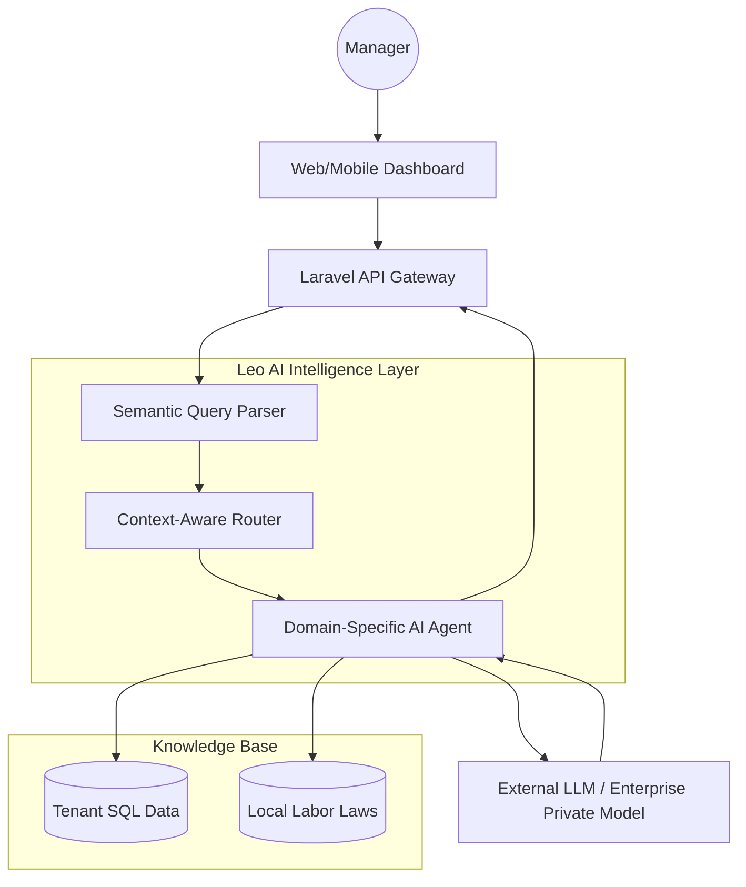

# AI & Workforce Intelligence — Leopardo RH

Leopardo RH integrates a sophisticated AI layer designed to transform raw HR data into actionable workforce intelligence. Our AI strategy focuses on **Augmentation**, not replacement—empowering managers with real-time insights.

## 🤖 Leo AI: The Intelligence Engine

Leo AI is the platform's central intelligence orchestration layer. It bridges the gap between structured HR data (SQL) and natural language interaction.

### Core Capabilities
- **Predictive Payroll:** Analyzes historical attendance and salary patterns to predict end-of-month financial liabilities.
- **Anomaly Detection:** Automatically flags unusual clock-in patterns, potential fraud, or labor law compliance risks.
- **Workforce Summaries:** Generates instant, natural-language executive summaries of department performance.
- **Intelligent Onboarding:** Assists in document OCR and automated data extraction during employee registration.

## 🏗 AI Orchestration Architecture

## 🔒 Privacy & Ethical AI (The "Sentinel" Protocol)

1. **Strict Context Isolation:** Our AI agents are "tenant-locked." Data from Tenant A never leaves its schema and is never used to train or inform queries for Tenant B.
2. **PII Anonymization:** Before any data is sent to an external LLM, sensitive fields (Names, IDs, IBANs) are pseudonymized.
3. **Deterministic Verification:** Every AI-generated financial summary is double-checked by a deterministic rules-based engine to ensure 100% accuracy in payroll.
4. **Human-in-the-loop:** AI-suggested changes to employee records or payroll must be manually approved by an HR Manager.

## 🗺 AI Roadmap

- **Phase 1 (Current):** Semantic search and daily workforce summaries.
- **Phase 2:** Advanced anomaly detection and "Smart Alerts" for managers.
- **Phase 3:** Predictive attrition modeling and career path recommendations.
- **Phase 4:** Voice-driven attendance and task management via Kiosk and Mobile.

---

### Technical Resources
- [Main Architecture](ARCHITECTURE.md)
- [System Design](SYSTEM_DESIGN.md)
- [Data Security Policy](SECURITY.md)
