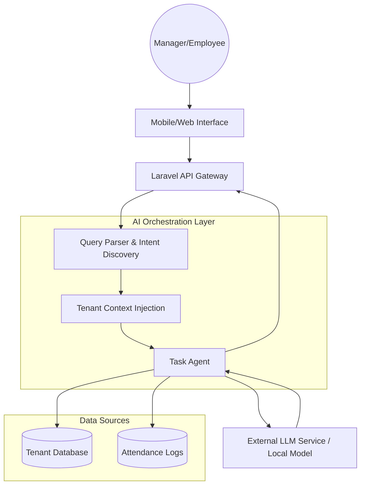

# AI & Smart Workforce Architecture

Leopardo RH integrates an AI-ready infrastructure designed to provide actionable insights for managers and personalized assistance for employees.

## 🤖 The Leo AI Layer

Leo AI is not just a chatbot; it is a workforce intelligence engine that sits on top of our modular API.

### Core AI Features
- **Conversational Queries:** Managers can ask "Who is late today?" or "Summarize the payroll risk for this month" in natural language.
- **Anomaly Detection:** Automated detection of unusual attendance patterns or salary discrepancies.
- **Smart Onboarding:** AI-guided data entry and document verification during employee setup.

## 🏗 AI Orchestration Diagram

## 🔒 Security & Privacy in AI

1. **Context Isolation:** AI agents only receive data from the current tenant's schema. Data from Company A never feeds into queries for Company B.
2. **PII Filtering:** Sensitive personal information (like IBANs or National IDs) is redacted before being processed by any external LLM service.
3. **Auditability:** Every AI-generated action or report is logged in the tenant's audit trail.

## 🗺 AI Roadmap
- **Current:** Placeholder UI and intent analysis framework.
- **Phase 2:** Real-time workforce summary generation.
- **Phase 3:** Automated payroll anomaly detection.
- **Phase 4:** Multi-lingual voice commands for on-site managers.

---

For technical integration details, see [ARCHITECTURE.md](ARCHITECTURE.md).
