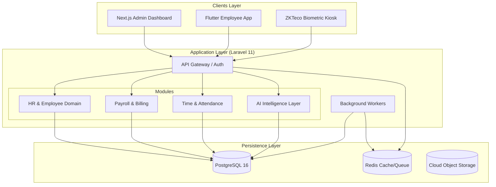
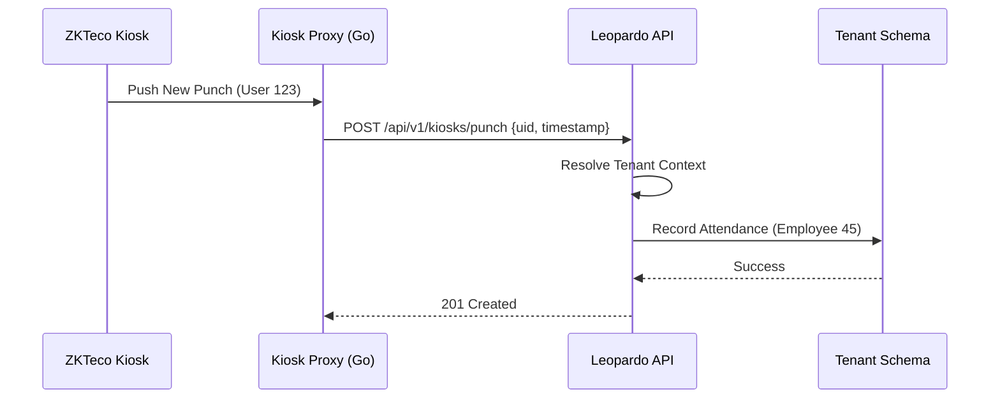

# Technical Architecture — Leopardo RH

Leopardo RH is an enterprise-grade Human Resources Management System (HRMS) designed for global scalability. The platform is built on a **Modular Monolith** foundation, combining the ease of deployment of a monolith with the domain isolation of microservices.

## 🏛 Core Architectural Principles

- **Domain-Driven Design (DDD):** Logic is organized into autonomous modules (HR, Payroll, Attendance).
- **Multi-Tenant First:** Built-in support for both shared and isolated database schemas.
- **Client Agnostic:** A unified RESTful API serving Web, Mobile, and hardware Kiosks.
- **Security by Design:** Row-level security and mandatory tenant context at every layer.

## 🏗 High-Level System Design

## 🌍 Multi-Tenancy Engine

Leopardo RH implements a **Hybrid Multi-Tenancy** strategy, allowing businesses to grow from a shared infrastructure to dedicated enterprise-grade isolation seamlessly.

- **Standard Isolation (Shared):** Data is isolated logically using a mandatory `company_id` and enforced via Laravel Global Scopes.
- **Enterprise Isolation (Schema):** High-compliance tenants receive a dedicated PostgreSQL schema, enforced at the database level via `search_path`.

For a deep dive into our tenancy logic, see [Multi-Tenancy Details](docs/architecture/MULTITENANCY.md).

## 🧩 Domain Modules

1.  **HR Module:** Manages the employee lifecycle, contract types, and organizational hierarchies.
2.  **Attendance Module:** Real-time synchronization with biometric devices (ZKTeco) and GPS-validated mobile check-ins.
3.  **Payroll Module:** Automated calculation engine supporting multi-country regulations (starting with Algeria, Morocco, and France).
4.  **AI Intelligence (Leo AI):** A natural language processing layer for workforce analytics and anomaly detection.

## 🔄 Core Workflows

### Biometric Synchronization Flow

## 🛠 Tech Stack

- **Backend:** Laravel 11, PHP 8.4
- **Database:** PostgreSQL 16 (Managed via Neon.tech)
- **Frontend:** Next.js 14, Tailwind CSS, Shadcn/UI
- **Mobile:** Flutter 3.x, BLoC Architecture
- **Infrastrucutre:** Render (Compute), Redis (Cache), Cloudflare (Edge)
- **Testing:** Pest PHP, Playwright, Flutter Test

---

### Further Reading
- [System Design Deep-Dive](SYSTEM_DESIGN.md)
- [Security & RBAC](docs/security/RBAC_SYSTEM.md)
- [API Documentation](docs/api/README.md)
- [Database Schema (ERD)](docs/dossierdeConception/04_architecture_erd/03_ERD_COMPLET.md)
