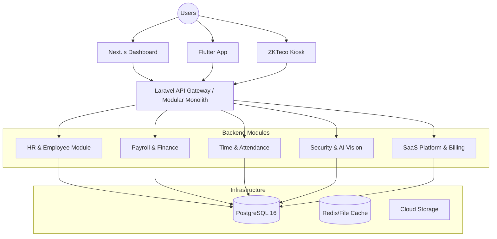
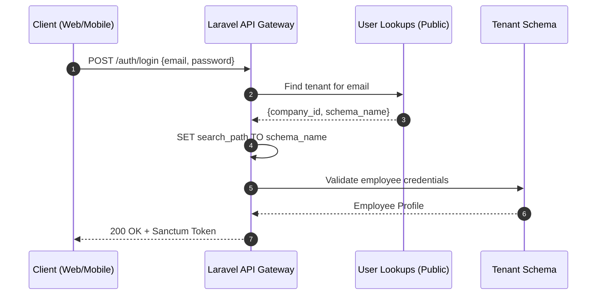

# System Architecture — Leopardo RH

Leopardo RH is an enterprise-grade HR management SaaS designed for SMEs and growing organizations. The platform features a robust multi-tenant architecture, modular backend design, and a unified experience across Web, Mobile, and Kiosk interfaces.

## 🏗 High-Level Architecture

Leopardo RH follows a **Clean Architecture** approach with a modular monolith backend, ensuring scalability, maintainability, and clear separation of concerns.

## 🛠 Tech Stack

- **Backend:** Laravel 11 + PHP 8.4
- **Database:** PostgreSQL 16 (Multi-schema & Shared Isolation)
- **Frontend:** Next.js 14+ (App Router, Tailwind CSS, Shadcn/UI)
- **Mobile:** Flutter (iOS & Android)
- **Infrastructure:** Render (Web Service), Neon.tech (Managed Postgres)
- **Testing:** Pest PHP, Playwright (E2E), Flutter Test

## 🌍 Multi-Tenancy Strategy

Leopardo RH implements a hybrid multi-tenancy model to balance cost-efficiency for SMEs and strict isolation for Enterprise clients.

- **Shared Mode (Standard):** Logical isolation using `company_id` and global scopes within a shared PostgreSQL schema.
- **Schema Mode (Enterprise):** Physical isolation using dedicated PostgreSQL schemas per tenant.

For deep dive into tenancy implementation, see [Multi-Tenancy Documentation](docs/architecture/MULTITENANCY.md).

## 🧩 Modular Domain Design

The backend is organized into autonomous modules, each following the Domain-Driven Design (DDD) principles:

- **Domain:** Pure business logic, entities, and value objects.
- **Application:** Use cases, commands, queries, and DTOs.
- **Infrastructure:** Eloquent models, repositories, and third-party integrations.
- **Interfaces:** API Controllers, Web Controllers, and Resources.

### Core Modules
- **HR Module:** Employee lifecycle, contracts, and department hierarchy.
- **Attendance Module:** Real-time check-in/out, GPS validation, and schedule management.
- **Payroll Module:** Automated salary calculations, deductions, and banking exports.
- **AI Vision:** Integration with ZKTeco devices and RTSP streams for biometric verification.

## 🔄 Core Workflows

### Multi-Tenant Authentication Flow

## 🔒 Security & Data Isolation

- **Tenant Isolation:** Enforced at the middleware level using PostgreSQL `search_path`.
- **RBAC:** Fine-grained role-based access control (Manager, HR, Finance, Supervisor, Employee).
- **Encryption:** Sensitive data (IBAN, National ID) is encrypted at rest using AES-256.

---

For more details on specific components, refer to:
- [API Reference](docs/api/README.md)
- [Security Policy](SECURITY.md)
- [Database Schema (ERD)](docs/dossierdeConception/04_architecture_erd/03_ERD_COMPLET.md)
