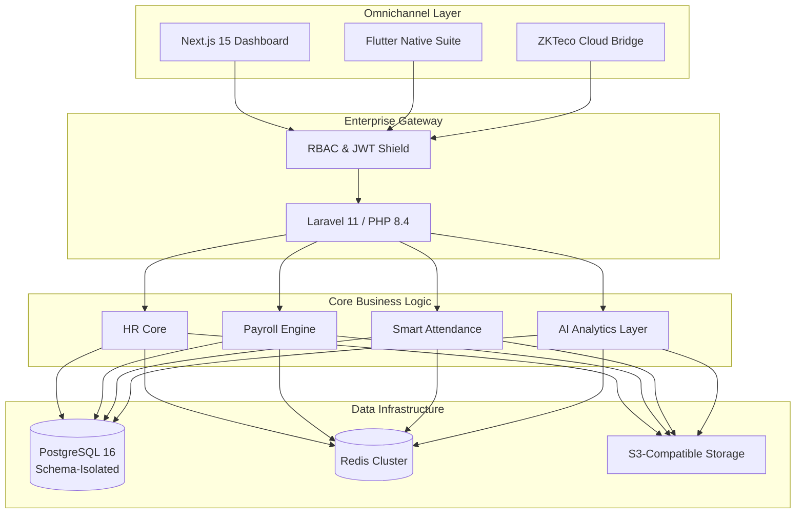

# <p align="center">🐆 Leopardo RH — Enterprise Human Resources OS</p>

<p align="center">
  <b>The modern, AI-native, multi-tenant ecosystem for Human Capital Management in High-Growth Companies.</b>
</p>

<p align="center">
  <a href="https://github.com/kitokoh/leopardo-hr/actions"></a>
  <a href="https://codecov.io/gh/kitokoh/leopardo-hr"></a>
  <a href="docs/security/SECURITY.md"></a>
  <a href="LICENSE"></a>
  
  
  
</p>

---

## 💎 The SaaS Benchmark for Modern Workforce Management

Leopardo RH is not just a tool; it's a **High-Performance Ecosystem** designed to bridge the gap between traditional HR and the AI-driven future. Engineered with a **Modular Monolith** architecture, it provides absolute data isolation, enterprise-grade security, and an unmatched developer experience.

### 🌟 Core Platform Pillars

*   🌍 **True Multi-Tenancy:** Secure schema-based and logical isolation for high-compliance enterprise needs.
*   🤖 **AI-Native Intelligence:** Predictive workforce analytics, automated anomaly detection, and LLM-driven HR insights.
*   💰 **Automated Payroll Engine:** One-click payroll calculation with multi-country regulatory compliance (DZ, MA, FR, TR).
*   🕒 **Smart Attendance & Kiosk:** Real-time biometric verification via ZKTeco and GPS-fenced mobile attendance.
*   📱 **Omnichannel Experience:** Dedicated native mobile apps for Employees, Managers, and Platform Admins.

---

## 🎥 Visual Showcase

### 🚀 Platform Excellence
<p align="center">
  <video src="assets/videos/landing_demo.webm" width="800" controls muted autoplay loop playsinline>
    Your browser does not support the video tag.
  </video>
</p>

### 📱 Mobile Workforce
<p align="center">
  
  
  
</p>

---

## 🏗 System Architecture

Leopardo RH is engineered for 99.9% uptime and extreme data integrity.



---

## 🚀 Live Ecosystem

| Module | Access Point | Technology Stack |
| :--- | :--- | :--- |
| **API Backend** | [Gateway](https://gestionemployerbackend.onrender.com) | Laravel 11, PostgreSQL |
| **Corporate Web** | [Live Preview](https://gestionemployer-backend.vercel.app) | Next.js 15, Tailwind CSS |
| **Admin Panel** | [Dashboard](https://leo-admin.pages.dev) | Cloudflare Pages |
| **Mobile Suite** | [Employee / Manager / Admin](https://github.com/kitokoh/leopardo-hr#mobile-ecosystem) | Flutter 3.x, Riverpod |

---

## 🛠 Developer Hub & Quick Start

Launch a full enterprise environment in under 5 minutes:

```bash
# 1. Clone the repository
git clone https://github.com/kitokoh/leopardo-hr.git && cd leopardo-hr

# 2. Launch Infrastructure with Docker
docker-compose up -d

# 3. Bootstrap the Backend
cd api
composer install
php artisan migrate --seed
```

---

## 📚 Documentation Hub

Explore our comprehensive guides for every role and layer:

| Category | Guides |
| :--- | :--- |
| 🏗 **Architecture** | [System Design](docs/architecture/SYSTEM_DESIGN.md) • [Multi-Tenancy](docs/architecture/MULTITENANCY.md) • [Performance](docs/architecture/PERFORMANCE.md) |
| 🔑 **Security** | [Security Policy](docs/security/SECURITY.md) • [Auth System](docs/security/AUTH_SYSTEM.md) • [RBAC Matrix](docs/security/RBAC_SYSTEM.md) |
| 🤖 **AI & Innovation** | [AI Architecture](docs/ai/AI_ARCHITECTURE.md) • [Predictive Analytics](docs/ai/AI_ARCHITECTURE.md) |
| 🌐 **API & Dev** | [API Reference](docs/api/API_REFERENCE.md) • [OpenAPI Spec](api/openapi.yaml) • [Postman](postman/) |
| 📱 **Interfaces** | [Mobile Setup](docs/mobile/README.md) • [Kiosk Mode](docs/kiosk/README.md) • [Web Admin](docs/admin/README.md) |
| 🚀 **Operations** | [Deployment Guide](docs/deployment/DEPLOYMENT_GUIDE.md) • [Testing Suite](docs/testing/TESTING.md) • [Observability](docs/architecture/OBSERVABILITY.md) |

---

## 🗺 Strategic Roadmap

- [x] **Phase 1:** Core HRM & Multi-tenant isolation.
- [x] **Phase 2:** AI-driven Salary Estimation Layer.
- [ ] **Phase 3:** Public API Ecosystem & SDKs.
- [ ] **Phase 4:** Global Financial Integrations (SEPA/SWIFT).

See the **[Full Public Roadmap](ROADMAP.md)**.

---

## 🛡 Security & Compliance

Leopardo RH is built with a **Security-First** mindset.
- **ISO 27001 Ready Architecture**
- **GDPR & Multi-Region Data Privacy Compliant**
- **Automated Security Scanning (SAST/DAST)**

---

## 🤝 Community & Support

*   **Need Help?** See our [Support Page](SUPPORT.md).
*   **Found a Bug?** Open an [Enterprise Issue](https://github.com/kitokoh/leopardo-hr/issues).
*   **Want to Contribute?** Check our [Contribution Guidelines](CONTRIBUTING.md).

<p align="center">
  Made with Precision by <b>Leopardo RH Engineering Team</b>.
</p>
