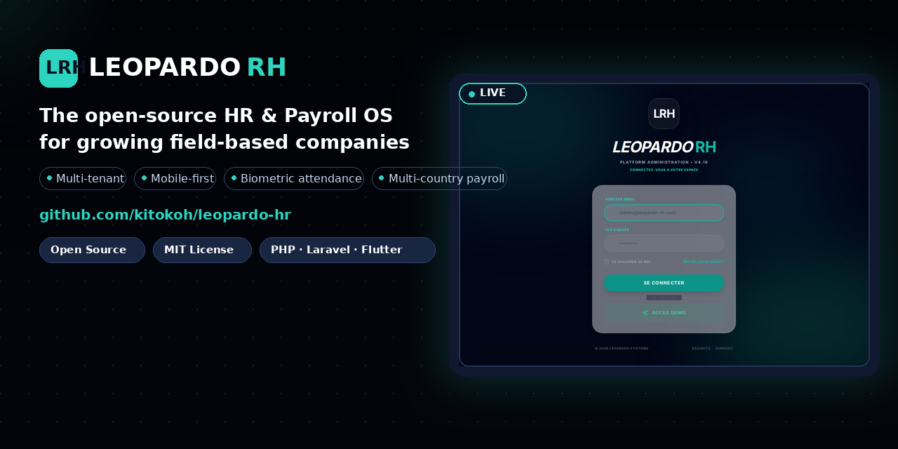
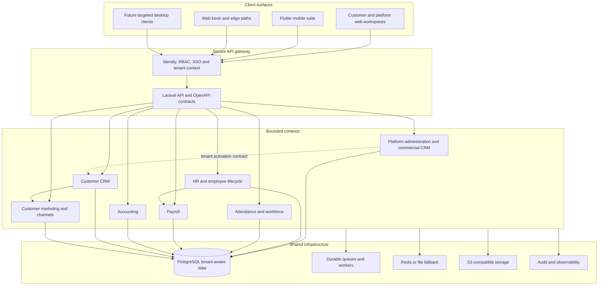

<div align="center">

# Leopardo

### Open-source business operations platform for multi-site and field-based companies

**Leopardo RH** is the core HR and payroll experience inside a broader modular platform for running people, workforce, financial and customer operations.

[](https://github.com/kitokoh/leopardo-hr/actions)
[](https://github.com/kitokoh/leopardo-hr/actions/workflows/coverage-gate.yml)
[](https://github.com/kitokoh/leopardo-hr/releases/latest)
[](LICENSE)
[](SECURITY.md)

**HR & Payroll · Workforce · Accounting · Customer CRM · Marketing · Mobile · Open API**

[Product site](https://kitokoh.github.io/leopardo-hr) · [Documentation](docs/README.md) · [Architecture](ARCHITECTURE.md) · [API](api/openapi.yaml) · [Contributing](CONTRIBUTING.md) · [Security](SECURITY.md)

</div>



---

## What is Leopardo?

Leopardo is an **open-source, self-hostable and SaaS-ready modular platform** for companies that manage people, sites, schedules, customers and operational processes across multiple locations.

Its historical foundation is **Leopardo RH**: employee records, attendance, leave, documents, payroll preparation and workforce operations. The platform now extends that foundation with accounting capabilities, customer relationship management, marketing integrations and an API ecosystem.

The objective is not to force every company into one monolithic workflow. Leopardo provides a shared security, identity, tenant and integration foundation while each business capability remains isolated in its own bounded context.

> **One platform. Several business domains. Explicit boundaries. Secure tenant isolation.**

## Why Leopardo?

Growing companies often coordinate HR, attendance, payroll, customer follow-up and operational communication through disconnected spreadsheets, messaging applications and local tools. Leopardo brings the most important workflows together while keeping the platform modular enough to evolve safely.

| Need | Leopardo capability |
| :--- | :--- |
| Manage employees and contracts | HR records, onboarding, documents, roles and self-service. |
| Coordinate field teams | Mobile attendance, GPS-aware workflows, schedules, approvals and kiosk paths. |
| Prepare payroll | Multi-country payroll rules, validation workflows, payslips and audit trails. |
| Manage company finances | Accounting documents, journals, currencies, VAT and payment-related workflows. |
| Manage customers | Tenant-scoped accounts, contacts, leads, opportunities, activities and tasks. |
| Activate customer marketing | Segments, consent, campaigns and official channel adapters. |
| Integrate existing systems | OpenAPI contracts, SDKs, webhooks and explicit domain events. |
| Operate securely | Multi-tenant isolation, RBAC, audit, secret scanning and security testing. |

## Product map

Leopardo is a platform, not a single undifferentiated application. Each module has a clear owner, data boundary and maturity level.

| Domain | Product surface | Maturity | Responsibility |
| :--- | :--- | :--- | :--- |
| **Leopardo RH** | Web, mobile and admin | Core | Employees, contracts, onboarding, documents, leave and HR workflows. |
| **Payroll** | Web and accounting/RH workflows | Core / evolving | Payroll preparation, country rules, validation and compliant outputs. |
| **Attendance & Workforce** | Mobile, web, kiosk and edge | Core / evolving | Attendance, schedules, sites, GPS-aware and biometric paths. |
| **Accounting** | Admin and finance workspaces | Evolving | Documents, journals, currencies, VAT, payments and reports. |
| **Customer CRM** | Client workspaces and tenant API | Planned V0/V1 | Customer accounts, contacts, leads, opportunities, activities and tasks. |
| **Customer Marketing** | Client workspaces and channel API | Planned V1 | Segments, consent, campaigns, email/SMS and official WhatsApp integration. |
| **Platform Administration** | Leopardo admin | Core | Platform configuration, tenant lifecycle, support and commercial operations. |
| **Commercial CRM** | Leopardo admin only | Existing / evolving | Leopardo’s own acquisition, trials, onboarding and customer conversion pipeline. |
| **Mobile suite** | Flutter apps | Core / evolving | Employee, manager, HR, marketing and platform administration experiences. |
| **Desktop clients** | Future targeted clients | Planned | Only justified desktop workflows such as intensive accounting or kiosk operation. |

### Two CRM contexts — deliberately separate

Leopardo has two CRM contexts that evolve in parallel:

```text
Leopardo Platform Administration
└── Commercial CRM
    ├── MarketingLead
    ├── acquisition pipeline
    ├── trials and onboarding
    └── conversion into a Leopardo customer tenant

Customer Workspace
└── Customer CRM
    ├── customer accounts and contacts
    ├── tenant leads and opportunities
    ├── activities and tasks
    ├── customer marketing
    └── WhatsApp/email/SMS integrations
```

The **commercial CRM belongs to the Leopardo platform administration layer**. The **customer CRM belongs to each customer’s workspace and tenant API**. Their tables, routes, permissions and business rules are not interchangeable.

---

## Core capabilities

### HR and payroll

Leopardo provides a foundation for employee lifecycle management, contracts, onboarding, leave, documents, attendance and payroll preparation. Payroll rules are treated as regulated domain logic: calculations require versioned inputs, validation, traceability and tests rather than opaque business logic inside controllers.

### Workforce and attendance

Field teams can use native mobile applications, GPS-aware attendance workflows and kiosk/edge paths. The platform is designed for multi-site organizations where attendance, schedules and approvals must remain linked to the right company and operational context.

### Accounting

The accounting domain includes documents, currencies, journals, VAT-oriented reporting, payment workflows and reconciliation capabilities. Accounting is a separate bounded context from Payroll and CRM; integrations are made through contracts and audited events rather than direct table access.

### Customer CRM

The customer CRM is designed for each tenant’s own commercial operations. It includes accounts, contacts, leads, pipelines, opportunities, activities, tasks, ownership, imports, exports, dashboards and data quality controls.

The CRM is tenant-scoped by design. A customer tenant cannot access the Leopardo commercial CRM, and one customer tenant cannot access another customer tenant.

### Customer marketing and communications

The marketing context connects to the customer CRM through explicit IDs and versioned events. It can manage segments, campaigns, templates, consent and delivery state. WhatsApp is designed around the official Business/Cloud API or an approved BSP, with signed webhooks, durable inbox storage, idempotent consumers, rate limits and dead-letter handling.

No channel integration is allowed to bypass consent, tenant policies, secret management or audit requirements.

---

## Architecture

Leopardo uses a **modular monolith with Domain-Driven Design**. This keeps deployment and local development manageable while enforcing boundaries that can later support separate services where there is a real operational reason.



### Technical stack

| Layer | Technology |
| :--- | :--- |
| Backend | PHP 8.4, Laravel 12, modular monolith and REST/OpenAPI. |
| Database | PostgreSQL 16 with tenant schema isolation and logical isolation. |
| Queues | Laravel queue abstractions, database-backed fallback and worker supervision. |
| Cache/session | Redis when available, with a documented fallback strategy. |
| Web | Next.js/React and Vue 3 surfaces already present in the repository. |
| Mobile | Flutter and Dart with shared core packages. |
| Desktop | Not enabled globally; Flutter Desktop is the primary candidate for justified workflows. |
| Storage | S3-compatible object storage for controlled documents and exports. |
| Quality | PHPUnit, Playwright, Flutter analysis/tests, PHPStan, OpenAPI checks and security scanners. |

### Data boundaries

Each domain owns its models and rules. Shared code is limited to true platform capabilities such as identity, tenant context, validation primitives, contracts, notifications, audit and observability.

The following boundaries are intentional:

- CRM does not calculate payroll.
- Payroll does not read CRM tables directly.
- Accounting does not become a shared utility folder for all financial logic.
- The commercial CRM does not become the customer CRM.
- Customer marketing does not send messages without consent and channel policy.
- Client applications never connect directly to PostgreSQL.
- Desktop and mobile clients consume the API; they do not duplicate authoritative business rules.

Full details are available in [ARCHITECTURE.md](ARCHITECTURE.md), the [C4 architecture](docs/architecture/C4_ARCHITECTURE.md), the [multi-tenancy guide](docs/architecture/MULTITENANCY.md) and the [ADR index](docs/architecture/adr/).

---

## Security and data protection

Security is a design constraint for every module, not a release-stage checklist. Leopardo combines tenant context, logical scopes, Policies, RBAC, audit, protected secrets and automated analysis.

The security model includes:

- server-derived tenant context rather than client-supplied tenant authority;
- PostgreSQL schema/search-path isolation plus logical `company_id` checks;
- cross-tenant negative tests for reads, writes, jobs, caches, exports and webhooks;
- strict request validation, allowlisted filters and bounded payloads;
- encrypted or minimized sensitive data and masked logs;
- signed webhook verification and replay protection;
- expiring export URLs and controlled file handling;
- CodeQL, secret scanning, dependency audit, Semgrep and OWASP ZAP workflows;
- a private responsible disclosure process in [SECURITY.md](SECURITY.md).

> Security controls reduce risk; they do not replace operational review, backups, monitoring and responsible deployment.

Read the [security policy](SECURITY.md), [authentication documentation](docs/security/AUTH_SYSTEM.md), [RBAC matrix](docs/security/RBAC_SYSTEM.md) and [multi-tenant architecture](docs/architecture/MULTITENANCY.md) before changing authentication, tenant, payroll, payment, webhook or export code.

---

## Project status

Leopardo is an active and evolving open-source project. The repository contains production-oriented foundations, but not every module has the same maturity. Check the relevant specification and pilot status before using a domain for a critical production workflow.

| Status | Meaning |
| :--- | :--- |
| **Core** | Existing capability with dedicated tests and operational ownership. |
| **Evolving** | Existing capability receiving stabilization, convergence or feature work. |
| **Planned** | Architecture and issues prepared; implementation is not yet complete. |
| **Pilot** | Enabled for selected tenants or workflows with explicit monitoring and rollback. |

Current project metrics are maintained in the repository audit and operational documents. They should not be copied into long-lived marketing claims without updating their measurement date.

---

## Live ecosystem

The project currently uses a low-cost, resilient deployment approach. Availability and URLs may change; consult [deployment URLs](docs/ops/DEPLOYMENT_URLS.md) before integrating.

| Surface | Access | Role |
| :--- | :--- | :--- |
| API backend | [gestionemployerbackend.onrender.com](https://gestionemployerbackend.onrender.com) | Laravel API and tenant services. |
| Corporate web | [gestionemployer-backend.vercel.app](https://gestionemployer-backend.vercel.app) | Public/product web surface. |
| Platform admin | [leo-admin.pages.dev](https://leo-admin.pages.dev) | Leopardo platform administration and commercial CRM. |
| Mobile suite | [Mobile documentation](docs/mobile/README.md) | Employee, Manager, HR, Marketing and Platform Admin apps. |
| Product site | [kitokoh.github.io/leopardo-hr](https://kitokoh.github.io/leopardo-hr) | Static project and product landing page. |

Queue and cache behavior is described in [deployment documentation](docs/deployment/DEPLOYMENT_GUIDE.md) and [architecture documentation](ARCHITECTURE.md). Do not assume that a free-tier environment has production-grade availability for a customer deployment.

---

## Quick start

### Requirements

Install Git, Docker Compose, PHP 8.4, Composer, Node.js and Flutter if you intend to work on the corresponding surfaces. The backend and database are the primary starting point.

### Run locally

```bash
git clone https://github.com/kitokoh/leopardo-hr.git
cd leopardo-hr

docker compose up -d

cd api
composer install
php artisan leopardo:migrate --seed
```

Then follow the [development guide](DEVELOPMENT.md) for environment variables, frontend commands, mobile setup, tests and troubleshooting.

> Never use production credentials in local development. Copy `.env.example` where available, keep secrets outside Git and verify the active tenant context in local tests.

---

## API and integrations

The API is the shared contract for web, mobile, desktop and external integrations. The source OpenAPI document is available at [`api/openapi.yaml`](api/openapi.yaml), with additional references in [`docs/api/API_REFERENCE.md`](docs/api/API_REFERENCE.md), [`postman/`](postman/) and [`dev-hub/`](dev-hub/).

API changes must include:

1. strict request validation and stable error responses;
2. authentication, authorization and tenant tests;
3. OpenAPI updates and route/contract parity checks;
4. idempotency for retryable mutations and external events;
5. audit and changelog updates where behavior changes;
6. migration collision checks when database files change;
7. performance evidence for lists, exports, dashboards and timelines.

For WhatsApp, payment providers and other inbound integrations, the endpoint must persist an authenticated event durably before acknowledging successful receipt. Processing happens asynchronously and must be idempotent.

---

## Repository map

```text
leopardo-hr/
├── api/                 Laravel backend and domain modules
├── front/               Web, mobile and future desktop surfaces
├── shared/              Shared contracts, design system and tooling
├── edge/                Edge and kiosk-related components
├── marketing/           Platform marketing and acquisition assets
├── docs/                Architecture, security, specifications and runbooks
├── dev-hub/             Quality gates, scripts and engineering tools
├── assets/              Product visuals and documentation assets
├── postman/             API collections
└── examples/            Integration and usage examples
```

Important entry points:

| Topic | Document |
| :--- | :--- |
| Platform architecture | [ARCHITECTURE.md](ARCHITECTURE.md) |
| Multi-tenancy | [docs/architecture/MULTITENANCY.md](docs/architecture/MULTITENANCY.md) |
| Security | [SECURITY.md](SECURITY.md) and [docs/security/SECURITY.md](docs/security/SECURITY.md) |
| API | [api/openapi.yaml](api/openapi.yaml) and [docs/api/API_REFERENCE.md](docs/api/API_REFERENCE.md) |
| Development | [DEVELOPMENT.md](DEVELOPMENT.md) |
| Contributing | [CONTRIBUTING.md](CONTRIBUTING.md) |
| Specs | [docs/specifications/README.md](docs/specifications/README.md) |
| Testing | [docs/testing/TESTING.md](docs/testing/TESTING.md) |
| Operations | [PILOTAGE.md](PILOTAGE.md) and [docs/ops/DEPLOYMENT_URLS.md](docs/ops/DEPLOYMENT_URLS.md) |
| Mobile | [docs/mobile/README.md](docs/mobile/README.md) |
| Kiosk | [docs/kiosk/README.md](docs/kiosk/README.md) |

---

## Roadmap

The roadmap is deliberately staged to protect reliability while the platform expands.

### Foundation

- Stabilize `main`, CI and deployment observability.
- Keep tenant isolation fail-closed across every endpoint, job, cache, export and webhook.
- Maintain Payroll and Accounting golden tests.
- Keep the commercial CRM in the platform admin and evolve it independently.

### Customer CRM V0

- Deliver the tenant-scoped CRM module and API.
- Add accounts, contacts, leads, pipelines, opportunities, activities and tasks.
- Add strict validation, Policies, audit, import preview and cross-tenant tests.
- Provide a minimal client workspace without changing the platform admin CRM.

### Customer CRM V1

- Add conversion, deduplication, dashboards, consent, segments and campaigns.
- Add official WhatsApp Business, email and additional channel adapters.
- Add durable inbox/outbox, idempotency, queues, rate limits and dead letters.
- Add mobile field workflows and a reversible tenant pilot.

### Platform evolution

- Continue commercial CRM acquisition, trial, onboarding and customer lifecycle features.
- Add public API ecosystem and integrations only after contract governance is reliable.
- Evaluate desktop clients only where measured usage justifies them.
- Expand countries and modules from validated operational evidence, not from feature count alone.

See the [CRM programme](docs/specifications/PROGRAMME-CRM-INTERNE-CLIENT-COMPLET.md), [V0/V1 SQL and integration plan](docs/specifications/PLAN-V0-V1-CRM-CLIENT-SQL-INTEGRATIONS.md) and [refactoring roadmap](docs/architecture/refactoring/ROADMAP-BACKLOG-REFACTORING.md).

---

## Contributing

Before starting significant work, read [`AGENTS.md`](AGENTS.md) and [`.specify/constitution.md`](.specify/constitution.md). Leopardo uses a spec-driven workflow:

```text
specify → clarify → plan → analyze → tasks → implement
```

Every significant change needs a focused issue, a clear owner, a unique branch, tests and a reviewable pull request. Do not implement the same issue on multiple branches. Database work must pass migration collision guards. Security, tenant and payroll changes require negative tests and explicit review.

Please read [CONTRIBUTING.md](CONTRIBUTING.md), follow the [Code of Conduct](CODE_OF_CONDUCT.md) and use [SECURITY.md](SECURITY.md) for private vulnerability reports.

---

## License

Leopardo is released under the [MIT License](LICENSE). It can be self-hosted or adapted into a managed service, subject to the responsibilities described in the security, deployment and operational documentation.

<div align="center">

**Leopardo — one modular platform for people, workforce and customer operations.**

[Star the repository](https://github.com/kitokoh/leopardo-hr) · [Explore the documentation](docs/README.md) · [Join the project](CONTRIBUTING.md)

</div>
