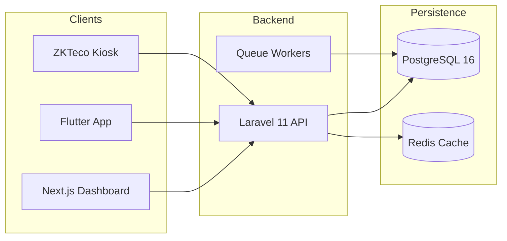

# <p align="center">🐆 Leopardo RH</p>
<p align="center"><b>Modern, AI-Powered, Multi-Tenant HR Management Platform for SMEs</b></p>

<p align="center">
  <a href="https://github.com/kitokoh/leopardo-hr/actions"></a>
  <a href="https://codecov.io/gh/kitokoh/leopardo-hr"></a>
  <a href="SECURITY.md"></a>
  <a href="LICENSE"></a>
  
  
</p>

---

Leopardo RH is an enterprise-grade HR SaaS platform specifically designed to empower SMEs with tools typically reserved for large corporations. From **Automated Payroll** and **Biometric Attendance** to **AI-driven Workforce Insights**, Leopardo RH is the all-in-one cockpit for modern human resources.

## ✨ Key Features

- 🏢 **Multi-Tenant Architecture:** Secure isolation with dedicated schemas for Enterprise clients.
- 🕒 **Smart Attendance:** Real-time check-in/out via Mobile (GPS) and ZKTeco biometric devices.
- 💰 **Automated Payroll:** One-click salary calculations compliant with multi-country regulations (DZ, MA, FR, etc.).
- 🤖 **AI Assistant:** Intelligent workforce summaries and automated anomaly detection.
- 📱 **Unified Experience:** Native Flutter mobile app for employees and a powerful Next.js dashboard for managers.
- 🌍 **International Ready:** Full RTL (Arabic) support and multilingual capabilities (FR, EN, TR).
- 🔒 **Enterprise Security:** AES-256 data encryption at rest and strict RBAC governance.

## 🏗 System Architecture

Leopardo RH is built on a modular monolith foundation, ensuring high performance and ease of deployment.



For a deep dive into our design, see [ARCHITECTURE.md](docs/ARCHITECTURE.md).

## 🚀 Quick Start

Get your development environment up and running in minutes:

```bash
# 1. Clone the repository
git clone https://github.com/kitokoh/leopardo-hr.git && cd leopardo-hr

# 2. Run the bootstrap script
./scripts/bootstrap.sh

# 3. Start the API
cd api && ./vendor/bin/sail up -d
```

Detailed onboarding instructions: [DEVELOPMENT.md](DEVELOPMENT.md).

## 📚 Documentation Hub

| Section | Description |
|---------|-------------|
| 🛠 **[Architecture](docs/architecture/README.md)** | System design, multi-tenancy, and ERD. |
| 🔑 **[Security](SECURITY.md)** | Data protection, encryption, and RBAC matrix. |
| 🌐 **[API Reference](docs/api/README.md)** | OpenAPI specs and Postman collections. |
| 🚀 **[Deployment](docs/DEPLOYMENT_GUIDE.md)** | Render, Vercel, and Docker production guides. |
| 🤝 **[Contributing](CONTRIBUTING.md)** | Developer guidelines and coding standards. |

## 🛠 Tech Stack

- **Backend:** Laravel 11, PHP 8.4, PostgreSQL 16
- **Frontend:** Next.js 14, Tailwind CSS, Shadcn/UI
- **Mobile:** Flutter 3.x, Bloc
- **Infra:** Render, Vercel, Neon.tech
- **Testing:** Pest PHP, Playwright, Flutter Test

## 🗺 Roadmap

- [x] MVP: Core HR & Attendance
- [x] Multi-tenant Schema Isolation
- [x] AI Salary Estimation Layer
- [ ] Phase 2: Full Leave Management & Approvals
- [ ] Phase 3: ZKTeco Cloud Integration
- [ ] Phase 4: Automated Banking Exports (SEPA, etc.)

Check out our [Full Roadmap](docs/ROADMAP.md).

## 🛡 Security & Compliance

We take data privacy seriously. Leopardo RH is designed with **RGPD** and local African regulations (DZ Loi 18-07, MA Loi 09-08) in mind. Sensitive data is always encrypted.

See our [Security Policy](SECURITY.md) for more info.

## 🤝 Community & Support

- **Found a bug?** [Open an issue](https://github.com/kitokoh/leopardo-hr/issues/new?template=bug_report.md)
- **Need help?** Join our [Discord](https://discord.gg/leopardo-rh) or check [SUPPORT.md](SUPPORT.md).
- **Want to contribute?** See [CONTRIBUTING.md](CONTRIBUTING.md).

---

<p align="center">
  Built with ❤️ by the Leopardo RH Team. Ready for the next generation of workforce management.
</p>
