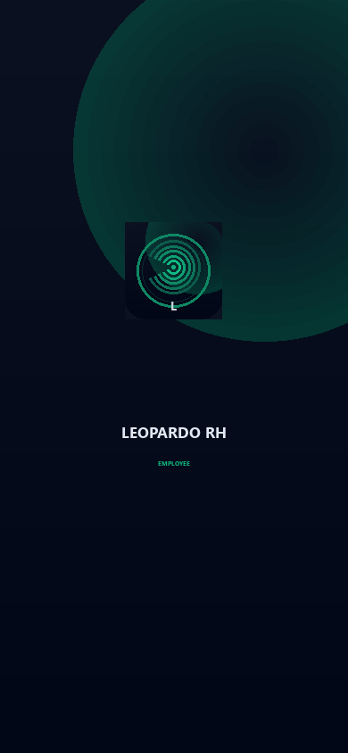
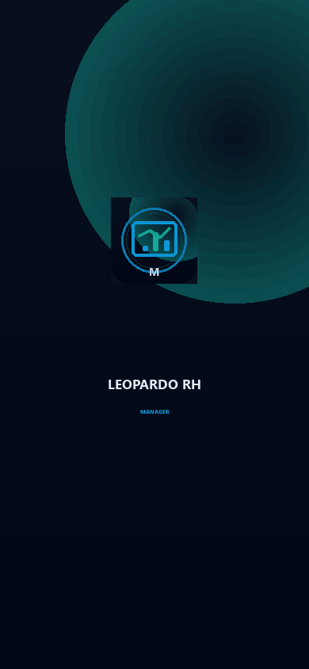
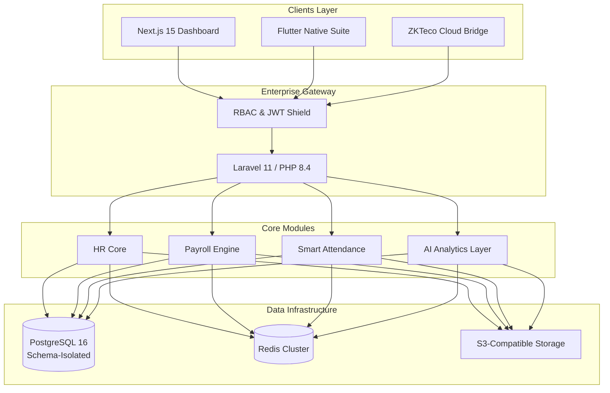

# <p align="center">🐆 Leopardo RH — Enterprise SaaS Human Resources Platform</p>

<p align="center">
  <b>The modern, AI-native, multi-tenant cockpit for Human Capital Management in SMEs and Large Enterprises.</b>
</p>

<p align="center">
  <a href="https://github.com/kitokoh/leopardo-hr/actions"></a>
  <a href="https://codecov.io/gh/kitokoh/leopardo-hr"></a>
  <a href="docs/security/SECURITY.md"></a>
  <a href="LICENSE"></a>
  
  
  
  
</p>

---

## 💎 The Enterprise Choice for HR Digitalization

Leopardo RH is a comprehensive **High-Performance Ecosystem** designed to bridge the gap between traditional HR and the AI-driven future. Built on a robust **Modular Monolith** architecture, it provides absolute data isolation, high scalability, and an unmatched developer experience.

### 🌟 Platform Pillars

*   🌍 **True Multi-Tenancy:** Secure schema-based isolation for high-compliance enterprise needs.
*   💰 **Automated Payroll Engine:** One-click payroll calculation with multi-country regulatory compliance (DZ, MA, FR).
*   🤖 **AI-Native Insights:** Predictive workforce analytics and automated anomaly detection using LLMs.
*   🕒 **Smart Attendance:** Seamless integration with ZKTeco hardware and GPS-fenced mobile attendance.
*   📱 **Omnichannel Access:** Dedicated Native Flutter apps for Employees, Managers, and Platform Admins.

---

## 🎥 Visual Showcase

### 🚀 Platform in Action
<p align="center">
  <video src="assets/videos/landing_demo.webm" width="800" controls muted autoplay loop playsinline>
    Your browser does not support the video tag.
  </video>
</p>

### 📱 Mobile Ecosystem
<p align="center">
  <video src="assets/videos/mobile_demo.webm" width="250" controls muted autoplay loop playsinline>
    Your browser does not support the video tag.
  </video>
</p>
<p align="center">
  
  
  
</p>

### 🔐 Admin Cockpit
<p align="center">
  <video src="assets/videos/admin_demo.webm" width="800" controls muted autoplay loop playsinline>
    Your browser does not support the video tag.
  </video>
</p>

---


Leopardo RH is engineered for 99.9% uptime and extreme data integrity.



---

## 🚀 Experience the Platform

| Module | Access Point | Technology Stack |
| :--- | :--- | :--- |
| **API Backend** | [Gateway](https://gestionemployerbackend.onrender.com) | Laravel 11, PostgreSQL |
| **Corporate Web** | [Live Preview](https://leopardo-hr.vercel.app) | Next.js 15, Tailwind CSS |
| **Admin Panel** | [Dashboard](https://leo-admin.pages.com) | Cloudflare Pages |
| **Mobile 1** | [Download APK](https://appdistribution.firebase.dev/i/e2bde6595da9d96e) | Flutter 3.x, Riverpod |
| **Mobile Tenant** | [Download APK](https://appdistribution.firebase.dev/i/e51102534a5dff22) | Flutter 3.x, Riverpod |
| **Mobile Admin** | [Download APK](https://appdistribution.firebase.dev/i/f37b128b1c89a006) | Flutter 3.x, Riverpod |
---

## 🛠 Quick Start for Developers

Get Leopardo RH running locally in under 5 minutes:

```bash
# 1. Clone the repository
git clone https://github.com/kitokoh/leopardo-hr.git && cd leopardo-hr

# 2. Launch Infrastructure with Docker
docker-compose up -d

# 3. Initialize the Backend
cd api
composer install
php artisan migrate --seed
```

For detailed onboarding, visit the **[Development Guide](docs/deployment/DEPLOYMENT_GUIDE.md)**.

---

## 📚 Documentation Hub

Explore our comprehensive guides for every role:

- 🏗 **[System Architecture](docs/architecture/ARCHITECTURE.md)** — Deep dive into our multi-tenant engine.
- 🔑 **[Security & Compliance](docs/security/SECURITY.md)** — Data protection and RGPD standards.
- 🌐 **[API Reference](docs/api/README.md)** — OpenAPI 3.0 specs and Postman collections.
- 🚀 **[Deployment Guide](docs/deployment/DEPLOYMENT_GUIDE.md)** — Production-ready setup.
- 🤝 **[Developer Hub](docs/contributing/GUIDELINES.md)** — Contribution and coding standards.

---

## 🗺 Strategic Roadmap

- [x] **Phase 1:** Core HRM & Multi-tenant isolation.
- [x] **Phase 2:** AI-driven Salary Estimation Layer.
- [ ] **Phase 3:** Advanced Workforce Forecasting & Recruiting.
- [ ] **Phase 4:** Global Financial Integrations (SEPA/SWIFT).

See the **[Full Public Roadmap](docs/ROADMAP.md)**.

---

## 🛡 Security & Reliability

Leopardo RH is built with a **Security-First** mindset. Every tenant is isolated at the database schema level, ensuring that your data never touches another client's environment.

- **ISO 27001 Ready Architecture**
- **GDPR & African Data Privacy Compliant**
- **Automated Security Scanning (SAST/DAST)**

---

## 💬 Community & Support

*   **Need Help?** See our [Support Page](SUPPORT.md).
*   **Found a Bug?** Open an [Enterprise Issue](https://github.com/kitokoh/leopardo-hr/issues).
*   **Want to Invest?** Contact us at [investors@leopardo-rh.com](mailto:investors@leopardo-rh.com).

<p align="center">
  Made with Precision by <b>Leopardo RH Team</b>.
</p>
