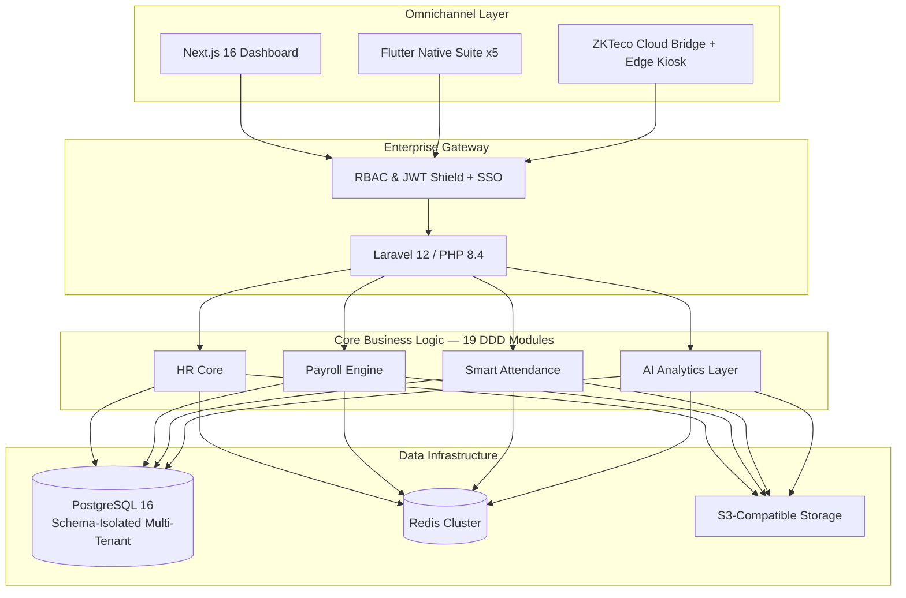

<div align="center">

# 🐆 Leopardo RH

### The open-source, AI-native HR & Payroll OS for high-growth companies

**Multi-tenant · Modular Monolith (DDD) · Biometric Time Tracking · Automated Multi-Country Payroll**

[](https://github.com/kitokoh/leopardo-hr/actions)
[](https://github.com/kitokoh/leopardo-hr/actions/workflows/coverage-gate.yml)
[](https://github.com/kitokoh/leopardo-hr/releases/latest)
[](docs/security/SECURITY.md)
[](LICENSE)

[](https://github.com/kitokoh/leopardo-hr/stargazers)
[](https://github.com/kitokoh/leopardo-hr/forks)
[](https://github.com/kitokoh/leopardo-hr/graphs/contributors)
[](https://github.com/kitokoh/leopardo-hr/commits/main)

**PHP 8.4 · Laravel 12 · PostgreSQL 16 · Redis 7 · Next.js 16 · React 19 · Vue 3 · Flutter · Dart 3 · ZKTeco**

</div>

---

## 📊 Project Stats

> Measured on `main`, 2026-08-11 — see the [full audit](docs/audits/AUDIT.md) for methodology.

| Metric | Value |
| :--- | :--- |
| 🧪 **Backend tests passing** | **1 917** (6 909 assertions, 291 test files) |
| 📈 **Backend code coverage** | **71,11 %** (blocking CI gate ≥ 65 %) |
| 🧩 **DDD business modules** | **19** + shared core (Auth, Tenant, Feature) |
| 🔌 **API endpoints** (OpenAPI spec) | **326** |
| 📱 **Native mobile apps** (Flutter) | **5** + shared design-system package |
| ⚙️ **CI/CD pipelines** | **35** (tests, CodeQL, TruffleHog, OWASP ZAP, Lighthouse, coverage gate…) |
| 📚 **Documentation files** | **518** (architecture, security, specs, runbooks, GTM) |
| 🕒 **Commit history** | **2 622 commits** since Sept 2025 |
| 🌍 **Regions covered** (payroll) | 🇩🇿 🇲🇦 🇫🇷 🇹🇷 (+ growing) |
| 📦 **License** | MIT — open source, self-hostable or SaaS |

> Coverage per module is tracked in CI ([issue #1726](https://github.com/kitokoh/leopardo-hr/issues/1726)) with a **Payroll ≥ 80 %** target.

---

## 💎 Why Leopardo RH?

Traditional HR & payroll suites are either **too expensive** (SAP, Oracle), **not adapted** to
local regulations, or **closed**. Leopardo RH is built for the next wave of high-growth
companies — with absolute data isolation, biometric-grade attendance, automated payroll, and
AI-native insights, **open source from day one**.

- 🌍 **True multi-tenancy** — PostgreSQL `search_path` schema isolation + logical isolation, for high-compliance enterprises.
- 🤖 **AI-native** — predictive workforce analytics, anomaly detection, LLM-driven HR insights.
- 💰 **Automated payroll engine** — one-click multi-country payroll (DZ, MA, FR, TR), validation, PDFs, compliance-first.
- 🕒 **Biometric attendance** — ZKTeco cloud bridge, on-prem edge kiosk, GPS-fenced mobile check-in.
- 📱 **Omnichannel** — 5 native apps (Employee, Manager, HR, Platform Admin) + web dashboards + PWA offline.
- 🔐 **Security-first** — RBAC matrix, SSO SAML/OIDC, encrypted-at-rest sensitive data, GDPR / law 18-07 posture, Secret Scanning + full-history secret audit (Spec A-2).

---

## 🏗 Architecture at a glance

**Modular Monolith (Domain-Driven Design)** — every business capability lives in its own
module under `api/app/Modules/`, with explicit Application / Domain / Infrastructure /
Interfaces layers.



📐 Full architecture: [ARCHITECTURE.md](ARCHITECTURE.md) · [C4 diagrams](docs/architecture/C4_ARCHITECTURE.md) · [Multi-tenancy](docs/architecture/MULTITENANCY.md) · [ADR log](docs/architecture/adr/)

---

## 🚀 Live ecosystem

| Layer | Access | Stack |
| :--- | :--- | :--- |
| **API Backend** | [gestionemployerbackend.onrender.com](https://gestionemployerbackend.onrender.com) | Laravel 12 · PostgreSQL 16 · Redis |
| **Corporate Web** | [gestionemployer-backend.vercel.app](https://gestionemployer-backend.vercel.app) | Next.js 16 · Tailwind |
| **Admin Panel** | [leo-admin.pages.dev](https://leo-admin.pages.dev) | Vue 3 · Cloudflare Pages |
| **Mobile Suite** | [Employee / Manager / HR / Platform Admin](docs/mobile/README.md) | Flutter · Riverpod |

---

## 🧑‍💻 Quick start — full environment in ~5 minutes

```bash
# 1. Clone
git clone https://github.com/kitokoh/leopardo-hr.git && cd leopardo-hr

# 2. Launch infrastructure (PostgreSQL + Redis)
docker-compose up -d

# 3. Bootstrap the backend
cd api
composer install
php artisan leopardo:migrate --seed
```

Developer guide: [DEVELOPMENT.md](DEVELOPMENT.md) · [Conventions](CONVENTIONS.md) · [Makefile](Makefile)

---

## 📚 Documentation hub

| Area | Guides |
| :--- | :--- |
| 🏗 **Architecture** | [System](docs/architecture/ARCHITECTURE.md) · [Multi-tenancy](docs/architecture/MULTITENANCY.md) · [Performance](docs/architecture/PERFORMANCE.md) · [Scaling](docs/architecture/SCALABILITY.md) |
| 🔑 **Security** | [Policy](docs/security/SECURITY.md) · [Auth](docs/security/AUTH_SYSTEM.md) · [RBAC matrix](docs/security/RBAC_SYSTEM.md) · [Secret history](docs/security/HISTORIQUE_SECRETS.md) |
| 🤖 **AI** | [AI architecture](docs/ai/AI_ARCHITECTURE.md) · [Predictive analytics](docs/ai/AI_ARCHITECTURE.md) |
| 🌐 **API & SDK** | [Reference](docs/api/API_REFERENCE.md) · [OpenAPI](api/openapi.yaml) · [Postman](postman/) · [dev-hub](dev-hub/) |
| 📱 **Interfaces** | [Mobile](docs/mobile/README.md) · [Kiosk](docs/kiosk/README.md) · [Admin](docs/admin/README.md) |
| 🚀 **Ops** | [Deployment](docs/deployment/DEPLOYMENT_GUIDE.md) · [Testing](docs/testing/TESTING.md) · [Observability](docs/architecture/OBSERVABILITY.md) |
| 📐 **Specs & project** | [Specifications](docs/specifications/README.md) · [Design dossier](docs/dossierdeConception/README.md) · [Full docs index](docs/README.md) |

---

## 🗺 Roadmap

- [x] **Phase 1** — Core HRM + multi-tenant isolation
- [x] **Phase 2** — AI-driven salary estimation layer
- [x] **Phase 3 (partial)** — OpenAPI spec + JS/Python SDKs + Postman collection
- [ ] **Phase 4** — Public API ecosystem, billing & app marketplace
- [ ] **Phase 5** — Global financial integrations (SEPA / SWIFT / mobile money)
- [x] **v1.0 release** — tag sémantique `v4.24.0` + release notes automatiques via `release.yml` ([issue #1722](https://github.com/kitokoh/leopardo-hr/issues/1722))

Operational reality is tracked in [PILOTAGE.md](PILOTAGE.md) (source of truth, FR).

---

## 🛡 Security & compliance

- ISO 27001-ready architecture, GDPR & law 18-07 (Algeria) posture
- **Automated scanning** : CodeQL · TruffleHog (PR/push + weekly full-history Spec A-2) · OWASP ZAP · Composer audit · Dependency review · Semgrep
- **Responsible disclosure** : [SECURITY.md](SECURITY.md) — private reporting, 72 h ack
- 🔒 **Full git-history secret purge executed 2026-08-11** — post-mortem: [POST_MORTEM_PURGE_2026-08-11.md](docs/security/POST_MORTEM_PURGE_2026-08-11.md)

---

## 🤝 Community & contributing

- **Contribute** : [CONTRIBUTING.md](CONTRIBUTING.md) · [Code of Conduct](CODE_OF_CONDUCT.md)
- **Report a bug** : [Issues](https://github.com/kitokoh/leopardo-hr/issues) — always reference `Closes #X`
- **Security issue** : private disclosure via [SECURITY.md](SECURITY.md)
- **Documentation** : [docs/README.md](docs/README.md) (518 files, FR/EN)

<div align="center">

**Made with precision by the Leopardo RH Engineering Team — open source, forever.**

⭐ Star this repo to support the project ⭐

</div>
