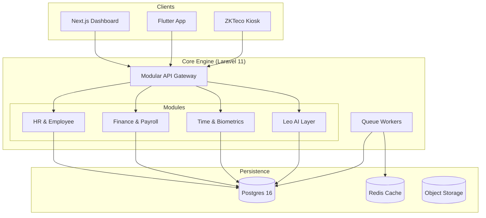

# <p align="center">🐆 Leopardo RH</p>
<p align="center"><b>The Modern, AI-Powered, Multi-Tenant HR Cockpit for SMEs & Enterprise</b></p>

<p align="center">
  <a href="https://github.com/leopardo-rh/leopardo-rh/actions"></a>
  <a href="https://codecov.io/gh/leopardo-rh/leopardo-rh"></a>
  <a href="SECURITY.md"></a>
  <a href="docs/api/README.md"></a>
  <a href="LICENSE"></a>
  
  
</p>

---

Leopardo RH is an enterprise-grade HR SaaS platform specifically designed to empower SMEs with tools typically reserved for large corporations. From **Automated Multi-Country Payroll** and **Biometric Attendance** to **AI-driven Workforce Intelligence**, Leopardo RH provides the ultimate unified experience for modern human resources.

## ✨ Platform Highlights

- 🏢 **Hybrid Multi-Tenancy:** Secure isolation with dedicated PostgreSQL schemas for Enterprise clients and logical isolation for SMEs.
- 🕒 **Smart Attendance:** Real-time check-in/out via Native Mobile (GPS/Biometrics) and direct ZKTeco hardware integration.
- 💰 **Precision Payroll:** One-click salary calculations compliant with multi-country regulations (DZ, MA, FR).
- 🤖 **Leo AI Intelligence:** Natural language workforce summaries, anomaly detection, and predictive analytics.
- 📱 **Unified Ecosystem:** High-performance Next.js Admin Dashboard, Native Flutter Mobile App, and dedicated Kiosk interface.
- 🌍 **Global Ready:** Full RTL (Arabic) support and multilingual capabilities (FR, EN, TR).
- 🔒 **Zero-Trust Security:** AES-256 data encryption at rest, strict RBAC governance, and hardened tenant isolation.

## 🏗 System Architecture

Leopardo RH follows a **Modular Monolith** architecture, ensuring high performance, ease of deployment, and clear domain separation.



For a deep dive into our design, see [ARCHITECTURE.md](ARCHITECTURE.md).

## 🚀 Quick Start for Developers

Get your professional HR environment up and running in minutes:

```bash
# 1. Clone the repository
git clone https://github.com/leopardo-rh/leopardo-rh.git && cd leopardo-rh

# 2. Run the automated bootstrap script
./scripts/bootstrap.sh

# 3. Launch the API & Web Dashboard
cd api && ./vendor/bin/sail up -d
```

Detailed onboarding instructions: [QUICKSTART.md](QUICKSTART.md).

## 📚 Documentation Hub

| Section | Description |
|---------|-------------|
| 🛠 **[Architecture](ARCHITECTURE.md)** | System design, modular monolith patterns, and ERD. |
| 🧩 **[Multi-Tenancy](docs/architecture/MULTITENANCY.md)** | Hybrid isolation strategy and schema management. |
| 🤖 **[AI Intelligence](AI_ARCHITECTURE.md)** | Leo AI orchestration and workforce analytics. |
| 🔑 **[Security & RBAC](SECURITY.md)** | Data protection, encryption, and the 7-role permission matrix. |
| 🌐 **[API Reference](docs/api/README.md)** | OpenAPI specs, Postman collections, and SDK examples. |
| 🚀 **[Deployment](docs/deployment/DEPLOYMENT_GUIDE.md)** | Render, Vercel, and Docker production production guides. |
| 🤝 **[Contributing](CONTRIBUTING.md)** | Developer guidelines, coding standards, and PR process. |

## 🛠 Enterprise Tech Stack

- **Backend:** Laravel 11 (PHP 8.4), PostgreSQL 16, Redis
- **Frontend:** Next.js 14, Tailwind CSS, Shadcn/UI, Headless UI
- **Mobile:** Flutter 3.x, BLoC, Clean Architecture
- **Infrastructure:** Render (Web/API), Neon.tech (Postgres), Cloudflare (CDN)
- **Quality:** Pest PHP, Playwright, Flutter Test, SonarCloud

## 🗺 Strategic Roadmap

- [x] **Phase 1:** Core HR, Attendance & Multi-tenant Schema Isolation.
- [x] **Phase 2:** Leo AI Intelligence Layer & Multi-Country Payroll (DZ/MA).
- [ ] **Phase 3:** Advanced Leave Management & Automated Banking Exports (SEPA/Swift).
- [ ] **Phase 4:** ZKTeco Cloud Sync & Predictive Attrition Analytics.

Check out our [Full Roadmap](docs/REFERENTIEL_PRODUIT/ROADMAP.md).

## 🤝 Community & Support

- **Found a bug?** [Open a Bug Report](https://github.com/leopardo-rh/leopardo-rh/issues/new?template=bug_report.md)
- **Feature request?** [Propose a Feature](https://github.com/leopardo-rh/leopardo-rh/issues/new?template=feature_request.md)
- **Need help?** See our [SUPPORT.md](SUPPORT.md).

---

<p align="center">
  Built with ❤️ for the future of workforce management.
  <br>
  <b>Leopardo RH: Empowering Global SMEs through Intelligence.</b>
</p>
