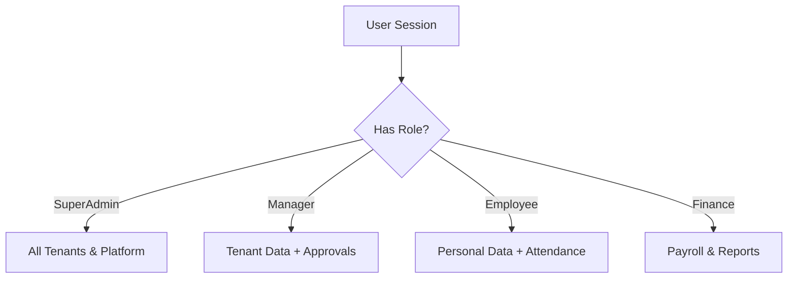
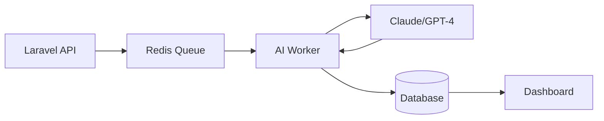

# Visual Assets Directory — Leopardo RH

This directory contains high-quality visual assets for documentation, marketing, and developer onboarding.

## 📁 Directory Structure

- 🖼 **[/screenshots/](screenshots/)** — High-resolution captures of the Web and Mobile interfaces (includes `web_dashboard/`, `web_showcase/`, `admin/`, `mobile_employee/`, `mobile_manager/`, and `marketing/`).
- 🎞 **[/videos/](videos/)** — Product demos and feature walkthroughs.

> Sequence/class/state diagrams (Mermaid Markdown) live in
> [`docs/dossierdeConception/19_diagrammes_uml/`](../docs/dossierdeConception/19_diagrammes_uml/) — that
> is the canonical location. There is no `/diagrams/` or `/banners/` subfolder here; the
> two quick reference diagrams below live directly in this README.

## 🏗 Key Diagrams

### RBAC System Flow

### AI Orchestration

## 📸 Branding Assets

Official icons and splash screens can be found in `docs/assets/mobile-branding/`.
