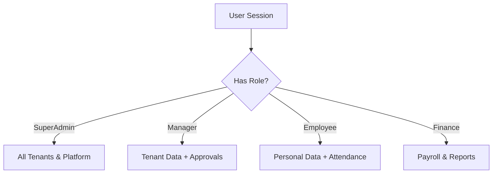
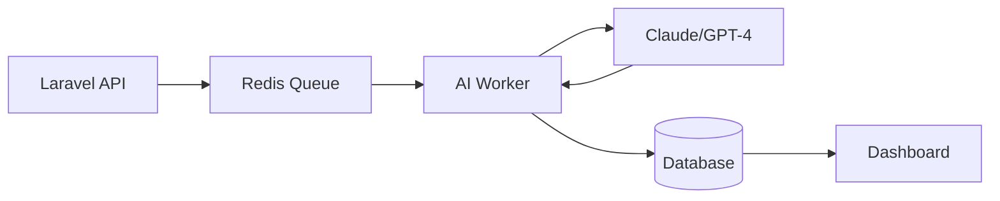

# Visual Assets Directory — Leopardo RH

This directory contains high-quality visual assets for documentation, marketing, and developer onboarding.

## 📁 Directory Structure

- 🖼 **[/screenshots/](screenshots/)** — High-resolution captures of the Web and Mobile interfaces.
- 📊 **[/diagrams/](diagrams/)** — Architecture, RBAC, and Workflow diagrams (SVG/PNG).
- 🎞 **[/videos/](videos/)** — Product demos and feature walkthroughs.
- 🏴 **[/banners/](banners/)** — Repository banners and social preview images.

## 🏗 Key Diagrams

### RBAC System Flow

### AI Orchestration

## 📸 Branding Assets

Official icons and splash screens can be found in `docs/assets/mobile-branding/`.
