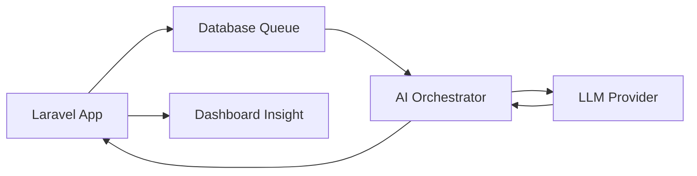

# AI & Intelligent Automation — Leopardo RH

Leopardo RH integrates Artificial Intelligence at its core to transform traditional HR data into actionable business intelligence. Our AI architecture is designed for privacy, accuracy, and enterprise scale.

## 🧠 AI Capabilities

The platform implements three families of capability. Only the first one calls a
language model; the other two are deterministic SQL and **work with no provider
configured at all** — they are listed here because the product surfaces them
together, not because they are "AI".

### 1. Conversational assistant (LLM, tool-calling)
- **Mechanism:** `App\AI\Orchestrator` runs a bounded tool-calling loop (max 4 exchanges) over a
  role-filtered tool registry. Read tools query the tenant database; write tools require explicit
  human confirmation before any effect.
- **Outcome:** Managers and employees can ask operational questions ("how many active employees?",
  "who is absent this week?") and have them answered from live data, with every tool execution audited.
- **Requires a provider:** see *Activation* below. Without one, the assistant is disabled by design.

### 2. Attendance anomaly detection (deterministic)
- **Mechanism:** Compares attendance logs against schedules over a rolling window (SQL).
- **Outcome:** Flags missing check-ins or absences without an approved leave request.
- **No model involved:** pure rules over tenant data.

### 3. Workforce report workflows (deterministic)
- **Mechanism:** `WeeklyReportWorkflow` / `PreparePayrollWorkflow` aggregate headcount, absences,
  anomalies and payroll readiness with SQL and emit a templated summary sentence.
- **Outcome:** Ready-to-read weekly and pre-payroll reports, usable without any AI provider.

> **What is *not* provided:** the absenteeism and turnover "predictions" are moving averages with
> fixed seasonal multipliers, **not** statistical or machine-learning models. They are exposed as
> `AbsenteeismPredictor` / `TurnoverPredictor` under `App\AI\Predictions` — read the code before
> quoting them as forecasting.

## 🆓 Free setup guide

For a turnkey free stack (Groq free tier for the model and speech-to-text, `edge-tts`
for French voice output), see **[INSTALLATION_GRATUITE.md](INSTALLATION_GRATUITE.md)**.

## ⚙️ Activation

The assistant is **off by default** (fail-closed). All of the following are required:

| Gate | Where | Default |
| :--- | :--- | :--- |
| `AI_ENABLED=true` | API environment (`config/ai.php`) | `false` → `403 AI_FEATURE_DISABLED` |
| `leo_ai` feature flag | tenant (`companies.features`) | `false` |
| `ai_cloud_allowed` feature flag | tenant (GDPR, `AiCloudPolicy`) | `false` → cloud prompts refused |
| Tool registry seeded | `shared_tenants.ai_tool_registry` | seeded by `php artisan db:seed` |
| `AI_LLM_DRIVER` + provider key | `AI_LLM_DRIVER=openai\|groq\|claude` + `OPENAI_API_KEY`/`GROQ_API_KEY`/`ANTHROPIC_API_KEY` | `fake` outside production (echoes the prompt, no tool calls) |

Without a seeded tool registry the model receives **zero** tools, whatever the provider.
Run `php artisan db:seed` (or `leopardo:migrate --seed`) to populate it.

## 🏗 AI Orchestration Architecture

Our AI layer is decoupled from the main application logic to allow for easy model swapping and scaling.

- **Data Privacy:** PII is redacted from conversation text before any prompt leaves for a cloud
  provider, and cloud dispatch requires the opt-in tenant flag `ai_cloud_allowed`.
- **Async Execution:** `ProvisionDemoTenantJob` and export jobs run on the queue; the chat loop
  itself is synchronous per request and bounded by a token budget.

## 🛠 Tech Stack

- **Providers:** OpenAI (`gpt-4o`), Groq (`openai/gpt-oss-120b`, free tier), Anthropic
  (`claude-sonnet-4-20250514`) — plain HTTP adapters behind the `App\AI\LLMClient` interface
  (`App\AI\Providers\*`). No LangChain.
- **Queue:** Laravel's database queue (`QUEUE_CONNECTION=database`). Horizon is **not** installed.
- **Local analysis:** none — there is no Python component in this repository.

## 🚀 Future Roadmap (AI)

- [ ] **Voice Command Interface:** mobile app support for "Check my remaining leave balance."
- [ ] **Resume Screening:** automated matching of candidates to internal job openings.
- [ ] **Sentiment Analysis:** analysing anonymous employee feedback to gauge organisational health.

---

*See also:*
- [System Architecture](../architecture/ARCHITECTURE.md)
- [Attendance Documentation](../kiosk/README.md)
