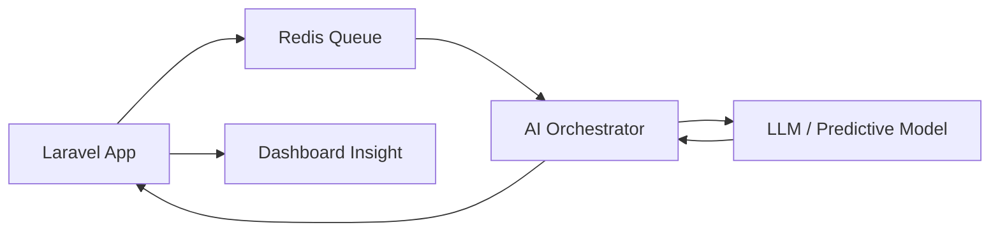

# AI & Intelligent Automation — Leopardo RH

Leopardo RH integrates Artificial Intelligence at its core to transform traditional HR data into actionable business intelligence. Our AI architecture is designed for privacy, accuracy, and enterprise scale.

## 🧠 AI Capabilities

The platform currently implements three primary AI-driven workflows:

### 1. Intelligent Anomaly Detection
- **Mechanism:** Analyzes attendance logs against historical patterns and shift schedules.
- **Outcome:** Flags suspicious check-ins, frequent tardiness, or unusual overtime before they impact payroll.

### 2. Predictive Payroll Analytics
- **Mechanism:** Uses regression models to forecast next month's total labor costs.
- **Outcome:** Provides management with early warnings on budget variances.

### 3. Automated HR Summaries (NLP)
- **Mechanism:** Aggregates complex employee performance and attendance data into natural language reports.
- **Outcome:** Enables managers to understand workforce trends without digging through spreadsheets.

## 🏗 AI Orchestration Architecture

Our AI layer is decoupled from the main application logic to allow for easy model swapping and scaling.

- **Data Privacy:** Personal Identifiable Information (PII) is anonymized before being processed by external LLM providers.
- **Async Execution:** AI tasks are never blocking; they run in the background to ensure a snappy user experience.

## 🛠 Tech Stack

- **Models:** GPT-4o / Claude 3.5 Sonnet (via API)
- **Local Analysis:** Custom Python-based statistical scripts for basic trend analysis.
- **Infrastructure:** Laravel Horizon for managing AI task queues.

## 🚀 Future Roadmap (AI)

- [ ] **Voice Command Interface:** Mobile app support for "Check my remaining leave balance."
- [ ] **Resume Screening:** Automated matching of candidates to internal job openings.
- [ ] **Sentiment Analysis:** Analyzing anonymous employee feedback to gauge organizational health.

---

*See also:*
- [System Design](SYSTEM_DESIGN.md)
- [Attendance Documentation](../kiosk/README.md)
