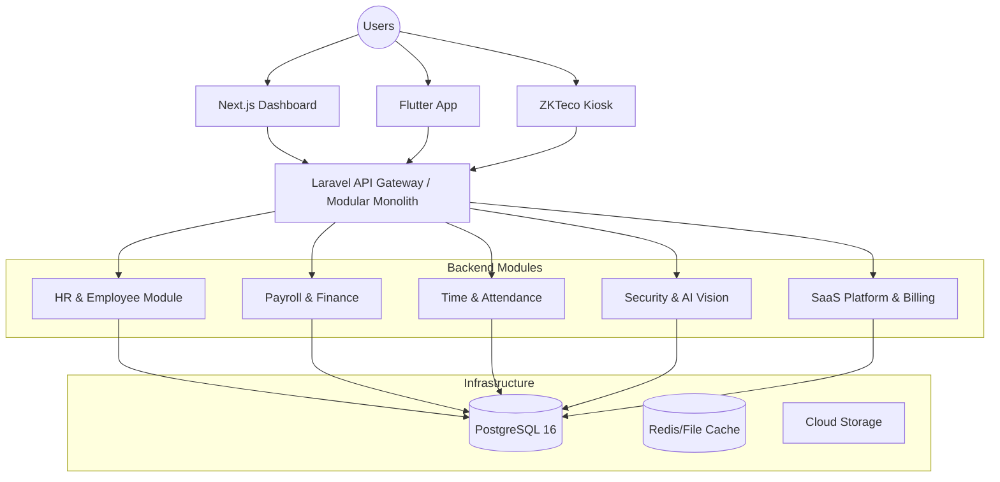

# System Architecture — Leopardo RH

Leopardo RH is an enterprise-grade HR management SaaS designed for SMEs and growing organizations. The platform features a robust multi-tenant architecture, modular backend design, and a unified experience across Web, Mobile, and Kiosk interfaces.

## 🏗 High-Level Architecture

Leopardo RH follows a **Clean Architecture** approach with a modular monolith backend, ensuring scalability, maintainability, and clear separation of concerns.



## 🏰 The Modular Monolith Approach

Leopardo RH is architected as a **Modular Monolith**. This strategy provides the benefits of microservices (clear boundaries, domain isolation) with the operational simplicity of a single deployment unit.

### Why Modular Monolith?
- **Clear Boundaries:** Each business domain is isolated, preventing "spaghetti code."
- **Simplified Deployment:** One CI/CD pipeline, one unit of scale.
- **Reduced Latency:** Domain communication happens in-process rather than over the network.
- **Scalability:** Modules can be extracted into microservices if needed in the future.

## 🧩 Module Structure (DDD)

The backend is organized into autonomous modules under `api/app/Modules/`, each following the **real, current** internal structure (see `api/ARCHITECTURE.md` for the authoritative decision tree and per-module status table in `docs/ARCHITECTURE_STATUS.md`):

```text
Modules/<Name>/
├── Application/
│   ├── Actions/        # Use cases (1 action = 1 execute() method)
│   └── DTOs/           # Internal transfer objects
├── Domain/
│   ├── Models/         # Eloquent domain entities
│   ├── Exceptions/      # Business/domain exceptions
│   └── Contracts/      # Domain interfaces
├── Infrastructure/
│   └── Services/       # External integrations, technical implementations
├── Interfaces/
│   └── Api/V1/         # Controllers + Requests + Resources
└── Providers/           # Module ServiceProvider
```

### Domain Boundaries
1. **Identity & Access:** Multi-tenant authentication and RBAC (`Core/Auth`, `Core/Tenant`).
2. **Core HRM:** Employee lifecycle and organizational structure (`Modules/HR`).
3. **Attendance Engine:** Real-time tracking with geofencing and biometrics (`Modules/Attendance`, `Modules/SmartAttendance`, `Modules/Cameras`).
4. **Payroll Processor:** Multi-country compliant salary calculations (`Modules/Payroll`, `Modules/Billing`).
5. **AI Insights:** LLM-driven forecasting and anomaly detection (`app/AI/`).

### Cross-Module Communication

Modules communicate via **Events** to maintain loose coupling — they never import each other's classes directly.

**Example:**
1. `Modules/Attendance` records a check-in.
2. It dispatches an `EmployeeCheckedIn` event.
3. `Modules/Payroll` listens and updates the month's working hours.
4. `Modules/Notification` listens and pushes a notification to the Manager.

## 🌍 Multi-Tenancy Strategy

Leopardo RH implements a **Hybrid Multi-Tenancy** model:

- **Standard Isolation:** Logical isolation within the `shared_tenants` schema using `company_id`.
- **Enterprise Isolation:** Physical isolation using dedicated PostgreSQL schemas per tenant for maximum security and compliance.

For detailed implementation, see [Multi-Tenancy Documentation](MULTITENANCY.md).

## 🔄 Core Data Workflows

### Attendance Punch Workflow
1. **Capture:** Mobile (GPS) or Kiosk (Biometric).
2. **Validate:** Geofence check or template matching.
3. **Ingest:** API processes payload and writes to `attendance_logs`.
4. **Analyze:** Background jobs update daily summaries and flag anomalies.
5. **Report:** Real-time visibility in Manager and Platform Admin dashboards.

## 🛠 Tech Stack Rationale

- **Laravel 11 / PHP 8.4:** Robust ecosystem for rapid enterprise development.
- **PostgreSQL 16:** Advanced JSONB support and schema-based multi-tenancy.
- **Redis:** High-speed queue and cache management.
- **Next.js 16:** Server-side rendering for optimal dashboard performance (`front/web`, deployed on Vercel).
- **Vue 3 / Vite:** Platform admin dashboard (`front/admin-dashboard`).
- **Flutter:** Single codebase for native-performance mobile apps (`front/mobile_apps/*`).

---

For deeper dives, see:
- [C4 Architecture Diagrams](C4_ARCHITECTURE.md) — context, containers, components
- [Multi-Tenancy Deep Dive](MULTITENANCY.md)
- [Performance Strategy](PERFORMANCE.md)
- [Scalability](SCALABILITY.md)
- [ADR Registry](adr/README.md) — structuring decisions
- [API Reference](../api/API_REFERENCE.md)
- [`api/ARCHITECTURE.md`](../../api/ARCHITECTURE.md) — backend decision tree, conventions, and migration TODOs (authoritative for backend internals)
