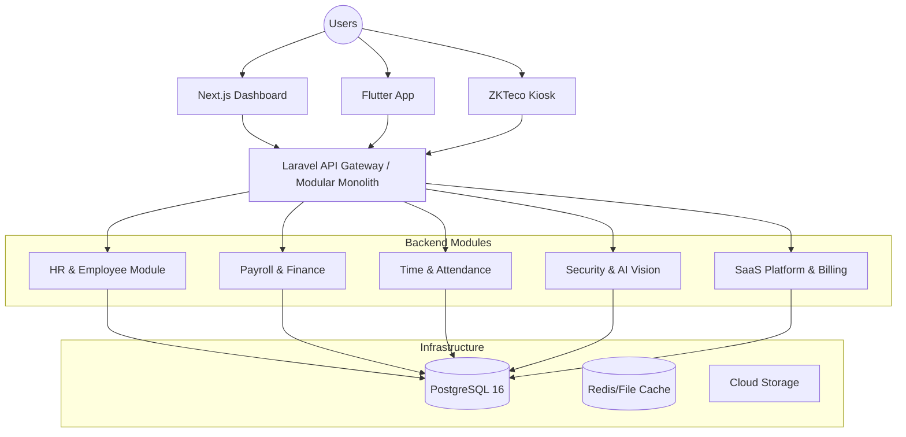

# System Architecture — Leopardo RH

Leopardo RH is an enterprise-grade HR management SaaS designed for SMEs and growing organizations. The platform features a robust multi-tenant architecture, modular backend design, and a unified experience across Web, Mobile, and Kiosk interfaces.

## 🏗 High-Level Architecture

Leopardo RH follows a **Clean Architecture** approach with a modular monolith backend, ensuring scalability, maintainability, and clear separation of concerns.

## 🧩 Modular Domain Design (DDD)

The backend is organized into autonomous modules, each following Domain-Driven Design (DDD) principles:

- **Domain Layer:** Contains pure business logic, entities, value objects, and domain events.
- **Application Layer:** Orchestrates use cases, commands, and queries.
- **Infrastructure Layer:** Handles database persistence (Eloquent), external integrations, and file storage.
- **Interface Layer:** Manages API controllers, DTOs, and resource transformations.

### Domain Boundaries
1.  **Identity & Access:** Multi-tenant authentication and RBAC.
2.  **Core HRM:** Employee lifecycle and organizational structure.
3.  **Attendance Engine:** Real-time tracking with geofencing and biometrics.
4.  **Payroll Processor:** Multi-country compliant salary calculations.
5.  **AI Insights:** LLM-driven forecasting and anomaly detection.

## 🌍 Multi-Tenancy Strategy

Leopardo RH implements a **Hybrid Multi-Tenancy** model:

-   **Standard Isolation:** Logical isolation within the `shared_tenants` schema using `company_id`.
-   **Enterprise Isolation:** Physical isolation using dedicated PostgreSQL schemas per tenant for maximum security and compliance.

For detailed implementation, see [Multi-Tenancy Documentation](MULTITENANCY.md).

## 🔄 Core Data Workflows

### Attendance Punch Workflow
1.  **Capture:** Mobile (GPS) or Kiosk (Biometric).
2.  **Validate:** Geofence check or template matching.
3.  **Ingest:** API processes payload and writes to `attendance_logs`.
4.  **Analyze:** Background jobs update daily summaries and flag anomalies.
5.  **Report:** Real-time visibility in Manager and Platform Admin dashboards.

---

For deeper dives, see:
- [System Design & Modularity](SYSTEM_DESIGN.md)
- [Multi-Tenancy Deep Dive](MULTITENANCY.md)
- [API Reference](../api/API_REFERENCE.md)
