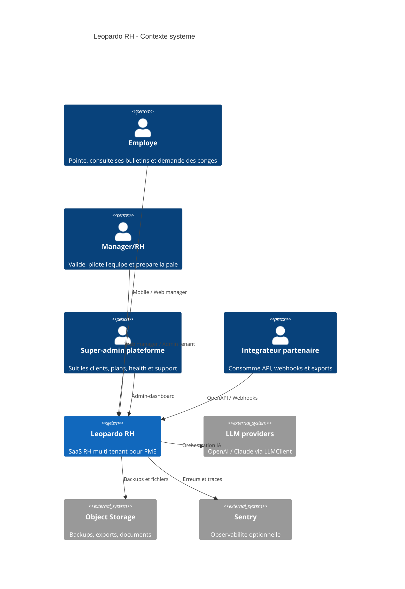
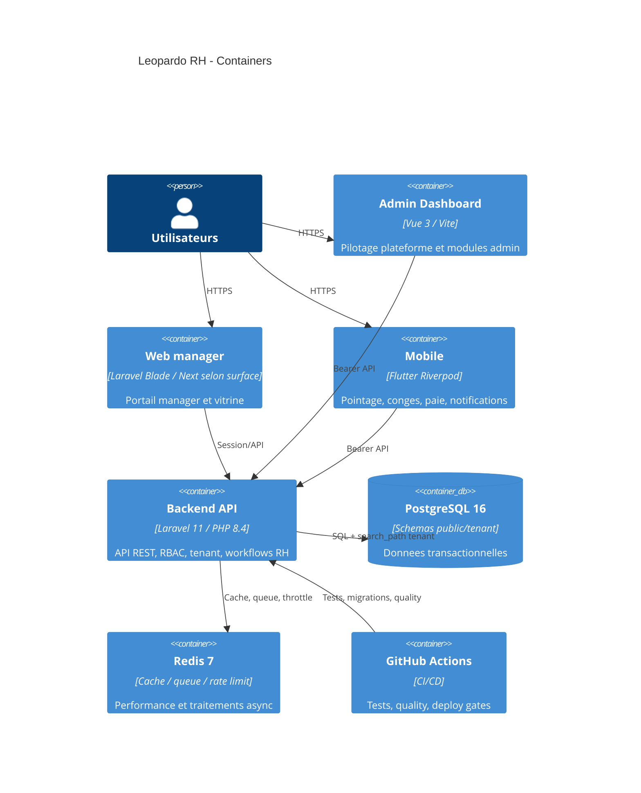
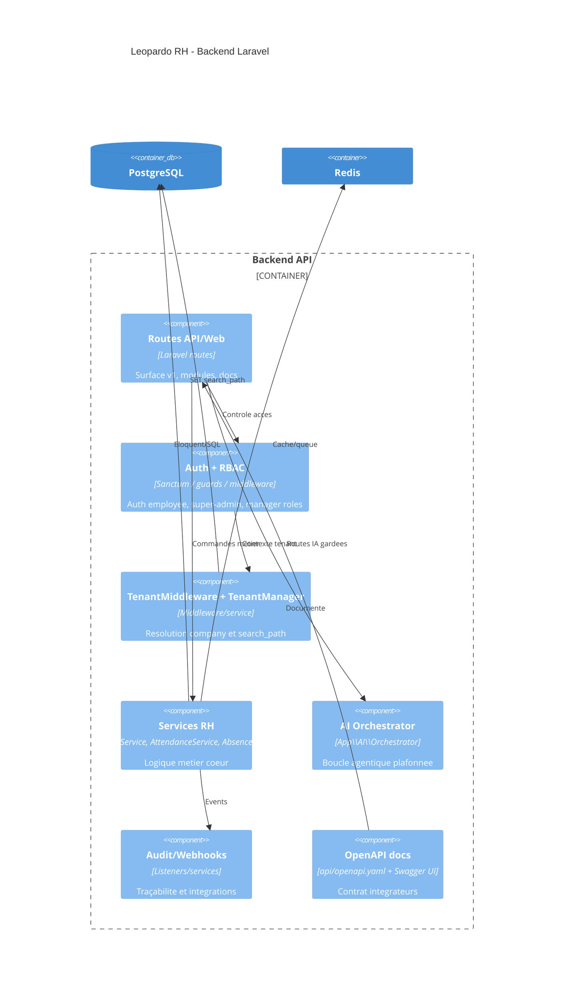

# Leopardo RH - C4 Architecture

## Niveau 1 - Contexte

## Niveau 2 - Containers

## Niveau 3 - Backend composants critiques

## Regles de maintien

- Mettre a jour ce diagramme quand une surface deployable, un store ou un provider externe devient critique.
- Garder `api/openapi.yaml` comme source contractuelle, pas ce document.
- Les decisions structurantes doivent etre ajoutees dans `docs/architecture/adr/`.
