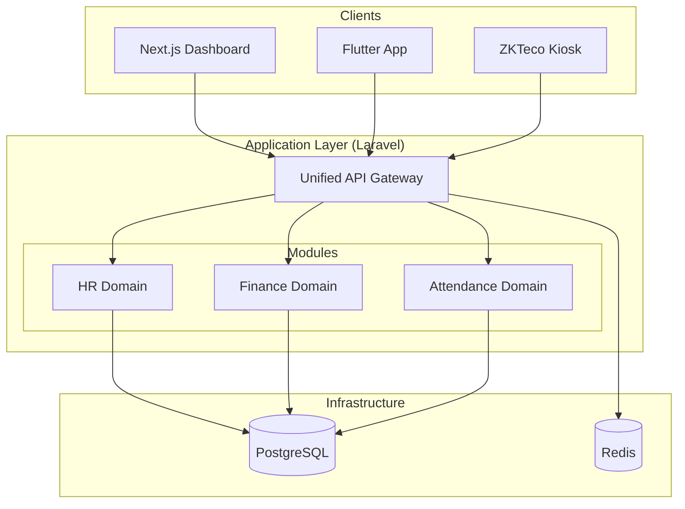
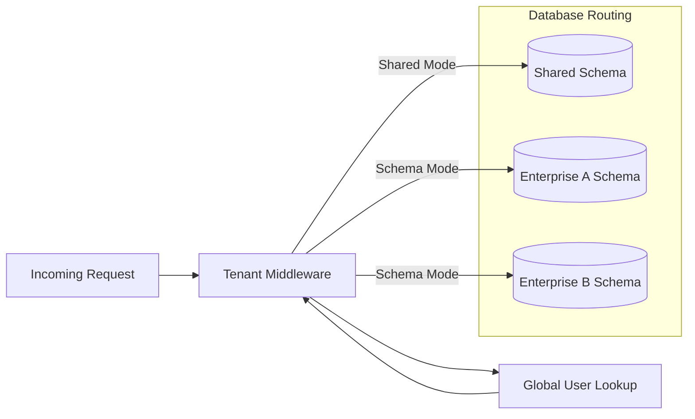
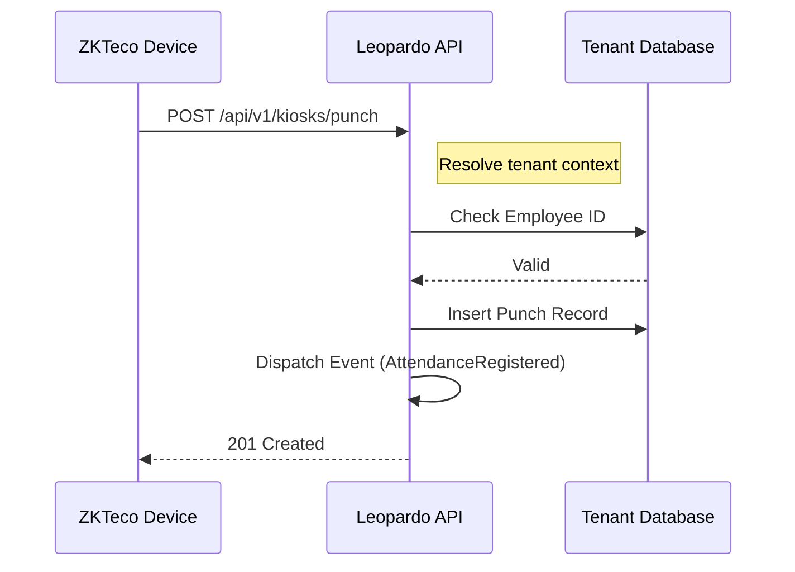
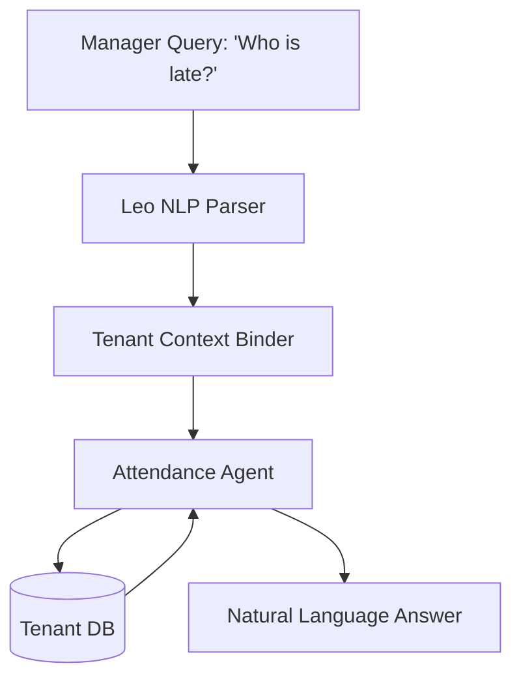
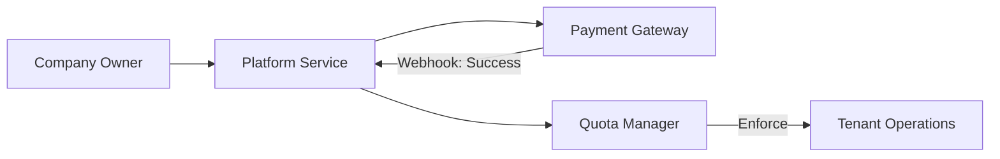

# System Diagrams — Leopardo RH

This document centralizes all architectural and workflow diagrams for the platform, providing a visual reference for developers and architects.

## 🏗 High-Level Architecture

The 3-tier Modular Monolith structure.

## 🌍 Multi-Tenant Isolation

How we handle Shared vs. Enterprise tenants.

## 🕒 Attendance Synchronization

Workflow for hardware-to-cloud synchronization.

## 🤖 Leo AI Orchestration

Intent parsing and domain-specific data retrieval.

## 💳 Subscription & Billing

Platform-level billing workflow.

---

*Note: All diagrams are maintained using Mermaid.js syntax.*
