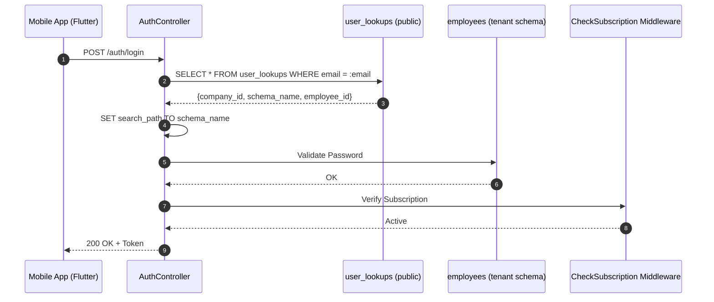
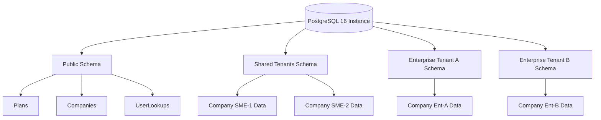

# Architecture Visuals

This directory contains diagrams and visual assets explaining the Leopardo RH internal mechanics.

## 🔑 Multi-Tenant Authentication
The following diagram explains how we route a single login request to the correct tenant schema in our multi-tenant PostgreSQL database.

## 📊 Database Topology
Our database is organized to scale while maintaining strict isolation.

