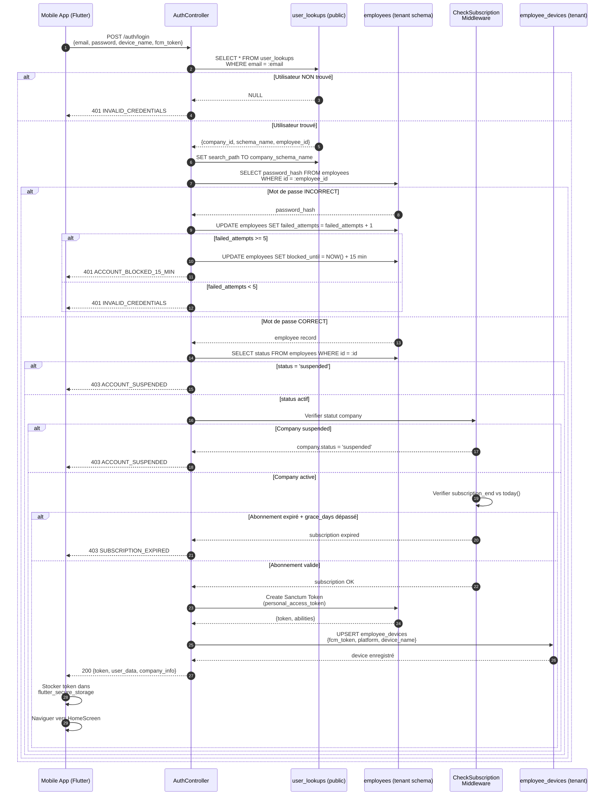

# Diagramme de séquence — Authentification Multi-Tenant

---

## Explication des interactions

| Étape | Interaction | Détail |
|--------|-------------|---------|
| 1 | **Requête de connexion** | L'application mobile envoie les identifiants (email, mot de passe) avec les informations de l'appareil (nom, FCM token). |
| 2-3 | **Recherche dans user_lookups (public schema)** | Le controlleur interroge la table publique `user_lookups` pour retrouver le schel0me tenant associé à l'email. Si l'utilisateur n'existe pas, une erreur 401 est renvoyée immédiatement. |
| 4-5 | **Changement de contexte tenant** | Le `search_path` PostgreSQL est basculé vers le schéma de l'entreprise pour toutes les requêtes suivantes. |
| 6-8 | **Vérification du mot de passe** | Le mot de passe est vérifié dans la table `employees` du schéma tenant. En cas d'échec, le compteur `failed_attempts` est incrémenté. Au bout de 5 échecs, le compte est bloqué pendant 15 minutes. |
| 9 | **Vérification du statut employé** | Un employé ou une entreprise suspendus bloquent toute connexion (403). |
| 10 | **Vérification de l'abonnement** | Le middleware `CheckSubscription` compare la date de fin d'abonnement avec la date du jour, en tenant compte de la période de grâce définie dans le plan. |
| 11 | **Création du token Sanctum** | Un `personal_access_token` Sanctum est généré pour les requêtes authentifiées ultérieures. |
| 12 | **Enregistrement de l'appareil** | Le token FCM est upserté dans `employee_devices` pour les notifications push. |
| 13-15 | **Réponse et navigation** | L'application stocke le token de manière sécurisée et navigue vers l'écran d'accueil. |
