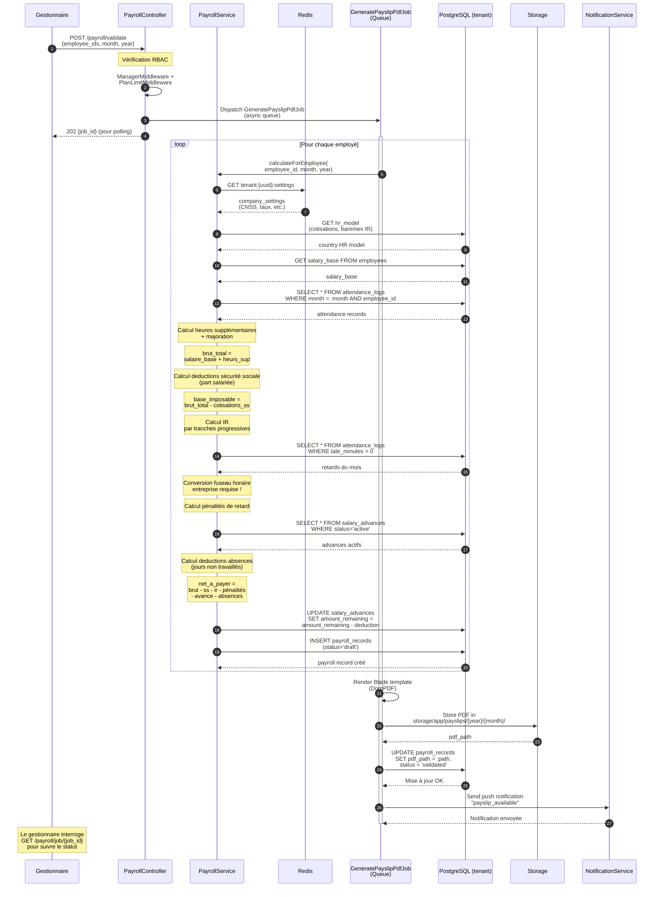

# Diagramme de séquence — Calcul de la Paie

---

## Explication des interactions

| Étape | Interaction | Détail |
|--------|-------------|---------|
| 1-2 | **Requête de validation de paie** | Le gestionnaire lance le calcul pour une liste d'employés, un mois et une année donnés. Les middleware RBAC et de limites de plan sont vérifiés en premier lieu. |
| 3-4 | **Job asynchrone** | Le calcul étant potentiellement lourd, il est dispatché dans une queue Laravel. Le gestionnaire reçoit un `job_id` pour interroger le statut via polling. |
| 5a-b | **Configuration & modèle RH** | Les réglages de l'entreprise sont récupérés depuis le cache Redis (clé `tenant:{uuid}:settings`). Les modèles de cotisations et barèmes IR sont issus du modèle RH du pays. |
| 5c-e | **Calcul du brut** | Le salaire de base est additionné aux heures supplémentaires calculées à partir des `attendance_logs` du mois. |
| 5f-h | **Deductions sociales et fiscales** | La sécurité sociale (part salariée) est déduite du brut. L'impôt sur le revenu est calculé par tranches progressives. |
| 5i | **Pénalités de retard** | Les minutes de retard sont récupérées depuis les pointages. La conversion en fuseau horaire de l'entreprise est obligatoire pour un calcul correct. |
| 5j-k | **Avances & absences** | Les avances sur salaire actives sont déduites du net. Les jours d'absence non rémunérés sont également déduits. |
| 5l-m | **Net à payer** | Le salaire net est calculé et stocké en base avec le statut `draft`. Le `amount_remaining` des avances est mis à jour. |
| 6-8 | **Génération du bulletin PDF** | Le job rend un template Blade via DomPDF, stocke le fichier dans le système de fichiers et met à jour le chemin et le statut (`validated`). |
| 9 | **Notification employé** | L'employé reçoit une notification push l'informant que son bulletin de paie est disponible. |
