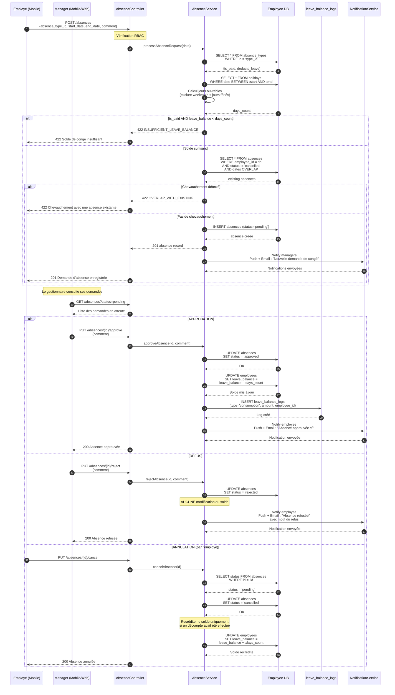

# Diagramme de séquence — Demande et Approbation d'Absence

---

## Explication des interactions

| Étape | Interaction | Détail |
|--------|-------------|---------|
| 1-3 | **Soumission de la demande** | L'employé soumet une demande d'absence via l'application mobile avec le type, les dates et un commentaire optionnel. |
| 4-5 | **Vérification du type & calcul des jours** | Le service vérifie si le type d'absence est rémunéré et s'il déduit du solde de congé. Le nombre de jours ouvrables est calculé en excluant les weekends et jours fériés. |
| 6 | **Contrôle du solde** | Si l'absence est rémunérée et que le solde est insuffisant, la demande est rejetée avec une erreur 422. |
| 7-8 | **Détection de chevauchement** | Le service vérifie qu'il n'existe pas d'absence en chevauchement (statut différent de `cancelled`) pour les mêmes dates. |
| 9-10 | **Création & notification** | L'absence est créée avec le statut `pending`. Les managers concernés reçoivent une notification push et email. |
| 11-12 | **Consultation par le manager** | Le manager consulte les demandes en attente depuis l'application mobile ou web. |
| 13-15 | **Approbation** | Le manager approuve la demande. Le statut passe à `approved`, le solde de congé est décrémenté et un log de consommation est créé. L'employé est notifié. |
| 16-18 | **Refus** | Le manager refuse la demande avec un motif. Le solde n'est pas modifié. L'employé est notifié avec la raison du refus. |
| 19-21 | **Annulation par l'employé** | L'employé peut annuler une demande en attente (`pending`). Si un décompte avait été effectué, le solde est recrédité automatiquement. |
