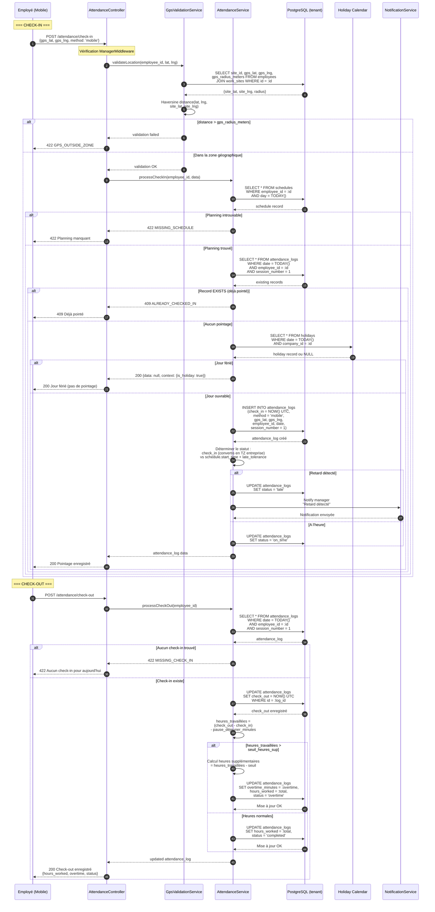

# Diagramme de séquence — Pointage Check-in / Check-out

---

## Explication des interactions

| Étape | Interaction | Détail |
|--------|-------------|---------|
| 1-5 | **Validation géolocalisation** | L'employé envoie ses coordonnées GPS. Le service calcule la distance de Haversine entre sa position et le site de travail assigné. Si la distance dépasse le rayon autorisé, le pointage est rejeté (422). |
| 6-7 | **Vérification du planning** | Le service vérifie qu'un planning horaire existe pour le jour en cours. Sans planning, le pointage est impossible. |
| 8 | **Double pointage** | Une recherche dans `attendance_logs` vérifie qu'il n'existe pas déjà un check-in pour la journée et la session (session_number = 1). |
| 9-10 | **Jour férié** | Le calendrier des jours fériés de l'entreprise est consulté. Si c'est un jour férié, le pointage n'est pas enregistré et le contexte est retourné à l'application. |
| 11-13 | **Enregistrement du check-in** | Le pointage est inséré en base avec l'heure UTC. Le statut (`on_time` ou `late`) est déterminé en comparant l'heure convertie dans le fuseau de l'entreprise avec l'heure de début du planning + la tolérance de retard. |
| 14 | **Notification de retard** | Si un retard est détecté, le manager reçoit une notification push immédiatement. |
| 15-17 | **Recherche du check-in** | Au check-out, le service recherche le pointage d'entrée du jour. S'il n'existe pas, le check-out est rejeté (422). |
| 18-20 | **Calcul du temps travaillé** | Les heures travaillées sont calculées en soustrayant la pause déjeuner. Si le total dépasse le seuil d'heures supplémentaires, les heures sup sont calculées et stockées séparément. |
| 21-22 | **Mise à jour & réponse** | Le statut final est mis à jour (`completed` ou `overtime`) et l'employé reçoit le détail de son pointage. |
