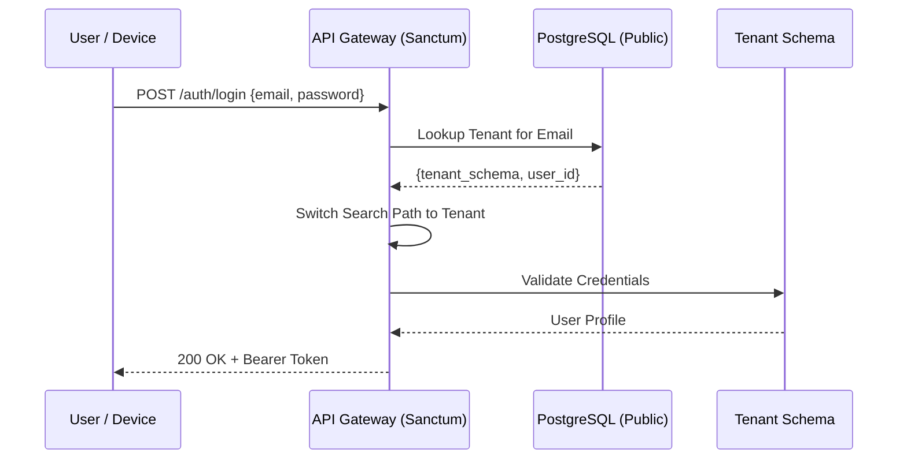

# Authentication & Identity System — Leopardo RH

Leopardo RH uses a secure, modern identity layer designed for omnichannel access (Web, Mobile, Kiosk) and strict multi-tenant isolation.

## 🔑 Authentication Mechanisms

### 1. Web & Mobile: Laravel Sanctum
We use **Laravel Sanctum** for issuing API tokens.
-   **Web:** Uses stateful, cookie-based session authentication for the Next.js dashboard.
-   **Mobile:** Uses Bearer Tokens (JWT-like) for secure communication between the Flutter apps and the API.

### 2. Kiosk & IoT: Device Tokens
ZKTeco devices and Kiosk interfaces use a dedicated `device_token` mechanism.
-   Tokens are long-lived but restricted to specific Kiosk endpoints (Punch, Roster, Announcements).
-   Authentication is bound to a physical `device_code`.

### 3. SSO & Enterprise Identity (Roadmap)
-   **SAML 2.0 / OIDC:** Integration for Enterprise clients to use Okta, Azure AD, or Google Workspace.

---

## 🛡 Security Features

-   **Multi-Factor Authentication (MFA):** Optional TOTP (Time-based One-Time Password) for administrative accounts.
-   **Secure Storage:** Mobile apps use `flutter_secure_storage` (Keychain/Keystore) to prevent token theft.
-   **Rate Limiting:** Aggressive throttling on login endpoints to prevent brute-force attacks.
-   **Audit Trails:** Every login attempt, successful or failed, is logged with IP and Device info.

---

## 🔄 Authentication Flow

---

## 🔒 Password Policy
-   Bcrypt hashing (12 rounds).
-   Minimum 8 characters, including symbols and numbers.
-   Account lockout after 5 failed attempts.

---

For role-based access details, see [RBAC System](RBAC_SYSTEM.md).
